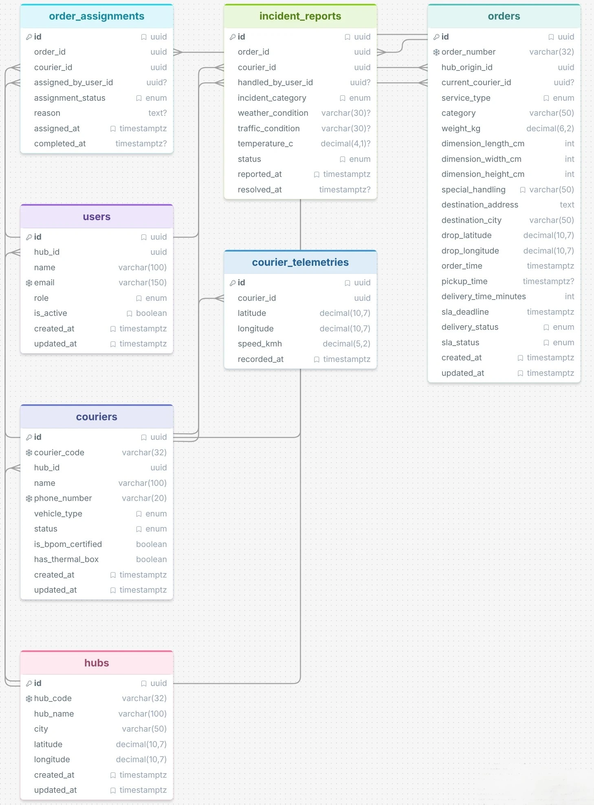

# Database Schema — Anteraja Courier Admin Mini-Panel

Dokumentasi ini menjelaskan struktur database PostgreSQL (via **Supabase**) yang digunakan oleh sistem **Courier Admin Mini-Panel** Anteraja. Skema dirancang untuk mendukung empat modul utama: *Live Monitoring Map*, *SLA Risk Indicator*, *One-Click Task Reassignment*, dan *Quick Incident Reporting*.

---

## Daftar File

| File | Deskripsi |
|------|-----------|
| [`schema.sql`](./schema.sql) | DDL: Definisi seluruh tabel, constraint, dan indeks |
| [`seed.sql`](./seed.sql) | DML: Data awal (dummy) untuk pengujian dan simulasi |
| [`erd_design.webp`](./erd_design.webp) | Diagram ERD visual hubungan antar tabel |

---

## Struktur Tabel

Skema terdiri dari **7 tabel utama** dengan relasi seperti berikut:

```
hubs ──< users
hubs ──< couriers ──< courier_telemetries
hubs ──< orders ──< order_assignments
              │        └──< couriers
              └──< incident_reports
                        └──< couriers
```

---

## Detail Tabel

### 1. `hubs` — Staging Store / Kantor Operasional Hub

Menyimpan data fisik setiap hub/staging store yang menjadi titik asal operasional pengiriman.

| Kolom | Tipe | Constraint | Deskripsi |
|-------|------|-----------|-----------|
| `id` | `UUID` | PK, default `gen_random_uuid()` | Identifikasi unik hub |
| `hub_code` | `VARCHAR(32)` | NOT NULL, UNIQUE | Kode unik hub, contoh: `HUB-JAKSEL-TEBET` |
| `hub_name` | `VARCHAR(100)` | NOT NULL | Nama representatif hub operasional |
| `city` | `VARCHAR(50)` | NOT NULL | Wilayah kota (mis. Jakarta Selatan, Bandung) |
| `latitude` | `DECIMAL(10,7)` | NOT NULL | Koordinat lintang fisik hub |
| `longitude` | `DECIMAL(10,7)` | NOT NULL | Koordinat bujur fisik hub |
| `created_at` | `TIMESTAMPTZ` | NOT NULL, default `NOW()` | Waktu data dibuat |
| `updated_at` | `TIMESTAMPTZ` | NOT NULL, default `NOW()` | Waktu data terakhir diperbarui |

**Relasi:** Menjadi induk bagi tabel `users`, `couriers`, dan `orders`.

---

### 2. `users` — Petugas Internal & Pengguna Sistem

Menyimpan akun pengguna sistem internal yang memiliki akses ke dasbor admin. Setiap user terikat ke satu hub.

| Kolom | Tipe | Constraint | Deskripsi |
|-------|------|-----------|-----------|
| `id` | `UUID` | PK | Identifikasi unik user |
| `hub_id` | `UUID` | FK → `hubs(id)` ON DELETE RESTRICT | Hub tempat user bertugas |
| `name` | `VARCHAR(100)` | NOT NULL | Nama lengkap petugas |
| `email` | `VARCHAR(150)` | NOT NULL, UNIQUE | Email login unik |
| `role` | `VARCHAR(30)` | NOT NULL, CHECK | Peran sistem (lihat nilai valid di bawah) |
| `is_active` | `BOOLEAN` | NOT NULL, default `TRUE` | Status akun aktif/nonaktif |
| `created_at` | `TIMESTAMPTZ` | NOT NULL, default `NOW()` | Waktu data dibuat |
| `updated_at` | `TIMESTAMPTZ` | NOT NULL, default `NOW()` | Waktu data terakhir diperbarui |

**Nilai valid `role`:**

| Nilai | Deskripsi |
|-------|-----------|
| `ADMIN_HUB` | Admin operasional hub, akses penuh ke dasbor |
| `HUB_MANAGER` | Manajer hub, pemantauan dan persetujuan eskalasi |
| `CUSTOMER_CARE` | Tim layanan pelanggan, akses status pengiriman |

---

### 3. `couriers` — Armada Kurir SATRIA

Menyimpan profil lengkap setiap kurir termasuk jenis kendaraan, status operasional, dan kualifikasi khusus (BPOM/thermal box) untuk validasi pengalihan tugas.

| Kolom | Tipe | Constraint | Deskripsi |
|-------|------|-----------|-----------|
| `id` | `UUID` | PK | Identifikasi unik kurir |
| `courier_code` | `VARCHAR(32)` | NOT NULL, UNIQUE | Kode kurir, format: `STR-JKT-001` |
| `hub_id` | `UUID` | FK → `hubs(id)` ON DELETE RESTRICT | Hub induk kurir |
| `name` | `VARCHAR(100)` | NOT NULL | Nama lengkap kurir |
| `phone_number` | `VARCHAR(20)` | NOT NULL, UNIQUE | Nomor HP aktif kurir |
| `vehicle_type` | `VARCHAR(30)` | NOT NULL, CHECK | Jenis kendaraan (lihat nilai valid di bawah) |
| `status` | `VARCHAR(20)` | NOT NULL, default `'OFFLINE'` | Status operasional terkini |
| `is_bpom_certified` | `BOOLEAN` | NOT NULL, default `FALSE` | Wajib `TRUE` untuk layanan PHARMA |
| `has_thermal_box` | `BOOLEAN` | NOT NULL, default `FALSE` | Wajib `TRUE` untuk layanan Frozen |
| `created_at` | `TIMESTAMPTZ` | NOT NULL, default `NOW()` | Waktu data dibuat |
| `updated_at` | `TIMESTAMPTZ` | NOT NULL, default `NOW()` | Waktu data terakhir diperbarui |

**Nilai valid `vehicle_type`:**

| Nilai | Kategori |
|-------|----------|
| `Motorcycle` | Armada roda dua |
| `Scooter` | Armada roda dua |
| `Motor Listrik` | Armada roda dua (EV) |
| `Van` | Armada roda empat ringan |
| `Blind Van` | Armada roda empat ringan |
| `Cooler Box Van` | Armada roda empat (rantai dingin) |
| `Pick Up Box` | Armada roda empat sedang |
| `Cargo Truck` | Armada roda enam+ (kargo berat) |

**Nilai valid `status`:**

| Nilai | Deskripsi |
|-------|-----------|
| `ONLINE` | Aktif dan siap menerima tugas baru |
| `OFFLINE` | Tidak terhubung ke sistem |
| `IDLE` | Aktif namun tidak bergerak > 10 menit |
| `OFF_DUTY` | Sedang istirahat / di luar jam tugas |

---

### 4. `courier_telemetries` — Log Real-Time GPS & Sensor Kurir

Menyimpan snapshot posisi GPS dan kecepatan kurir yang diterima secara periodik. Digunakan oleh **Live Monitoring Map** untuk melacak pergerakan armada secara real-time.

| Kolom | Tipe | Constraint | Deskripsi |
|-------|------|-----------|-----------|
| `id` | `UUID` | PK | Identifikasi unik record telemetri |
| `courier_id` | `UUID` | FK → `couriers(id)` ON DELETE CASCADE | Kurir pemilik data telemetri |
| `latitude` | `DECIMAL(10,7)` | NOT NULL | Titik lintang GPS terkini kurir |
| `longitude` | `DECIMAL(10,7)` | NOT NULL | Titik bujur GPS terkini kurir |
| `speed_kmh` | `DECIMAL(5,2)` | NOT NULL, default `0.00` | Kecepatan kendaraan (km/jam); <= 0 memicu idle alert |
| `recorded_at` | `TIMESTAMPTZ` | NOT NULL, default `NOW()` | Timestamp penerimaan data GPS |

> **Catatan:** Tabel ini bersifat *append-only* (log). Data historis tidak dihapus agar audit trail tetap lengkap. Kurir yang dihapus akan menghapus semua telemetrinya secara otomatis (`CASCADE`).

---

### 5. `orders` — Transaksi & Pengiriman Paket

Tabel inti yang menyimpan seluruh detail paket pengiriman, termasuk dimensi fisik, tujuan, perhitungan SLA, dan status pengiriman terkini.

| Kolom | Tipe | Constraint | Deskripsi |
|-------|------|-----------|-----------|
| `id` | `UUID` | PK | Identifikasi unik order |
| `order_number` | `VARCHAR(32)` | NOT NULL, UNIQUE | Nomor resi pengiriman |
| `hub_origin_id` | `UUID` | FK → `hubs(id)` ON DELETE RESTRICT | Hub asal pengiriman |
| `current_courier_id` | `UUID` | FK → `couriers(id)` ON DELETE SET NULL | Kurir yang sedang menangani paket |
| `service_type` | `VARCHAR(30)` | NOT NULL, CHECK | Jenis layanan Anteraja |
| `category` | `VARCHAR(50)` | NOT NULL | Kategori isi paket |
| `weight_kg` | `DECIMAL(6,2)` | NOT NULL | Berat paket dalam kilogram |
| `dimension_length_cm` | `INT` | NOT NULL | Panjang paket (cm) |
| `dimension_width_cm` | `INT` | NOT NULL | Lebar paket (cm) |
| `dimension_height_cm` | `INT` | NOT NULL | Tinggi paket (cm) |
| `special_handling` | `VARCHAR(50)` | NOT NULL, default `'Standard'` | Penanganan khusus (mis. Fragile, PHARMA) |
| `destination_address` | `TEXT` | NOT NULL | Alamat tujuan lengkap |
| `destination_city` | `VARCHAR(50)` | NOT NULL | Kota tujuan |
| `drop_latitude` | `DECIMAL(10,7)` | NOT NULL | Koordinat lintang tujuan |
| `drop_longitude` | `DECIMAL(10,7)` | NOT NULL | Koordinat bujur tujuan |
| `order_time` | `TIMESTAMPTZ` | NOT NULL | Waktu paket terdaftar ke sistem |
| `pickup_time` | `TIMESTAMPTZ` | nullable | Waktu paket di-pickup secara fisik |
| `delivery_time_minutes` | `INT` | NOT NULL | Alokasi durasi SLA standar (menit) |
| `sla_deadline` | `TIMESTAMPTZ` | NOT NULL | Batas waktu SLA absolut |
| `delivery_status` | `VARCHAR(30)` | NOT NULL, default `'Assigned'` | Status pengiriman terkini |
| `sla_status` | `VARCHAR(20)` | NOT NULL, default `'SAFE'` | Tingkat risiko SLA saat ini |
| `created_at` | `TIMESTAMPTZ` | NOT NULL, default `NOW()` | Waktu data dibuat |
| `updated_at` | `TIMESTAMPTZ` | NOT NULL, default `NOW()` | Waktu data terakhir diperbarui |

**Nilai valid `service_type`:**

| Nilai | Deskripsi |
|-------|-----------|
| `Instant` | Pengiriman instan (< 3 jam) |
| `Same Day` | Pengiriman hari yang sama |
| `Next Day` | Pengiriman hari berikutnya |
| `Regular` | Pengiriman reguler |
| `Cargo` | Pengiriman kargo berat |
| `Mini Cargo` | Pengiriman kargo ringan |
| `Dokumen` | Pengiriman dokumen resmi |
| `PHARMA` | Pengiriman farmasi (wajib kurir bersertifikat BPOM) |
| `Frozen` | Pengiriman rantai dingin (wajib thermal box) |

**Nilai valid `delivery_status`:**

| Nilai | Deskripsi |
|-------|-----------|
| `Pending_Pickup` | Menunggu dijemput dari hub |
| `Assigned` | Sudah di-assign ke kurir |
| `Picked_Up` | Sudah diambil dari hub oleh kurir |
| `In_Sorting_Hub` | Sedang di sorting hub transit |
| `In_Transit` | Dalam perjalanan antar kota/hub |
| `Out_For_Delivery` | Sedang dalam proses pengiriman ke tujuan |
| `Delivered` | Berhasil diterima penerima |
| `Incident_Reported` | Terkendala, insiden sedang ditangani |

**Nilai valid `sla_status`:**

| Nilai | Warna UI | Deskripsi |
|-------|----------|-----------|
| `SAFE` | Hijau | SLA aman, tidak ada risiko |
| `ON_SCHEDULE` | Hijau | Tepat jadwal |
| `MEDIUM_RISK` | Kuning | Risiko sedang, perlu perhatian |
| `HIGH_RISK` | Oranye | Risiko tinggi, perlu tindakan segera |
| `CRITICAL` | Merah | Sangat kritis, hampir melewati SLA |
| `BREACHED` | Merah berkedip | SLA sudah dilanggar |

---

### 6. `order_assignments` — Junction Table Penugasan Kurir

Tabel pivot M:M yang mencatat riwayat penugasan dan pengalihan (reassignment) kurir untuk setiap paket. Setiap event pengalihan ulang membuat baris baru, sehingga histori audit pengalihan tetap terjaga.

| Kolom | Tipe | Constraint | Deskripsi |
|-------|------|-----------|-----------|
| `id` | `UUID` | PK | Identifikasi unik assignment |
| `order_id` | `UUID` | FK → `orders(id)` ON DELETE CASCADE | Paket yang ditugaskan |
| `courier_id` | `UUID` | FK → `couriers(id)` ON DELETE RESTRICT | Kurir penerima tugas |
| `assigned_by_user_id` | `UUID` | FK → `users(id)` ON DELETE SET NULL | User admin yang melakukan penugasan |
| `assignment_status` | `VARCHAR(20)` | NOT NULL, default `'ACTIVE'` | Status penugasan saat ini |
| `reason` | `TEXT` | nullable | Catatan alasan pengalihan (jika reassignment) |
| `assigned_at` | `TIMESTAMPTZ` | NOT NULL, default `NOW()` | Waktu penugasan dilakukan |
| `completed_at` | `TIMESTAMPTZ` | nullable | Waktu penugasan selesai/dibatalkan |

**Nilai valid `assignment_status`:**

| Nilai | Deskripsi |
|-------|-----------|
| `ACTIVE` | Penugasan sedang berjalan |
| `REASSIGNED` | Dialihkan ke kurir lain |
| `COMPLETED` | Pengiriman berhasil diselesaikan |
| `CANCELLED` | Penugasan dibatalkan |

---

### 7. `incident_reports` — Laporan Kendala Lapangan

Menyimpan laporan insiden yang dilaporkan kurir di lapangan. Mendukung berbagai jenis kendala operasional dan menyimpan konteks kondisi lingkungan saat insiden terjadi.

| Kolom | Tipe | Constraint | Deskripsi |
|-------|------|-----------|-----------|
| `id` | `UUID` | PK | Identifikasi unik laporan insiden |
| `order_id` | `UUID` | FK → `orders(id)` ON DELETE CASCADE | Paket yang terdampak insiden |
| `courier_id` | `UUID` | FK → `couriers(id)` ON DELETE RESTRICT | Kurir yang melaporkan insiden |
| `handled_by_user_id` | `UUID` | FK → `users(id)` ON DELETE SET NULL | Admin yang menangani laporan |
| `incident_category` | `VARCHAR(40)` | NOT NULL, CHECK | Kategori jenis insiden |
| `weather_condition` | `VARCHAR(30)` | nullable | Kondisi cuaca saat insiden (mis. `Hujan Deras`) |
| `traffic_condition` | `VARCHAR(30)` | nullable | Kondisi lalu lintas (mis. `Macet Total`) |
| `temperature_c` | `DECIMAL(4,1)` | nullable | Suhu sensor (°C); anomali jika > 5°C untuk Frozen/PHARMA |
| `status` | `VARCHAR(20)` | NOT NULL, default `'REPORTED'` | Status penanganan insiden |
| `reported_at` | `TIMESTAMPTZ` | NOT NULL, default `NOW()` | Waktu insiden dilaporkan |
| `resolved_at` | `TIMESTAMPTZ` | nullable | Waktu insiden dinyatakan selesai |

**Nilai valid `incident_category`:**

| Nilai | Deskripsi |
|-------|-----------|
| `Weather` | Kendala cuaca (banjir, hujan ekstrem) |
| `Traffic` | Kendala lalu lintas (macet total) |
| `Vehicle_Breakdown` | Kerusakan kendaraan kurir |
| `Cold_Chain_Anomaly` | Anomali suhu rantai dingin (> 5°C) |
| `Address_NotFound` | Alamat tujuan tidak ditemukan |

**Nilai valid `status`:**

| Nilai | Deskripsi |
|-------|-----------|
| `REPORTED` | Baru dilaporkan, belum ditangani |
| `ACKNOWLEDGED` | Admin sudah menerima laporan |
| `RESOLVED` | Insiden berhasil diselesaikan |
| `ESCALATED` | Diteruskan ke level manajemen (> 10 menit tanpa respons) |

---

## Indeks Database

Indeks berikut dibuat untuk mengoptimalkan performa query pada modul-modul dasbor:

| Nama Indeks | Tabel | Kolom | Digunakan Oleh |
|-------------|-------|-------|----------------|
| `idx_orders_hub_origin_id` | `orders` | `hub_origin_id` | F-02 SLA Risk Panel (filter hub) |
| `idx_orders_current_courier_id` | `orders` | `current_courier_id` | F-01 Live Map (filter kurir) |
| `idx_orders_sla_deadline` | `orders` | `sla_deadline ASC` | F-02 Auto-Sort by SLA urgency |
| `idx_orders_sla_status` | `orders` | `sla_status` | F-02 Filter by risk level |
| `idx_orders_delivery_status` | `orders` | `delivery_status` | F-02 Filter by delivery state |
| `idx_telemetries_courier_time` | `courier_telemetries` | `(courier_id, recorded_at DESC)` | F-01 Live GPS tracking |
| `idx_couriers_hub_status` | `couriers` | `(hub_id, status)` | F-03 Reassignment candidate filter |
| `idx_assignments_courier_active` | `order_assignments` | `(courier_id, assignment_status)` | F-03 Workload validation (< 20 paket) |
| `idx_assignments_order_id` | `order_assignments` | `order_id` | F-03 Assignment history lookup |
| `idx_incidents_status_reported` | `incident_reports` | `(status, reported_at)` | F-04 Active incident monitoring |

---

## Entity Relationship Diagram (ERD)



---

## Catatan Keamanan & Integritas Data

- **UUID sebagai Primary Key:** Menggunakan `gen_random_uuid()` dari ekstensi `pgcrypto` untuk ID yang tidak dapat ditebak dan aman secara kriptografi.
- **ON DELETE RESTRICT:** Diterapkan pada tabel `hubs` dan `couriers` untuk mencegah penghapusan data induk yang masih memiliki referensi aktif.
- **ON DELETE CASCADE:** Diterapkan pada `courier_telemetries`, `order_assignments`, dan `incident_reports` agar data turunan terhapus otomatis bersama data induknya.
- **ON DELETE SET NULL:** Diterapkan pada `current_courier_id` di `orders` dan kolom `*_user_id` di tabel lain, sehingga data operasional tetap ada meski akun user/kurir dihapus.
- **CHECK Constraints:** Setiap kolom enum menggunakan `CHECK` constraint untuk memastikan hanya nilai yang valid yang tersimpan di database.
