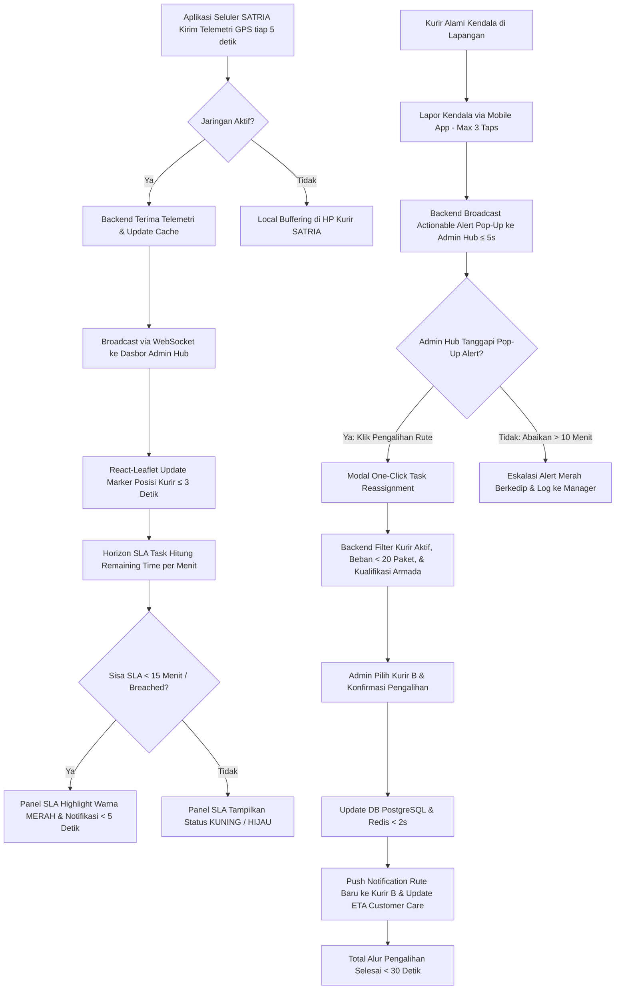

# Functional Requirement Document (FRD Induk / Master FRD)
## Courier Admin Mini-Panel Anteraja

---

### 1. Konteks
Dokumen FRD Induk (Master FRD) ini berfungsi sebagai landasan spesifikasi fungsional utama yang mengintegrasikan seluruh 4 modul operasional MVP (*Live Monitoring Map*, *SLA Risk Indicator Panel*, *One-Click Task Reassignment*, dan *Quick Incident Reporting*) ke dalam satu arsitektur sistem terpadu. Dokumen ini merujuk langsung pada **00-PRD-courier-admin-mini-panel-v2.md** untuk menyelesaikan ketiadaan visibilitas lokasi kurir secara *real-time*, koordinasi kendala yang terisolasi, serta identifikasi keterlambatan yang bersifat reaktif. Implementasi dokumen ini memandu pencapaian KPI bisnis: tingkat kepatuhan SLA **≥ 97.5%**, percepatan penanganan kendala hingga **75%**, durasi penugasan ulang **< 30 detik**, tingkat *re-delivery* **< 2.0%**, dan penekanan pesan manual **< 25 pesan/hari**.

---

### 2. Peran & Hak Akses

| Peran (Role) | Lihat (Read) | Buat (Create) | Ubah (Update) | Setujui (Approve) | Field Terkunci (Locked Fields) |
| :--- | :---: | :---: | :---: | :---: | :--- |
| **Admin Hub Operasional** | ✅ Ya | ✅ Ya (Tanggapi Kendala) | ✅ Ya (Pengalihan / Filter) | ✅ Ya (Eksekusi Aksi) | `courier_live_lat`, `courier_live_long`, `Order_ID`, `original_courier_id` |
| **Kurir SATRIA (Mobile App)** | ✅ Ya (Rute Sendiri) | ✅ Ya (Kirim Telemetri / Lapor Kendala) | ❌ Tidak | ❌ Tidak | `Store_Latitude`, `Drop_Latitude`, `SLA_Deadline`, `assigned_by_admin_id` |
| **System (Backend & WebSocket)** | ✅ Ya | ✅ Ya (Log GPS / Audit Log) | ✅ Ya (State Marker & SLA Status) | ✅ Ya (Auto-Sort & Escalation) | `Order_Time`, `reassignment_timestamp` |
| **Customer Care / Hub Manager** | ✅ Ya (Read-Only) | ❌ Tidak | ❌ Tidak | ❌ Tidak | Semua Field Sistem |

---

### 3. Alur



#### Pernyataan Alur Kebutuhan Sistem (EARS Pattern):
* **KETIKA** perangkat seluler kurir SATRIA terhubung ke jaringan internet, sistem **harus** mentransmisikan koordinat GPS (`courier_live_lat`, `courier_live_long`) ke backend via WebSocket setiap 5 detik.
* **KETIKA** backend menerima pembaruan telemetri GPS, sistem **harus** memperbarui posisi penanda (*marker*) kurir pada Peta Pemantauan Langsung dalam latensi maksimal 3 detik.
* **KETIKA** paket dipindai dan dibawa kurir (`Pickup_Time`), sistem **harus** menghitung `SLA_Deadline` berdasarkan estimasi `Delivery_Time_Minutes` dan memperbarui sisa waktu SLA secara otomatis setiap menit.
* **JIKA** sisa waktu SLA paket kurang dari 15 menit atau telah melampaui batas (`SLA_Remaining_Minutes <= 15`), sistem **harus** memberikan penanda warna **Merah** dan memicu peringatan visual pada dasbor admin dalam waktu < 5 detik.
* **JIKA** koneksi GPS kurir terputus > 15 detik, sistem **harus** mengubah warna penanda kurir menjadi abu-abu (*Offline*) dan mencatat status jaringan terputus.
* **JIKA** kurir mengirimkan laporan kendala fisik dari aplikasi seluler, sistem **harus** memunculkan notifikasi *pop-up* aksi (*actionable alert*) pada dasbor admin dalam durasi ≤ 5 detik.
* **SELAMA** kurir berstatus *ONLINE / Active*, sistem **harus** menampilkan radius titik tujuan pengiriman paket (`Drop_Latitude`, `Drop_Longitude`) yang menjadi tanggung jawab kurir tersebut.

---

### 4. Aturan Bisnis Global

| ID Rule | Kondisi / Pemicu | Hasil / Perilaku Sistem | Pengecualian |
| :--- | :--- | :--- | :--- |
| **BR-01** | Telemetri GPS diterima via WebSocket. | Pembaruan penanda kurir pada peta React.js selesai dalam latensi **≤ 3.0 detik**. | Terjadi pemutusan jaringan lokal pada dasbor Admin Hub. |
| **BR-02** | Sinyal GPS terputus selama **> 15 detik**. | Sistem mengubah warna penanda kurir menjadi **Abu-abu (Offline)** dan memicu log peringatan koneksi. | Kurir dalam status *OFF_DUTY* atau *Shift Ended*. |
| **BR-03** | Perhitungan `SLA_Remaining_Minutes` **< 15 menit** atau **< 0 menit**. | Status risiko di-set **HIGH_RISK / BREACHED** dengan warna baris **Merah Flashing** dan notifikasi < 5 detik. | Paket berstatus *Delivered* atau *Returned*. |
| **BR-04** | Perhitungan `SLA_Remaining_Minutes` **15 – 30 menit**. | Status risiko di-set **MEDIUM_RISK** dengan warna baris **Kuning**. | Paket berstatus *Delivered*. |
| **BR-05** | Paket mengalami kondisi `Weather = Hujan Deras / Banjir` atau `Traffic = Macet Total`. | Sistem memotong kalkulasi sisa waktu SLA sebesar **15% (Buffer Waktu Hambatan)** secara otomatis. | Pengiriman menggunakan moda kendaraan *van* di area *Urban*. |
| **BR-06** | Kurir terhenti (kecepatan 0 km/jam) selama **> 10 menit** di luar titik tujuan. | Penanda kurir diberi indikator **Idle Alert (Kuning Pulsasi)**. | Kurir berada di koordinat penyerahan (`Drop_Latitude`, `Drop_Longitude`). |
| **BR-07** | Admin memindahkan beban tugas paket (*Task Reassignment*). | Seluruh alur pengalihan dari klik admin hingga rute diterima kurir B wajib selesai **< 30.0 detik**. | Terjadi kegagalan koneksi total (*total network blackout*). |
| **BR-08** | Pemilihan kurir penerima pengalihan (*assignee*). | Sistem hanya merekomendasikan kurir berstatus **ONLINE** dengan beban paket aktif **< 20 paket** serta kualifikasi armada/layanan yang sesuai (*Cargo*->Van, *Frozen*->Tas Termal, *PHARMA*->BPOM). | Admin mengaktifkan opsi *Override Force Assign* darurat. |
| **BR-09** | Pelaporan kendala fisik dari aplikasi seluler kurir. | Proses pelaporan di aplikasi seluler wajib selesai dalam **maksimal 3 ketukan layar (taps)**. | Kurir melampirkan foto bukti fisik hambatan. |
| **BR-10** | Kendala tidak ditanggapi admin dalam waktu **> 10 menit**. | Sistem menaikkan skala notifikasi (*escalation alert*) menjadi **Merah Berkedip** dan mengirim log ke Manager Hub. | Kendala berkategori *Low Priority* (`Weather = Berawan`). |

---

### 5. Istilah

* **SATRIA:** Sebutan resmi untuk staf Kurir Lapangan Anteraja.
* **Admin Hub:** Petugas operasional di Stasiun Layanan (Hub) yang mengatur lalu lintas dan alokasi paket harian.
* **Telemetri GPS:** Aliran data koordinat lokasi (`latitude`, `longitude`) yang ditransmisikan secara berkala dari perangkat seluler kurir.
* **SLA (Service Level Agreement):** Batas waktu maksimal penyelesaian pengiriman paket dari penjemputan hingga penyerahan kepada penerima.
* **SLA Breached:** Kondisi operasional saat durasi pengiriman paket melampaui batas waktu SLA yang dijanjikan.
* **Local Buffering:** Penyimpanan data koordinat GPS sementara pada memori perangkat seluler kurir saat koneksi internet terputus.
* **Actionable Alert:** Notifikasi *pop-up* pada dasbor admin yang dilengkapi tombol tindakan langsung (misalnya tombol "Pengalihan Rute Instan").
* **Cross-Highlighting:** Fitur interaksi yang menghubungkan pemilihan data pada tabel panel SLA dengan *auto-zoom* penanda lokasi di peta.
* **Escalation Alert:** Peringatan susulan yang dipicu secara otomatis jika suatu kendala tidak ditanggapi admin dalam rentang waktu yang ditentukan.
* **Audit Log:** Catatan riwayat aktivitas sistem yang mencatat identitas eksekutor, stempel waktu, dan rincian perubahan data.

---

### 6. Data Utama & Status

#### Skema Data Utama Terintegrasi:
* `Order_ID` (String - Unique Identifier / Nomor Resi)
* `Service_Type` (Enum - Regular, Same Day, Next Day, Instant, Dokumen, Cargo, Mini Cargo, PHARMA, Frozen)
* `Courier_ID` & `Courier_Name` (String - Identitas Kurir SATRIA)
* `Hub_Origin` (String - ID Stasiun Layanan)
* `Store_Latitude` & `Store_Longitude` (Decimal - Titik Asal / Hub)
* `Drop_Latitude` & `Drop_Longitude` (Decimal - Titik Tujuan Penyerahan)
* `Courier_Live_Lat` & `Courier_Live_Long` (Decimal - Telemetri GPS Real-Time)
* `Order_Date`, `Order_Time`, `Pickup_Time`, `SLA_Deadline` (Timestamp - Waktu Operasional)
* `Weight_Kg` & `Dimensions_Cm` (Decimal/String - Bobot & Dimensi Paket)
* `Special_Handling` & `Temperature_C` (String/Decimal - Penanganan Khusus & Suhu Cold-Chain)
* `Weather` & `Traffic` (Enum - Kondisi Lingkungan)
* `Vehicle` (Enum - Motorcycle, Scooter, Van, Blind Van, Cargo Truck, Pick Up Box, Cooler Box Van, Motor Listrik)
* `Delivery_Status` (Enum - Assigned, In_Transit, Delivered, Incident_Reported, Picked_Up, In_Sorting_Hub, Out_For_Delivery, Pending_Pickup)
* `SLA_Remaining_Minutes` (Computed Integer - Menit Sisa SLA)
* `SLA_Status` (Enum - SAFE, MEDIUM_RISK, HIGH_RISK, BREACHED, CRITICAL, ON_SCHEDULE)
* `Courier_Status` (Enum - OFFLINE, ONLINE, IDLE, OFF_DUTY)
* `Incident_Status` (Enum - REPORTED, ACKNOWLEDGED, RESOLVED, ESCALATED)

#### Diagram Transisi Status Global:
```
[Status Kurir]:    OFFLINE (Abu-abu) <---> ONLINE (Hijau) ---> IDLE (Kuning Pulsasi) ---> OFF-DUTY
[Status SLA]:      SAFE (Hijau >30m) ---> MEDIUM_RISK (Kuning 15-30m) ---> HIGH_RISK (Merah <15m) ---> BREACHED (<0m)
[Status Kendala]:  REPORTED (Baru) ---> ACKNOWLEDGED (Dibaca) ---> RESOLVED (Selesai) / ESCALATED (Abaikan >10m)
```

---

### 7. Daftar Fungsi

* **F-01: Live Monitoring Map Module**
  * **F-01.1 Telemetry Receiver Service:** Menerima dan memvalidasi payload telemetri GPS & suhu dari kurir via WebSocket.
  * **F-01.2 Interactive Map Renderer:** Menampilkan peta React-Leaflet dengan *marker* kurir dan titik tujuan paket.
  * **F-01.3 Info Popup Component:** Menampilkan rincian paket, kendaraan, cuaca, dan suhu secara instan saat penanda diklik.
  * **F-01.4 Connection & Offline Handler:** Mengelola indikator sinyal kurir dan sinkronisasi data *local buffering*.
* **F-02: SLA Risk Indicator Panel Module**
  * **F-02.1 Dynamic SLA Calculator Engine:** Menghitung sisa waktu SLA secara *real-time* berbasis waktu server dan variabel hambatan lingkungan.
  * **F-02.2 Auto-Sorting Risk List Component:** Mengurutkan daftar paket secara *ascending* berdasarkan sisa waktu SLA pada tabel React.
  * **F-02.3 Visual Risk Color Coder:** Menerapkan pengkodean warna dinamis (Merah, Kuning, Hijau) pada baris tabel paket.
  * **F-02.4 Map Cross-Highlight Synchronizer:** Menghubungkan klik baris tabel dengan *auto-zoom* lokasi tujuan di peta.
* **F-03: One-Click Task Reassignment Module**
  * **F-03.1 Courier Reassignment Evaluator:** Memfilter dan merekomendasikan kurir penerima tugas yang aktif, beban < 20 paket, dan sesuai kualifikasi armada.
  * **F-03.2 One-Click Execution Controller:** Memproses pemindahan tugas di database PostgreSQL dan Redis Cache dalam < 2 detik.
  * **F-03.3 Dispatch & ETA Synchronizer:** Mengirim push notification ke kurir penerima dan memperbarui ETA di API Customer Care System.
  * **F-03.4 Reassignment Audit Logger:** Mencatat jejak audit pemindahan tugas secara permanen.
* **F-04: Quick Incident Reporting Module**
  * **F-04.1 Mobile Incident Dispatcher:** Antarmuka mobile 3 ketukan layar untuk pengiriman sinyal kendala oleh kurir.
  * **F-04.2 Actionable Alert Engine:** Layanan WebSocket memicu *pop-up alert* interaktif di dasbor admin.
  * **F-04.3 Quick Action Handler:** Memproses tombol aksi cepat (*Reassign Rute* / *Adjust SLA Buffer*).
  * **F-04.4 Escalation & History Logger:** Menangani eskalasi waktu kendala dan pencatatan riwayat di database.

---

### 8. AC Alur Utama (Acceptance Criteria - Data Nyata `delivery.txt`)

#### Skenario End-to-End: Deteksi Risiko SLA, Pelaporan Kendala Hujan Deras & Macet Total, dan Pengalihan Tugas 1-Klik
* **Diberikan:**
  * Admin Hub (Siti) membuka dasbor *Courier Admin Mini-Panel* di `HUB-BDG-BATUNUNGGAL`.
  * Kurir Indra Gunawan (`STR-BDG-004`, Vehicle: `Blind Van`) membawa paket resi `100024000104` (Layanan: `Regular`, Berat: 6.0 kg, Kategori: Pakaian & Tekstil) di lokasi awal `Store_Latitude: -6.953812, Store_Longitude: 107.627419` dengan `SLA_Deadline: 2026-09-21 12:15:00`.
  * Kurir Eko Prasetyo (`STR-JKT-006`, Vehicle: `Pick Up Box`) berada di area sekitar dengan status **ONLINE** dan membawa **10 paket aktif** (< 20 paket).
* **Ketika:**
  1. Pada pukul 12:45:00, kendaraan Kurir Indra Gunawan terjebak di lokasi `Courier_Live_Lat: -6.912403, Courier_Live_Long: 107.620154` akibat `Weather: Hujan Deras` dan `Traffic: Macet Total`.
  2. Kurir Indra Gunawan membuka aplikasi SATRIA, mengklik "Lapor Kendala" -> "Macet Total & Cuaca Buruk" -> "Kirim" (3 ketukan layar, memenuhi BR-09).
  3. Sinyal dikirim via WebSocket ke backend. Sisa waktu SLA paket `100024000104` terhitung **-30 menit** (status `BREACHED`, memenuhi BR-03).
  4. Admin Siti menerima notifikasi *pop-up* aksi warna **Merah Flashing** "Kendala Macet Total - Kurir Indra Gunawan (Resi 100024000104)" pada pukul 12:45:03 (latensi **3.0 detik**, memenuhi BR-01 ≤ 3s & BR-10 ≤ 5s). Baris resi `100024000104` di panel SLA berada di posisi teratas.
  5. Admin Siti mengklik tombol "Pengalihan Rute Instan" pada *pop-up*. Sistem memfilter rekomendasi kurir dan menampilkan Kurir Eko Prasetyo (karena mengoperasikan kendaraan van/box yang sesuai dengan kriteria cuaca Hujan Deras).
  6. Admin Siti memilih Kurir Eko Prasetyo dan mengklik "Konfirmasi Pengalihan Satu-Klik" pada pukul 12:45:18.
* **Maka:**
  1. Backend memperbarui alokasi resi `100024000104` dari Indra Gunawan ke Eko Prasetyo di database PostgreSQL dan Redis Cache dalam waktu **1.1 detik**.
  2. WebSocket mentransmisikan *push notification* rute baru ke ponsel Kurir Eko Prasetyo dan memperbarui estimasi tiba (*ETA*) di API Customer Care pada pukul 12:45:21 (total durasi pengalihan **18.0 detik**, memenuhi BR-07 < 30 detik).
  3. Dasbor Admin Siti menampilkan pesan sukses "Paket 100024000104 Berhasil Dialihkan ke Kurir Eko Prasetyo", penanda pada peta diperbarui, dan status kendala berubah menjadi **RESOLVED**.

---

### 9. Tidak Termasuk (Out-of-Scope)

* **Automated AI/ML Route Re-assignment:** Sistem tidak melakukan pemindahan tugas otomatis secara mandiri tanpa konfirmasi manual dari Admin Hub.
* **Full Mobile App Development:** Sistem tidak membangun aplikasi seluler kurir baru dari awal, melainkan menggunakan integrasi API/WebSocket pada aplikasi SATRIA yang sudah ada.
* **Public Customer Tracking Page:** Antarmuka pemantauan peta ini tidak dapat diakses oleh publik atau pembeli *e-commerce*.
* **Customer SMS/WhatsApp Notification Engine:** Sistem tidak mengirimkan pesan notifikasi keterlambatan langsung ke nomor pribadi konsumen.
* **Third-Party Emergency Dispatch:** Sistem tidak terhubung langsung dengan layanan panggilan darurat kepolisian, ambulans, atau bengkel eksternal.
* **Kalkulasi Insentif / Bonus Keuangan:** Sistem tidak mengkalkulasi skema pembagian komisi atau penalti akibat pemindahan beban tugas.
* **User Profile, Settings, & Preference Page (F-06 / FRD-06):** Pengaturan profil avatar dan pengaturan preferensi sistem dikeluarkan dari scope MVP.
