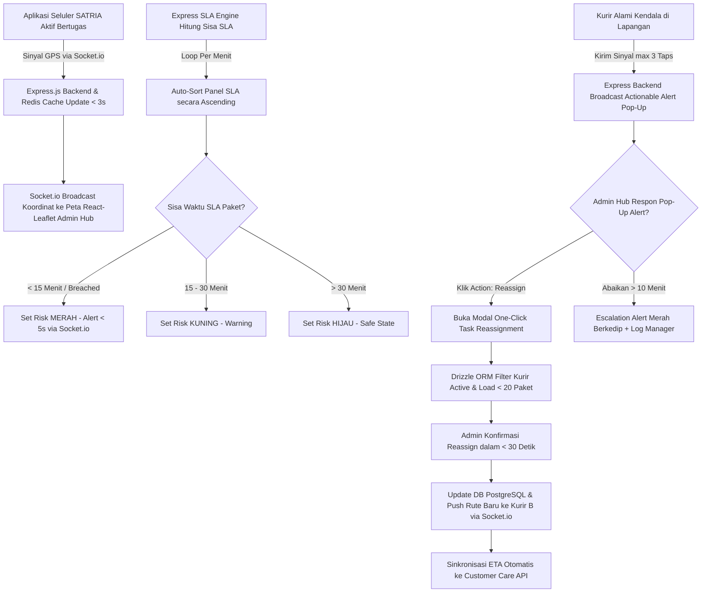

# Functional Requirement Document (FRD Induk / Master FRD)
## Courier Admin Mini-Panel Anteraja

**Nama Sistem:** Courier Admin Mini-Panel System  
**Dokumen Version:** v3.0 (Master Functional Requirement Document)  
**Status:** Approved for System Engineering  
**Arsitektur & Tech Stack:** Node.js, Express.js, React.js, Tailwind CSS, Socket.io, Redis Cache, PostgreSQL, Drizzle ORM  
**Target Rilis:** 8-Week Release Plan (Phase 1 MVP: Weeks 1–4, Phase 2 Extension: Weeks 5–8)  

---

### 1. Konteks
Dokumen **FRD Induk (Master FRD)** ini berfungsi sebagai landasan spesifikasi fungsional utama yang mengintegrasikan seluruh modul operasional (*Live Monitoring Map*, *SLA Risk Indicator Panel*, *One-Click Task Reassignment*, dan *Quick Incident Reporting*) dalam satu arsitektur sistem terpadu. Dokumen ini merujuk langsung pada **PRD-Javascript.md** untuk mengatasi akar masalah ketiadaan visibilitas lokasi kurir secara *real-time*, koordinasi kendala yang terisolasi, serta identifikasi keterlambatan yang bersifat reaktif. Tujuan utamanya adalah memastikan pencapaian target KPI bisnis: tingkat kepatuhan SLA **97.5%**, percepatan penanganan kendala hingga **75%**, durasi penugasan ulang **< 30 detik**, tingkat *re-delivery* **< 2.0%**, dan penekanan pesan manual **< 25 pesan/hari**.

---

### 2. Peran & Hak Akses (Global Access Matrix)

| Peran (Role) | Lihat (Read) | Buat (Create) | Ubah (Update) | Setujui (Approve) | Field Terkunci (Locked Fields) |
| :--- | :--- | :--- | :--- | :--- | :--- |
| **Admin Hub Operasional** | ✅ Ya | ✅ Ya (Incident Response) | ✅ Ya (Task Reassign / Filter) | ✅ Ya (Confirm Action) | `courier_live_lat`, `courier_live_long`, `Order_ID`, `original_courier_id` |
| **Kurir SATRIA (Mobile App)** | ✅ Ya (Rute Sendiri) | ✅ Ya (GPS Telemetry / Lapor Kendala) | ❌ Tidak | ❌ Tidak | `Store_Latitude`, `Drop_Latitude`, `sla_deadline`, `assigned_by_admin_id` |
| **System (Express Backend / Socket.io)** | ✅ Ya | ✅ Ya (Log GPS / Alert Audit) | ✅ Ya (State Marker & SLA Status) | ✅ Ya (Auto-Sort & Escalation) | `order_timestamp`, `reassignment_timestamp` |
| **Customer Care / Manager Hub** | ✅ Ya (Read-Only) | ❌ Tidak | ❌ Tidak | ❌ Tidak | Semua Field Sistem |

---

### 3. Alur Sistem Terintegrasi (System-Wide Workflow & EARS Pattern)



##### Pernyataan Alur Kebutuhan Sistem (EARS Pattern):
* **KETIKA** perangkat seluler kurir SATRIA terhubung ke jaringan internet, sistem **harus** mentransmisikan koordinat GPS (`courier_live_lat`, `courier_live_long`) ke Express.js backend via Socket.io setiap 5 detik.
* **KETIKA** Express.js backend menerima pembaruan telemetri GPS, sistem **harus** memperbarui posisi penanda (*marker*) kurir pada Peta Pemantauan Langsung dalam latensi maksimal 3 detik.
* **KETIKA** paket dipindai dan dibawa kurir (`Pickup_Time`), sistem **harus** menghitung `sla_deadline` berdasarkan estimasi `Delivery_Time` dan memperbarui sisa waktu SLA secara otomatis setiap menit.
* **JIKA** sisa waktu SLA paket kurang dari 15 menit atau telah melampaui batas, sistem **harus** memberikan penanda warna **Merah** dan memicu peringatan visual pada dasbor admin dalam waktu < 5 detik.
* **JIKA** koneksi GPS kurir terputus > 15 detik, sistem **harus** mengubah warna penanda kurir menjadi abu-abu (*Offline*) dan mencatat status jaringan terputus di Redis Cache.
* **JIKA** kurir mengirimkan laporan kendala fisik dari aplikasi seluler, sistem **harus** memunculkan notifikasi *pop-up* aksi (*actionable alert*) pada dasbor admin dalam durasi < 5 detik.
* **SELAMA** kurir berstatus *Active/On-Duty*, sistem **harus** menampilkan radius titik tujuan pengiriman paket (`Drop_Latitude`, `Drop_Longitude`) yang menjadi tanggung jawab kurir tersebut.

---

### 4. Aturan Bisnis Global (Business Rules)

| ID Rule | Kondisi / Pemicu | Hasil / Perilaku Sistem | Pengecualian |
| :--- | :--- | :--- | :--- |
| **BR-01** | Telemetri GPS diterima via Socket.io. | Pembaruan penanda kurir pada peta React.js selesai dalam latensi **≤ 3.0 detik**. | Terjadi pemutusan jaringan lokal pada dasbor Admin Hub. |
| **BR-02** | Sinyal GPS terputus selama **> 15 detik**. | Sistem mengubah warna penanda kurir menjadi **Abu-abu (Offline)** dan mencatat log jaringan terputus. | Kurir dalam status *Off-Duty* atau *Shift Ended*. |
| **BR-03** | Perhitungan `sla_remaining_time` **< 15 menit** atau **< 0 menit**. | Status risiko di-set **HIGH_RISK / BREACHED** dengan warna baris **Merah Flashing** dan notifikasi < 5 detik. | Paket berstatus *Delivered* atau *Returned*. |
| **BR-04** | Perhitungan `sla_remaining_time` **15 – 30 menit**. | Status risiko di-set **MEDIUM_RISK** dengan warna baris **Kuning**. | - |
| **BR-05** | Paket mengalami kondisi `Weather = Stormy` atau `Traffic = Jam`. | Sistem memotong kalkulasi sisa waktu SLA sebesar **15% (Buffer Waktu Hambatan)** secara otomatis. | Pengiriman menggunakan moda kendaraan *van* di area *Urban*. |
| **BR-06** | Kurir terhenti (kecepatan 0 km/jam) selama **> 10 menit** di luar titik tujuan. | Penanda kurir diberi indikator **Idle Alert (Kuning Pulsasi)**. | Kurir berada di koordinat penyerahan (`Drop_Latitude`/`Longitude`). |
| **BR-07** | Admin memindahkan beban tugas paket (*Task Reassignment*). | Seluruh alur pengalihan dari klik admin hingga rute diterima kurir B wajib selesai **< 30.0 detik**. | Terjadi kegagalan koneksi total (*total network blackout*). |
| **BR-08** | Pemilihan kurir penerima pengalihan (*assignee*). | Sistem hanya merekomendasikan kurir berstatus **ONLINE** dengan beban paket aktif **< 20 paket**. | Admin mengaktifkan opsi *Override Force Assign* darurat. |
| **BR-09** | Pelaporan kendala fisik dari aplikasi seluler kurir. | Proses pelaporan di aplikasi seluler wajib selesai dalam **maksimal 3 ketukan layar (taps)**. | Kurir wajib melampirkan foto bukti fisik hambatan. |
| **BR-10** | Kendala tidak ditanggapi admin dalam waktu **> 10 menit**. | Sistem menaikkan skala notifikasi (*escalation alert*) menjadi **Merah Berkedip** dan mengirim log ke Manager Hub. | Kendala berkategori *Low Priority* (`Weather = Cloudy`). |

---

### 5. Glosarium Istilah Operasional

* **SATRIA:** Sebutan resmi untuk staf Kurir Lapangan Anteraja.
* **Admin Hub:** Petugas operasional di Stasiun Layanan (Hub) yang mengatur lalu lintas dan alokasi paket harian.
* **Telemetry GPS:** Aliran data koordinat lokasi (*latitude*, *longitude*) yang ditransmisikan secara kontinu dari perangkat seluler kurir.
* **SLA (Service Level Agreement):** Batas waktu maksimal penyelesaian pengiriman paket dari penjemputan hingga penyerahan kepada penerima.
* **SLA Breached:** Kondisi operasional saat durasi pengiriman paket melampaui batas waktu SLA yang dijanjikan.
* **Local Buffering:** Penyimpanan data koordinat GPS sementara pada memori perangkat seluler kurir saat koneksi internet terputus.
* **Actionable Alert:** Notifikasi *pop-up* pada dasbor admin yang dilengkapi tombol tindakan langsung (misalnya tombol "Pengalihan Rute Instan").
* **Cross-Highlighting:** Fitur interaksi yang menghubungkan pemilihan data pada tabel panel SLA dengan *auto-zoom* penanda lokasi di peta.
* **Escalation Alert:** Peringatan susulan yang dipicu secara otomatis jika suatu kendala tidak ditanggapi admin dalam rentang waktu yang ditentukan.
* **Audit Log:** Catatan riwayat aktivitas sistem yang mencatat identitas eksekutor, stempel waktu, dan rincian perubahan data.

---

### 6. Data Utama & Status Transisi Global

##### Skema Data Utama Terintegrasi:
* `Order_ID` (String - Unique Identifier / Nomor Resi)
* `Agent_Age` & `Agent_Rating` (Integer / Float - Profil Kurir)
* `Store_Latitude` & `Store_Longitude` (Float - Titik Hub / Asal)
* `Drop_Latitude` & `Drop_Longitude` (Float - Titik Tujuan)
* `courier_live_lat` & `courier_live_long` (Float - Telemetri Real-Time)
* `Order_Date`, `Order_Time`, `Pickup_Time` (Timestamp - Waktu Operasional)
* `Weather` & `Traffic` (Enum - Kondisi Lingkungan)
* `Vehicle` (`motorcycle`, `scooter`, `van`) & `Area` (`Urban`, `Metropolitian`)
* `Delivery_Time` (Integer - Durasi Pengiriman dalam Menit)
* `sla_remaining_time` (Computed Integer - Menit Sisa SLA)
* `sla_status` (`SAFE`, `MEDIUM_RISK`, `HIGH_RISK`, `BREACHED`)
* `courier_status` (`OFFLINE`, `ONLINE`, `IDLE`, `OFF-DUTY`)
* `incident_status` (`REPORTED`, `ACKNOWLEDGED`, `RESOLVED`, `ESCALATED`)

##### Diagram Transisi Status Global:
```
[Status Kurir]:    OFFLINE (Abu-abu) <---> ONLINE (Hijau) ---> IDLE (Kuning Pulsasi) ---> OFF-DUTY
[Status SLA]:      SAFE (Hijau >30m) ---> MEDIUM_RISK (Kuning 15-30m) ---> HIGH_RISK (Merah <15m) ---> BREACHED
[Status Kendala]:  REPORTED (Baru) ---> ACKNOWLEDGED (Dibaca) ---> RESOLVED (Selesai) / ESCALATED (Abaikan >10m)
```

---

### 7. Daftar Fungsi Utama (System Function Breakdown)

* **F-01: Live Monitoring Map Module**
  * **F-01.1 Telemetry Receiver Service:** Menerima dan memvalidasi payload GPS dari kurir via Socket.io.
  * **F-01.2 Interactive Map Renderer:** Menampilkan peta React-Leaflet dengan *marker* kurir dan titik tujuan paket.
  * **F-01.3 Info Popup Component:** Menampilkan rincian paket dan kurir secara instan saat penanda diklik.
  * **F-01.4 Connection & Offline Handler:** Mengelola indikator sinyal dan sinkronisasi *local buffering*.
* **F-02: SLA Risk Indicator Panel Module**
  * **F-02.1 Dynamic SLA Calculator Engine:** Menghitung sisa waktu SLA secara *real-time* berbasis waktu server dan variabel hambatan.
  * **F-02.2 Auto-Sorting Risk List Component:** Mengurutkan daftar paket secara *ascending* pada tabel React.
  * **F-02.3 Visual Risk Color Coder:** Menerapkan pengkodean warna dinamis (Merah, Kuning, Hijau).
  * **F-02.4 Map Cross-Highlight Synchronizer:** Menghubungkan klik baris tabel dengan *auto-zoom* lokasi peta.
* **F-03: One-Click Task Reassignment Module**
  * **F-03.1 Courier Reassignment Evaluator:** Memfilter dan merekomendasikan kurir penerima tugas yang aktif dan tidak *overload*.
  * **F-03.2 One-Click Execution Controller:** Memproses pemindahan tugas di PostgreSQL dan Redis Cache dalam < 2 detik.
  * **F-03.3 Dispatch & ETA Synchronizer:** Mengirim push notification ke kurir B dan memperbarui ETA di Customer Care API.
* **F-04: Quick Incident Reporting Module**
  * **F-04.1 Mobile Incident Dispatcher:** Antarmuka mobile 3 ketukan layar untuk pengiriman sinyal kendala.
  * **F-04.2 Actionable Alert Engine:** Layanan Socket.io memicu *pop-up alert* interaktif di dasbor admin.
  * **F-04.3 Quick Action Handler:** Memproses tombol aksi cepat (*Reassign* / *Adjust SLA Buffer*).
  * **F-04.4 Escalation & History Logger:** Menangani eskalasi waktu dan pencatatan audit log di PostgreSQL.

---

### 8. Acceptance Criteria (AC) Alur Utama System-Wide (Data Nyata)

##### Skenario End-to-End: Deteksi Risiko SLA, Pelaporan Kendala, dan Pengalihan Tugas 1-Klik
* **Diberikan:** 
  * Admin Hub (Siti) membuka dasbor *Courier Admin Mini-Panel*.
  * Kurir Budi (Agent_Age: 37, Agent_Rating: 4.9, Vehicle: motorcycle) membawa paket resi `ialx566343618` di lokasi awal `Store_Latitude: 22.745049`, `Store_Longitude: 75.892471` dengan estimasi `Delivery_Time: 120` menit.
  * Kurir Agus (Agent_Age: 34, Agent_Rating: 4.5, Vehicle: scooter) berada di area yang sama dengan status **ONLINE** dan membawa **12 paket aktif** (< 20 paket).

* **Ketika:** 
  1. Pada pukul 11:45:00, sepeda motor Kurir Budi mengalami ban bocor di lokasi `courier_live_lat: 22.755049`, `courier_live_long: 75.902471` saat kondisi `Weather: Sunny` dan `Traffic: High`.
  2. Kurir Budi membuka aplikasi SATRIA, mengklik "Lapor Kendala" -> "Ban Bocor" -> "Kirim" (3 ketukan layar, memenuhi BR-09).
  3. Sinyal dikirim via Socket.io ke Express backend. Sisa waktu SLA paket `ialx566343618` terhitung tinggal **12 menit** (< 15 menit, memenuhi BR-03).
  4. Admin Siti menerima notifikasi *pop-up* aksi warna **Merah** "Kendala Ban Bocor - Kurir Budi (Resi ialx566343618)" pada pukul 11:45:03 (latensi **3.0 detik**, memenuhi BR-01 ≤ 3s & BR-10 ≤ 5s). Baris resi `ialx566343618` di panel SLA berada di posisi paling atas dengan warna **Merah Flashing**.
  5. Admin Siti mengklik tombol "Pengalihan Rute Instan" pada *pop-up*. Sistem menampilkan modal rekomendasi kurir dan memfilter Kurir Agus sebagai penerima utama.
  6. Admin Siti memilih Kurir Agus dan mengklik "Konfirmasi Pengalihan Satu-Klik" pada pukul 11:45:20.

* **Maka:** 
  1. Drizzle ORM memperbarui alokasi resi `ialx566343618` dari Kurir Budi ke Kurir Agus di database PostgreSQL dan Redis Cache dalam waktu **1.2 detik**.
  2. Socket.io mentransmisikan *push notification* rute baru ke aplikasi seluler Kurir Agus dan memperbarui estimasi tiba (*ETA*) di API Customer Care pada pukul 11:45:22 (total durasi pengalihan **22.0 detik**, memenuhi BR-07 < 30 detik).
  3. Dasbor Admin Siti menampilkan pesan sukses "Paket ialx566343618 Berhasil Dialihkan ke Kurir Agus", penanda pada peta diperbarui, dan status kendala berubah menjadi **RESOLVED**.

---

### 9. Tidak Termasuk (Global Out-of-Scope)

* **Automated AI/ML Route Re-assignment:** Sistem tidak melakukan pemindahan tugas otomatis secara mandiri tanpa konfirmasi manual dari Admin Hub.
* **Full Mobile App Development:** Sistem tidak membangun aplikasi seluler kurir baru dari awal, melainkan menggunakan integrasi API/WebSocket pada aplikasi SATRIA yang sudah berjalan.
* **Public Customer Tracking Page:** Antarmuka pemantauan peta ini tidak dapat diakses oleh publik atau pembeli *e-commerce*.
* **Customer SMS/WhatsApp Notification Engine:** Sistem tidak mengirimkan pesan notifikasi keterlambatan langsung ke nomor pribadi konsumen.
* **Third-Party Emergency Dispatch:** Sistem tidak terhubung langsung dengan layanan panggilan darurat kepolisian, ambulans, atau bengkel eksternal.
