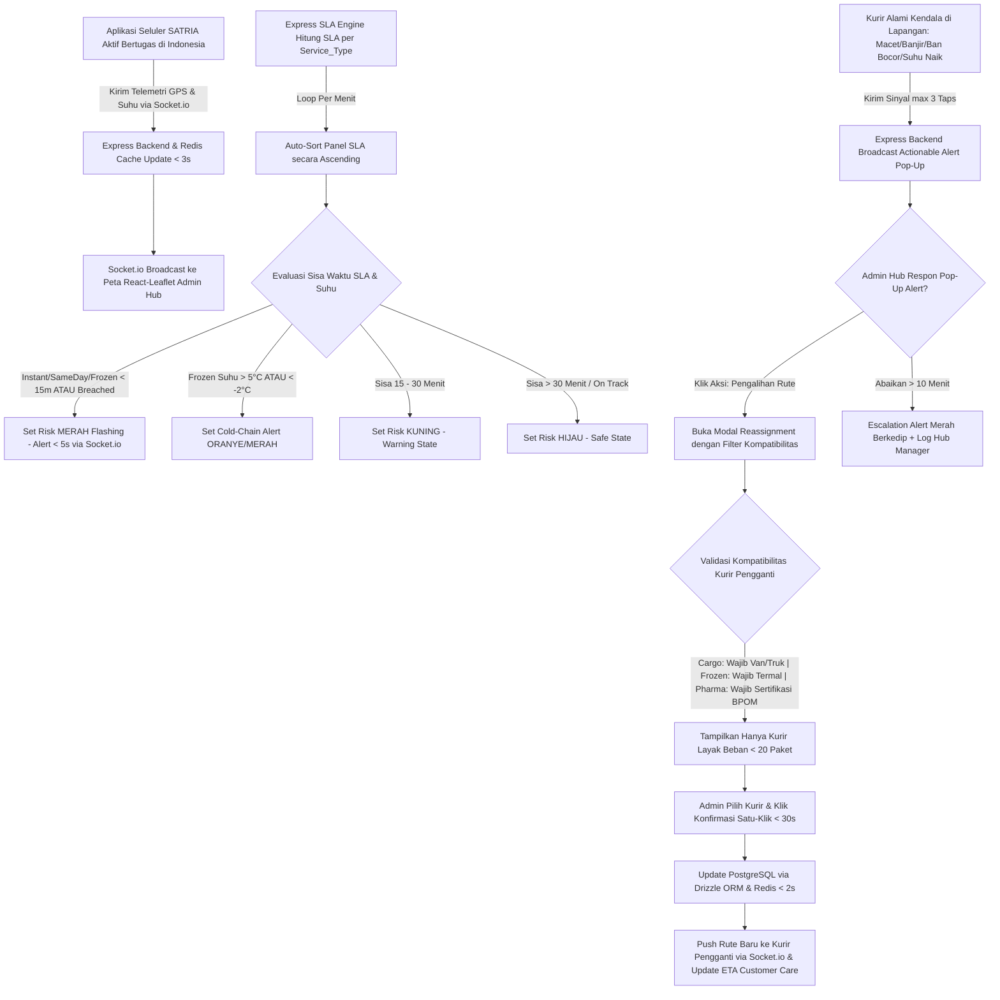

# Functional Requirement Document (FRD Induk / Master FRD)
## Courier Admin Mini-Panel Anteraja

**Nama Sistem:** Courier Admin Mini-Panel System  
**Dokumen Version:** v4.0 (Master Functional Requirement Document — Multi-Service Logistics)  
**Status:** Approved for System Engineering  
**Arsitektur & Tech Stack:** Node.js, Express.js, React.js, Tailwind CSS, Socket.io, Redis Cache, PostgreSQL, Drizzle ORM  
**Target Rilis:** 8-Week Release Plan (Phase 1 MVP: Weeks 1–4, Phase 2 Extension: Weeks 5–8)  

---

### 1. Konteks
Dokumen **FRD Induk (Master FRD)** ini berfungsi sebagai landasan spesifikasi fungsional utama yang mengintegrasikan seluruh modul operasional (*Live Monitoring Map*, *SLA Risk Indicator Panel*, *One-Click Task Reassignment*, dan *Quick Incident Reporting*) dalam satu arsitektur sistem terpadu di lingkungan operasional Anteraja Indonesia. Dokumen ini merujuk langsung pada [`docs/00-PRD-courier-admin-mini-panel.md`].

Sistem ini dirancang untuk mengatasi kompleksitas operasional logistik Anteraja yang menangani **9 Jenis Layanan Pengiriman (Delivery Services)** di berbagai kota dan rute di Indonesia (Jabodetabek, Jawa, hingga antarpulau):
1. **Regular** (1-2 hari Jawa/Jabodetabek, 2-4 hari antar provinsi, 5-9 hari nasional).
2. **Same Day** (Kirim pagi, tiba hari ini maks 22.00 WIB).
3. **Next Day** (Tiba dalam 24 jam / H+1).
4. **Instant** (Langsung titik jemput ke penerima tanpa transit, durasi 1-3 jam via API).
5. **Dokumen** (Penanganan khusus berkas penting/kartu nasabah dengan SLA Regular).
6. **Cargo** (Paket berat/besar hingga 300 kg, maks 100x100x180 cm, SLA 1-3 hari, armada truk/van).
7. **Mini Cargo** (Paket UMKM berat > 4 kg, SLA 1-3 hari).
8. **PHARMA** (Alkes dan obat berstandar BPOM, pengawasan suhu, kurir SATRIA tersertifikasi).
9. **Frozen** (Produk beku & sensitif suhu -2°C s/d 5°C, perlengkapan pendingin aktif, tiba hari yang sama).

Tujuan utamanya adalah memastikan pencapaian target KPI bisnis: kepatuhan SLA **≥ 97.5%**, respon kendala **< 3 menit**, durasi penugasan ulang **< 30 detik**, penekanan kegagalan suhu & dokumen rusak **< 0.5%**, dan pengurangan pesan manual **< 25 pesan/hari/hub**.

---

### 2. Peran & Hak Akses (Global Access Matrix)

| Peran (Role) | Lihat (Read) | Buat (Create) | Ubah (Update) | Setujui (Approve) | Field Terkunci (Locked Fields) |
| :--- | :---: | :---: | :---: | :---: | :--- |
| **Admin Hub Operasional** | ✅ Ya | ✅ Ya (Incident Response) | ✅ Ya (Filter, Task Reassign) | ✅ Ya (Confirm Action) | `courier_live_lat`, `courier_live_long`, `Order_ID`, `original_courier_id`, `Temperature_C` (telemetri) |
| **Kurir SATRIA (Mobile App)** | ✅ Ya (Rute Sendiri) | ✅ Ya (GPS Telemetri / Lapor Kendala / Suhu) | ❌ Tidak | ❌ Tidak | `Store_Latitude`, `Drop_Latitude`, `SLA_Deadline`, `assigned_by_admin_id`, `Service_Type` |
| **System (Express Backend / Socket.io)** | ✅ Ya | ✅ Ya (Log GPS, Audit Reassign, Alert Log) | ✅ Ya (Hitung SLA Dinamis, Status Marker) | ✅ Ya (Auto-Sort, Auto-Escalation) | `Order_Date`, `Order_Time`, `Pickup_Time`, `reassignment_timestamp` |
| **Customer Care / Hub Manager** | ✅ Ya (Read-Only) | ❌ Tidak | ❌ Tidak | ❌ Tidak | Semua Field Sistem |

---

### 3. Alur Sistem Terintegrasi (System-Wide Workflow & EARS Pattern)



##### Pernyataan Alur Kebutuhan Sistem (EARS Pattern):
* **KETIKA** perangkat seluler kurir SATRIA terhubung ke internet, sistem **harus** mentransmisikan koordinat GPS (`Courier_Live_Lat`, `Courier_Live_Long`) dan pembacaan sensor suhu termal (`Temperature_C` untuk layanan *Frozen*) ke Express backend via Socket.io setiap 5 detik.
* **KETIKA** Express backend menerima data telemetri, sistem **harus** memperbarui penanda (*marker*) posisi kurir pada Peta Pemantauan Langsung dalam latensi maksimal 3.0 detik.
* **KETIKA** paket dipindai dan dibawa kurir (`Pickup_Time`), sistem **harus** mengkalkulasi `SLA_Deadline` sesuai formula `Service_Type` (misal: *Instant* 1-3 jam, *Same Day & Frozen* maks 22.00 WIB, *Next Day* 24 jam, *Regular & Dokumen* 1-2 hari Jawa / 2-4 hari antar provinsi, *Cargo* 1-3 hari).
* **JIKA** sisa waktu SLA layanan berdurasi cepat (*Instant*, *Same Day*, *Frozen*) kurang dari 15 menit atau telah melewati batas, sistem **harus** menetapkan status risiko **HIGH_RISK / BREACHED** (Merah Flashing) dalam waktu < 5 detik.
* **JIKA** sensor suhu paket *Frozen* mencatat suhu di luar rentang aman (-2°C hingga 5°C), sistem **harus** memunculkan peringatan kritis rantai dingin (*Cold-Chain Alert*) pada marker kurir dan panel admin.
* **JIKA** Admin Hub memicu pengalihan tugas, sistem **harus** memvalidasi kualifikasi kurir pengganti berdasarkan jenis kendaraan, kapasitas berat (maks 300 kg untuk Cargo, > 4 kg untuk Mini Cargo), perlengkapan tas termal (*Frozen*), dan sertifikasi BPOM (*PHARMA*).
* **SELAMA** kurir bertugas aktif, sistem **harus** menampilkan titik tujuan pengiriman paket (`Drop_Latitude`, `Drop_Longitude`) serta alamat tujuan di wilayah Indonesia.

---

### 4. Aturan Bisnis Global (Business Rules)

| ID Rule | Kondisi / Pemicu | Hasil / Perilaku Sistem | Pengecualian |
| :--- | :--- | :--- | :--- |
| **BR-01** | Telemetri GPS kurir diterima via Socket.io. | Pembaruan penanda posisi kurir pada peta React-Leaflet selesai dalam latensi **≤ 3.0 detik**. | Terjadi pemutusan jaringan lokal di komputer Admin Hub. |
| **BR-02** | Sinyal telemetri kurir terputus selama **> 15 detik**. | Sistem mengubah warna penanda kurir menjadi **Abu-abu (Offline)** dan mencatat log putus koneksi di Redis. | Kurir telah menyelesaikan seluruh rute (*Off-Duty*). |
| **BR-03** | Kalkulasi SLA Dinamis per `Service_Type`. | Sistem menghitung `SLA_Remaining_Minutes` berdasarkan target layanan:<br>• **Instant:** 1–3 jam dari `Pickup_Time`.<br>• **Same Day & Frozen:** Wajib selesai maksimal pukul **22.00 WIB** hari berjalan.<br>• **Next Day:** Maksimal 24 jam (H+1) dari `Pickup_Time`.<br>• **Regular & Dokumen:** 24–48 jam (Jawa) / 48–96 jam (Luar Jawa).<br>• **Cargo & Mini Cargo:** 24–72 jam (1–3 hari). | Paket dengan status *Delivered* atau *Returned*. |
| **BR-04** | Ambang Batas Risiko SLA (`SLA_Status`). | • `SLA_Remaining_Minutes < 15` atau `< 0`: **HIGH_RISK / BREACHED** (Merah Flashing).<br>• `SLA_Remaining_Minutes 15 – 30`: **MEDIUM_RISK** (Kuning).<br>• `SLA_Remaining_Minutes > 30`: **SAFE** (Hijau). | Pada layanan berdurasi hari, status dinaikkan jika sisa waktu mendekati *cutoff* operasional harian. |
| **BR-05** | Hambatan Lingkungan Tropis Indonesia (`Weather = Hujan Deras/Banjir` atau `Traffic = Macet Total`). | Sistem secara otomatis memotong estimasi sisa SLA sebesar **15% (Buffer Waktu Hambatan)** untuk memicu peringatan dini. | Armada beroperasi menggunakan moda `Cargo_Truck` di jalur tol bebas hambatan. |
| **BR-06** | Pemantauan Suhu Rantai Dingin (*Frozen Cold-Chain*). | Jika paket berlayanan `Frozen` mencatat suhu **> 5.0°C** atau **< -2.0°C**, sistem memicu **Critical Temperature Alert (Oranye/Merah)** instan dalam waktu ≤ 3.0 detik. | Sensor sedang dalam proses inisialisasi awal (< 2 menit pertama). |
| **BR-07** | Eksekusi Pengalihan Tugas (*One-Click Task Reassignment*). | Total durasi dari klik admin hingga rute baru diterima kurir pengganti wajib **< 30.0 detik** (proses database PostgreSQL & Redis **< 2.0 detik**). | Gangguan koneksi total jaringan (*total blackout*). |
| **BR-08** | Matriks Kompatibilitas Kurir Pengganti (*Compatibility Matching Matrix*):<br>1. Layanan `Cargo` (> 40 kg / volume besar) wajib armada `Van` atau `Cargo_Truck`.<br>2. Layanan `Frozen` wajib kurir dengan `thermal_equipment = True`.<br>3. Layanan `PHARMA` wajib kurir dengan sertifikasi BPOM `pharma_certified = True`. | Sistem secara otomatis menyaring kurir kandidat yang tidak memenuhi spesifikasi dan hanya menampilkan kurir kompatibel dengan beban **< 20 paket**. | Admin menggunakan hak otorisasi darurat (*Super Admin Force Override*). |
| **BR-09** | Mekanisme Pelaporan Kendala Cepat Seluler. | Kurir dapat mengirimkan laporan kendala lapangan dalam **maksimal 3 ketukan layar (taps)** di aplikasi seluler SATRIA. | Laporan kendala yang mewajibkan foto bukti kerusakan fisik/kecelakaan. |
| **BR-10** | Eskalasi Kendala Tidak Ditanggapi. | Jika kendala status `REPORTED` tidak ditanggapi admin dalam waktu **> 10 menit**, sistem menaikkan prioritas menjadi **ESCALATED (Alarm Berkedip)** dan mengirim log ke Hub Manager. | Kendala berkategori *Low Priority* (`Weather = Berawan`). |

---

### 5. Glosarium Istilah Operasional

* **SATRIA:** Sebutan resmi kurir lapangan Anteraja (*Sistem Antar Terpadu Cepat Indonesia*).
* **Admin Hub:** Pengatur operasional harian di Stasiun Layanan (Hub/Staging Store) Anteraja tingkat kota/kecamatan di Indonesia.
* **Service Level Agreement (SLA):** Batas waktu maksimal penyelesaian penyerahan paket yang dijanjikan Anteraja kepada pelanggan sesuai tipe layanan.
* **Instant:** Layanan penjemputan dan pengantaran langsung tanpa transit dari gerai mitra ke penerima akhir dalam durasi 1–3 jam.
* **Same Day:** Layanan pengiriman dengan jaminan tiba di hari yang sama maksimal pukul 22.00 WIB.
* **Next Day:** Layanan pengiriman terjadwal tiba esok hari (H+1 / 24 jam).
* **Regular:** Layanan pengiriman standar ke seluruh penjuru Indonesia (1–2 hari Jawa, 2–4 hari antarprovinsi, 5–9 hari luar Jawa).
* **Dokumen:** Layanan pengiriman dokumen berharga dengan amplop segel keamanan khusus (*tamper-evident pouch*).
* **Cargo:** Layanan pengiriman barang berat/besar hingga 300 kg menggunakan armada mobil boks atau truk kargo.
* **Mini Cargo:** Layanan pengiriman paket UMKM berukuran sedang dengan berat di atas 4 kg.
* **PHARMA:** Layanan distribusi produk farmasi, reagen laboratorium, dan alat kesehatan berstandar regulasi BPOM.
* **Frozen:** Layanan pengiriman makanan/minuman beku bersuhu terkontrol (-2°C hingga 5°C) yang tiba di hari yang sama.
* **Cold-Chain Alert:** Peringatan visual otomatis jika suhu pada paket Frozen berada di luar ambang aman (-2°C s/d 5°C).
* **Tamper-Evident Pouch:** Amplop bersegel khusus bernomor seri unik yang menunjukkan tanda visual jika telah dibuka secara ilegal.
* **Compatibility Matching Engine:** Logika sistem yang memvalidasi kelaikan kurir penerima pengalihan tugas berdasarkan tipe kendaraan, perlengkapan pendingin, dan sertifikasi.

---

### 6. Data Utama & Status Transisi Global

##### Skema Data Utama Terintegrasi (`delivery.csv`):
* `Order_ID` (String - Nomor Resi simulasi Anteraja, format: `1000XXXXXXXXXX`)
* `Service_Type` (`Regular`, `Same Day`, `Next Day`, `Instant`, `Dokumen`, `Cargo`, `Mini Cargo`, `PHARMA`, `Frozen`)
* `Courier_ID` (String - ID Unik Kurir SATRIA, misal: `STR-JKT-001`)
* `Courier_Name` (String - Nama Kurir SATRIA)
* `Hub_Origin` (String - Identitas Hub Asal di Indonesia, misal: `HUB-JAKSEL-TEBET`)
* `Store_Latitude` & `Store_Longitude` (Float - Koordinat Hub Asal di Indonesia)
* `Destination_Address` & `Destination_City` (String - Alamat dan Kota Tujuan di Indonesia)
* `Drop_Latitude` & `Drop_Longitude` (Float - Koordinat Titik Penerima)
* `Courier_Live_Lat` & `Courier_Live_Long` (Float - Koordinat Telemetri Kurir Terkini)
* `Order_Date`, `Order_Time`, `Pickup_Time` (Timestamp Waktu Operasional)
* `Weight_Kg` (Float - Berat Aktual Paket)
* `Dimensions_Cm` (String - Dimensi Paket: Panjang x Lebar x Tinggi)
* `Special_Handling` (`Standard`, `Cold_Chain_-2_to_5C`, `BPOM_Pharma`, `Secure_Document_Pouch`, `Heavy_Cargo`, `Bulky_UMKM`, `Instant_Direct`)
* `Temperature_C` (String/Float - Pembacaan Suhu untuk Frozen/Pharma, atau `N/A`)
* `Weather` (`Cerah`, `Berawan`, `Gerimis`, `Hujan Deras`, `Banjir`)
* `Traffic` (`Lancar`, `Sedang`, `Padat`, `Macet Total`)
* `Vehicle` (`Motorcycle`, `Van`, `Cargo_Truck`)
* `Delivery_Status` (`Assigned`, `In_Transit`, `Delivered`, `Incident_Reported`)
* `SLA_Deadline` (Timestamp - Batas Waktu Akhir Pengantaran)
* `Delivery_Time_Minutes` (Integer - Durasi Total Alokasi SLA dalam Menit)
* `SLA_Remaining_Minutes` (Integer - Sisa Waktu SLA Menuju Batas)
* `SLA_Status` (`SAFE`, `MEDIUM_RISK`, `HIGH_RISK`, `BREACHED`)
* `Category` (String - Kategori Barang)

##### Diagram Transisi Status Global:
```
[Status Kurir]:    OFFLINE (Abu-abu) <---> ONLINE (Hijau) ---> IDLE (Kuning Pulsasi) ---> OFF-DUTY
[Status SLA]:      SAFE (Hijau >30m) ---> MEDIUM_RISK (Kuning 15-30m) ---> HIGH_RISK (Merah <15m) ---> BREACHED
[Status Suhu]:     OPTIMAL (-2°C s/d 5°C) ---> TEMPERATURE_BREACH (Oranye/Merah >5°C)
[Status Kendala]:  REPORTED (Baru) ---> ACKNOWLEDGED (Dibaca) ---> RESOLVED (Selesai) / ESCALATED (Abaikan >10m)
```

---

### 7. Daftar Fungsi Utama (System Function Breakdown)

* **F-01: Live Monitoring Map Module**
  * **F-01.1 Telemetry Receiver Service:** Menerima payload koordinat GPS kurir dan data suhu rantai dingin via Socket.io.
  * **F-01.2 Interactive Multi-Service Map Renderer:** Menampilkan peta React-Leaflet wilayah Indonesia dengan pemfilteran 9 jenis layanan dan diferensiasi ikon kendaraan (*Motorcycle*, *Van*, *Cargo Truck*).
  * **F-01.3 Info Popup Component:** Menampilkan rincian paket, nama kurir SATRIA, tipe layanan, suhu termal, dan sisa SLA secara instan saat marker diklik.
  * **F-01.4 Cold-Chain & Offline Handler:** Mengelola deteksi anomali suhu produk beku dan indikator pemutusan sinyal kurir (*Offline*).

* **F-02: SLA Risk Indicator Panel Module**
  * **F-02.1 Multi-Service SLA Calculator Engine:** Menghitung sisa SLA secara dinamis dengan formula spesifik 9 layanan (*Instant*, *Same Day*, *Next Day*, *Regular*, *Dokumen*, *Cargo*, *Mini Cargo*, *PHARMA*, *Frozen*).
  * **F-02.2 Auto-Sorting Risk List Component:** Mengurutkan daftar paket secara *ascending* (paket terancam terlambat di posisi teratas) berbasis waktu server.
  * **F-02.3 Visual Risk Color Coder:** Menerapkan pengkodean warna dinamis (Merah Flashing, Kuning, Hijau) pada baris tabel.
  * **F-02.4 Map Cross-Highlight Synchronizer:** Menghubungkan klik baris tabel paket dengan *auto-zoom* posisi kurir dan titik tujuan di peta.

* **F-03: One-Click Task Reassignment Module**
  * **F-03.1 Compatibility Matching Evaluator:** Menyaring kurir rekomendasi berdasarkan kualifikasi armada (motor vs van/truk), ketersediaan tas termal (*Frozen*), dan sertifikasi BPOM (*PHARMA*), dengan batas beban aktif < 20 paket.
  * **F-03.2 One-Click Execution Controller:** Memproses pemindahan tugas di PostgreSQL via Drizzle ORM dan Redis Cache dalam waktu < 2.0 detik.
  * **F-03.3 Mobile Route Push Dispatcher:** Mengirimkan sinyal pembaruan rute pengiriman ke kurir pengganti via Socket.io dan menyinkronkan ETA ke Customer Care API.

* **F-04: Quick Incident Reporting Module**
  * **F-04.1 Mobile Incident Dispatcher:** Antarmuka aplikasi seluler SATRIA 3 ketukan layar untuk pengiriman sinyal kendala (cuaca banjir, macet total, kendaraan mogok, anomali suhu pendingin, segel rusak).
  * **F-04.2 Actionable Alert Engine:** Layanan Socket.io memicu *pop-up alert* interaktif di dasbor admin dalam latensi ≤ 5.0 detik.
  * **F-04.3 Quick Action Handler:** Menyediakan tombol aksi langsung: "Pengalihan Rute Instan" (terkoneksi F-03) dan "Perpanjang SLA Buffer".
  * **F-04.4 Escalation & Audit Logger:** Menangani eskalasi alarm jika kendala tidak ditanggapi > 10 menit serta mencatat audit log lengkap di database.

---

### 8. Acceptance Criteria (AC) Alur Utama System-Wide

##### Skenario End-to-End: Deteksi Anomali Suhu Layanan Frozen, Pelaporan Kendala, dan Pengalihan Tugas Kompatibel
* **Diberikan:** 
  * Admin Hub (Siti) membuka dasbor *Courier Admin Mini-Panel* di Stasiun Layanan Hub Anteraja Jakarta Selatan (Tebet).
  * Kurir Rizky Pratama (`Vehicle`: `Motorcycle`, membawa tas termal pendingin aktif) membawa paket resi `100024000009` (Layanan: `Frozen`, Kategori: `Makanan Beku / Daging & Seafood`, Suhu: 3.2°C) dari Hub Tebet menuju alamat tujuan di Jl. Gatot Subroto Kav. 22, Jakarta Selatan.
  * Di area sekitar (radius 1.5 km), terdapat dua kurir SATRIA lain:
    1. Kurir Doni Kurniawan (`Vehicle`: `Motorcycle`, memiliki tas termal pendingin aktif, status: **ONLINE**, beban: 7 paket aktif).
    2. Kurir Budi Santoso (`Vehicle`: `Motorcycle`, TIDAK membawa tas termal, status: **ONLINE**, beban: 5 paket aktif).

* **Ketika:** 
  1. Pada pukul 14:15:00 WIB di Jl. Gatot Subroto, motor Kurir Rizky terhenti karena macet total (*Traffic*: `Macet Total`) dan unit pendingin mengalami kebocoran *ice gel*, menyebabkan sensor mendeteksi kenaikan suhu menjadi **6.2°C** (> 5.0°C ambang aman).
  2. Kurir Rizky membuka aplikasi seluler SATRIA, memilih menu "Lapor Kendala" -> "Anomali Suhu / Pendingin Rusak" -> "Kirim" (3 ketukan layar, memenuhi BR-09).
  3. Sinyal telemetri dan kendala ditransmisikan via Socket.io ke Express backend. Sisa waktu SLA paket terhitung tinggal **12 menit** sebelum batas ambang ketahanan produk beku terlampaui.
  4. Dasbor Admin Siti memunculkan notifikasi *pop-up actionable alert* warna **Merah Flashing** "Kritis: Anomali Suhu Cold-Chain (6.2°C) - Resi 100024000009 (Kurir Rizky Pratama)" pada pukul 14:15:03 (latensi **3.0 detik**, memenuhi BR-01 & BR-06).
  5. Baris resi `100024000009` di panel SLA langsung melompat ke urutan teratas dengan status **HIGH_RISK**.
  6. Admin Siti mengklik tombol "Pengalihan Rute Instan" pada notifikasi *pop-up*.
  7. Mesin filter kompatibilitas (*Compatibility Matching Engine*, BR-08) mengevaluasi kandidat: Kurir Budi Santoso otomatis disaring keluar karena tidak memiliki tas termal, sementara Kurir Doni Kurniawan direkomendasikan sebagai kandidat prioritas utama.
  8. Admin Siti memilih Kurir Doni Kurniawan dan mengklik "Konfirmasi Pengalihan Satu-Klik" pada pukul 14:15:20 WIB.

* **Maka:** 
  1. Drizzle ORM memperbarui database PostgreSQL dan Redis Cache dalam durasi **1.1 detik**.
  2. Notifikasi rute penjemputan paket darurat terkirim ke aplikasi seluler Kurir Doni Kurniawan via Socket.io pada pukul 14:15:22 WIB (total alur penanganan selesai dalam **22 detik**, memenuhi BR-07 < 30 detik).
  3. Dasbor Admin Siti menampilkan pesan konfirmasi hijau "Resi 100024000009 Berhasil Dialihkan ke Kurir Doni Kurniawan (Kualifikasi Termal Terverifikasi)", marker peta terbarui, dan status kendala berubah menjadi **RESOLVED**.

---

### 9. Tidak Termasuk (Global Out-of-Scope)

* **Automated AI/ML Route Dispatch:** Sistem tidak melakukan pengalihan tugas secara mandiri tanpa persetujuan konfirmasi manual Admin Hub.
* **Full Mobile App Development:** Sistem tidak membuat aplikasi kurir baru, melainkan menghubungkan backend dengan integrasi API / WebSocket ke aplikasi seluler SATRIA yang ada.
* **Pelacakan Publik Pelanggan Akhir:** Panel ini adalah alat internal operasional Stasiun Layanan Anteraja dan tidak dibuka untuk pelacakan publik konsumen.
* **Integrasi Panggilan Darurat Luar:** Sistem tidak terhubung langsung dengan layanan ambulans, kepolisian, atau bengkel eksternal.
