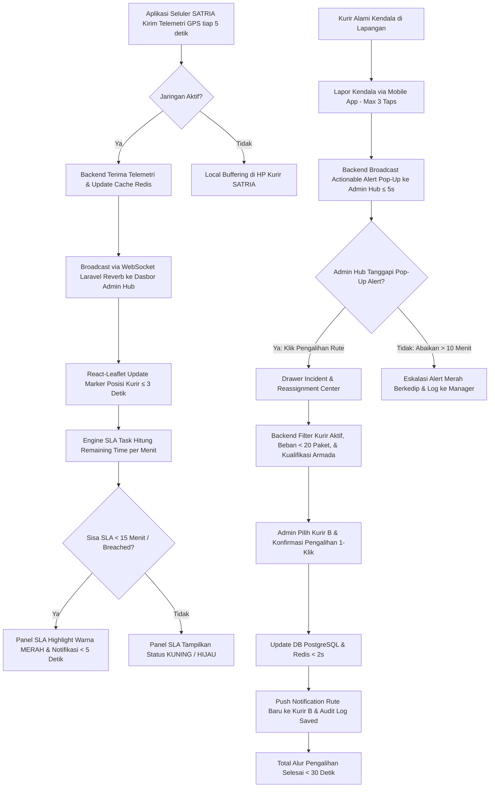

# Functional Requirement Document (FRD Induk / Master FRD)
## Courier Admin Mini-Panel Anteraja

--------------------------------------------------------------------------------

### 1. Konteks
Dokumen FRD Induk (Master FRD) ini berfungsi sebagai landasan spesifikasi fungsional utama yang mengintegrasikan seluruh 5 modul operasional MVP (*Live Monitoring Map*, *SLA Risk Indicator Panel*, *Incident & Reassignment Center*, *Audit Log & Riwayat Operasional*, dan *Login & Authentication*) ke dalam satu arsitektur sistem terpadu. Dokumen ini merujuk langsung pada **00-PRD-courier-admin-mini-panel.md** untuk menyelesaikan ketiadaan visibilitas lokasi kurir secara *real-time*, koordinasi kendala yang terisolasi, serta identifikasi keterlambatan yang bersifat reaktif. Implementasi dokumen ini memandu pencapaian KPI bisnis: tingkat kepatuhan SLA **≥ 97.5%**, percepatan penanganan kendala hingga **75%**, durasi penugasan ulang **< 30 detik**, tingkat *re-delivery* **< 2.0%**, dan penekanan pesan manual **< 25 pesan/hari**.

--------------------------------------------------------------------------------

### 2. Peran & Hak Akses
| Peran (Role) | Lihat (Read) | Buat (Create) | Ubah (Update) | Setujui (Approve) | Field Terkunci (Locked Fields) |
| ------ | ------ | ------ | ------ | ------ | ------ |
| **Admin Hub Operasional (Siti)** | ✅ Ya | ✅ Ya (Tanggapi Kendala) | ✅ Ya (Pengalihan / Filter) | ✅ Ya (Eksekusi Aksi) | courier_live_lat, courier_live_long, waybill_number, original_courier_id |
| **Kurir SATRIA (Mobile App)** | ✅ Ya (Rute Sendiri) | ✅ Ya (Kirim Telemetri / Lapor Kendala) | ❌ Tidak | ❌ Tidak | store_latitude, drop_latitude, sla_deadline, assigned_by_admin_id |
| **System (Backend & WebSocket)** | ✅ Ya | ✅ Ya (Log GPS / Audit Log) | ✅ Ya (State Marker & SLA Status) | ✅ Ya (Auto-Sort & Escalation) | created_at, reassignment_timestamp, audit_hash |

--------------------------------------------------------------------------------

### 3. Alur

```mermaid
graph TD
    A[Aplikasi Seluler SATRIA Kirim Telemetri GPS tiap 5 detik] --> B{Jaringan Aktif?}
    B -- Ya --> C[Backend Terima Telemetri & Update Cache Redis]
    B -- Tidak --> D[Local Buffering di HP Kurir SATRIA]
    C --> E[Broadcast via WebSocket Laravel Reverb ke Dasbor Admin Hub]
    E --> F[React-Leaflet Update Marker Posisi Kurir ≤ 3 Detik]
    F --> G[Engine SLA Task Hitung Remaining Time per Menit]
    G --> H{Sisa SLA < 15 Menit / Breached?}
    H -- Ya --> I[Panel SLA Highlight Warna MERAH & Notifikasi < 5 Detik]
    H -- Tidak --> J[Panel SLA Tampilkan Status KUNING / HIJAU]
    
    K[Kurir Alami Kendala di Lapangan] --> L[Lapor Kendala via Mobile App - Max 3 Taps]
    L --> M[Backend Broadcast Actionable Alert Pop-Up ke Admin Hub ≤ 5s]
    M --> N{Admin Hub Tanggapi Pop-Up Alert?}
    N -- Ya: Klik Pengalihan Rute --> O[Drawer Incident & Reassignment Center]
    N -- Tidak: Abaikan > 10 Menit --> P[Eskalasi Alert Merah Berkedip & Log ke Manager]
    
    O --> Q[Backend Filter Kurir Aktif, Beban < 20 Paket, & Kualifikasi Armada]
    Q --> R[Admin Pilih Kurir B & Konfirmasi Pengalihan 1-Klik]
    R --> S[Update DB PostgreSQL & Redis < 2s]
    S --> T[Push Notification Rute Baru ke Kurir B & Audit Log Saved]
    T --> U[Total Alur Pengalihan Selesai < 30 Detik]

```
#### Pernyataan Alur Kebutuhan Sistem (EARS Pattern):
*   **KETIKA** perangkat seluler kurir SATRIA terhubung ke jaringan internet, sistem **harus** mentransmisikan koordinat GPS (courier_live_lat, courier_live_long) dan data suhu dingin ke backend via WebSocket setiap 5 detik.
*   **KETIKA** backend menerima pembaruan telemetri GPS, sistem **harus** memperbarui posisi penanda (*marker*) kurir pada Peta Pemantauan Langsung dalam latensi maksimal 3 detik.
*   **KETIKA** paket dipindai dan dibawa kurir, sistem **harus** menghitung sla_deadline berdasarkan estimasi waktu layanan dan memperbarui sisa waktu SLA secara otomatis setiap menit.
*   **JIKA** sisa waktu SLA paket kurang dari 15 menit atau telah melampaui batas (sla_remaining_minutes <= 15), sistem **harus** memberikan penanda warna **Merah** dan memicu peringatan visual pada dasbor admin dalam waktu < 5 detik.
*   **JIKA** koneksi GPS kurir terputus > 15 detik, sistem **harus** mengubah warna penanda kurir menjadi abu-abu (*Offline*) dan mencatat status jaringan terputus.
*   **JIKA** kurir mengirimkan laporan kendala fisik dari aplikasi seluler, sistem **harus** memunculkan notifikasi *pop-up* aksi (*actionable alert*) pada dasbor admin dalam durasi ≤ 5 detik.
*   **SELAMA** kurir berstatus *ONLINE / Active*, sistem **harus** menampilkan radius titik tujuan pengiriman paket (drop_latitude, drop_longitude) yang menjadi tanggung jawab kurir tersebut.

--------------------------------------------------------------------------------

### 4. Aturan Bisnis Global
| ID Rule | Kondisi / Pemicu | Hasil / Perilaku Sistem | Pengecualian |
| ------ | ------ | ------ | ------ |
| **BR-01** | Telemetri GPS diterima via WebSocket. | Pembaruan penanda kurir pada peta React.js selesai dalam latensi **≤ 3.0 detik**. | Terjadi pemutusan jaringan lokal pada dasbor Admin Hub. |
| **BR-02** | Sinyal GPS terputus selama **> 15 detik**. | Sistem mengubah warna penanda kurir menjadi **Abu-abu (Offline)** dan memicu log peringatan koneksi. | Kurir dalam status *OFF_DUTY* atau *Shift Ended*. |
| **BR-03** | Perhitungan SLA Remaining **< 15 menit** atau **< 0 menit**. | Status risiko di-set **HIGH_RISK / BREACHED** dengan warna baris **Merah Flashing** dan notifikasi < 5 detik. | Paket berstatus *Delivered* atau *Returned*. |
| **BR-04** | Perhitungan SLA Remaining **15 – 30 menit**. | Status risiko di-set **MEDIUM_RISK** dengan warna baris **Kuning**. | Paket berstatus *Delivered*. |
| **BR-05** | Paket mengalami kondisi Weather = Hujan Deras / Banjir atau Traffic = Macet Total. | Sistem memotong kalkulasi sisa waktu SLA sebesar **15% (Buffer Waktu Hambatan)** secara otomatis. | Pengiriman menggunakan moda kendaraan *van/box* di area perkotaan. |
| **BR-06** | Kurir terhenti (kecepatan 0 km/jam) selama **> 10 menit** di luar titik tujuan. | Penanda kurir diberi indikator **Idle Alert (Kuning Pulsasi)**. | Kurir berada di koordinat penyerahan (drop_latitude, drop_longitude). |
| **BR-07** | Admin memindahkan beban tugas paket (*Task Reassignment*). | Seluruh alur pengalihan dari klik admin hingga rute diterima kurir B wajib selesai **< 30.0 detik**. | Terjadi kegagalan koneksi total (*total network blackout*). |
| **BR-08** | Pemilihan kurir penerima pengalihan (*assignee*). | Sistem hanya merekomendasikan kurir berstatus **ONLINE** dengan beban paket aktif **< 20 paket** serta kualifikasi armada/layanan yang sesuai (*Cargo* ->Van, *Frozen* ->Tas Termal, *PHARMA* ->BPOM). | Admin mengaktifkan opsi *Override Force Assign* darurat. |
| **BR-09** | Pelaporan kendala fisik dari aplikasi seluler kurir. | Proses pelaporan di aplikasi seluler wajib selesai dalam **maksimal 3 ketukan layar (taps)**. | Kurir melampirkan foto bukti fisik hambatan. |
| **BR-10** | Kendala tidak ditanggapi admin dalam waktu **> 10 menit**. | Sistem menaikkan skala notifikasi (*escalation alert*) menjadi **Merah Berkedip** dan mengirim log ke Manager Hub. | Kendala berkategori *Low Priority* (Weather = Berawan). |

--------------------------------------------------------------------------------

### 5. Istilah
*   **SATRIA:** Sebutan resmi untuk staf Kurir Lapangan Anteraja.
*   **Admin Hub:** Petugas operasional di Stasiun Layanan (Hub) yang mengatur lalu lintas dan alokasi paket harian.
*   **Telemetri GPS:** Aliran data koordinat lokasi (latitude, longitude) yang ditransmisikan secara berkala dari perangkat seluler kurir.
*   **SLA (Service Level Agreement):** Batas waktu maksimal penyelesaian pengiriman paket dari penjemputan hingga penyerahan kepada penerima.
*   **SLA Breached:** Kondisi operasional saat durasi pengiriman paket melampaui batas waktu SLA yang dijanjikan.
*   **Local Buffering:** Penyimpanan data koordinat GPS sementara pada memori perangkat seluler kurir saat koneksi internet terputus.
*   **Actionable Alert:** Notifikasi *pop-up* pada dasbor admin yang dilengkapi tombol tindakan langsung (misalnya tombol "Pengalihan Rute Instan").
*   **Cross-Highlighting:** Fitur interaksi yang menghubungkan pemilihan data pada tabel panel SLA dengan *auto-zoom* penanda lokasi di peta.
*   **Escalation Alert:** Peringatan susulan yang dipicu secara otomatis jika suatu kendala tidak ditanggapi admin dalam rentang waktu yang ditentukan.
*   **Audit Log:** Catatan riwayat aktivitas sistem yang mencatat identitas eksekutor, stempel waktu, dan rincian perubahan data secara *immutable*.

--------------------------------------------------------------------------------

### 6. Data Utama & Status
#### Skema Data Utama Terintegrasi:
*  waybill_number (VARCHAR(20) - Primary Key / Nomor Resi)
*  service_type (ENUM - Regular, Same Day, Next Day, Instant, Dokumen, Cargo, Mini Cargo, PHARMA, Frozen)
*  courier_id & courier_name (VARCHAR(20) - Identitas Kurir SATRIA)
*  hub_origin (VARCHAR(50) - ID Stasiun Layanan / Hub)
*  store_latitude & store_longitude (DECIMAL(10,8) - Titik Asal / Hub)
*  drop_latitude & drop_longitude (DECIMAL(10,8) - Titik Tujuan Penyerahan)
*  courier_live_lat & courier_live_long (DECIMAL(10,8) - Telemetri GPS Real-Time)
*  order_date, pickup_time, sla_deadline (TIMESTAMP - Waktu Operasional)
*  weight_kg & volume_cm3 (DECIMAL - Bobot & Dimensi Paket)

--------------------------------------------------------------------------------

### 7. Daftar Fungsi
*   **F-01: Live Monitoring Map Module** — Peta pemantauan posisi kurir, status sinyal, dan suhu *cold-chain* secara *real-time*.
*   **F-02: SLA Risk Indicator Panel Module** — Panel pengurutan risiko keterlambatan SLA 9 jenis layanan dengan penanda warna dan *cross-highlighting*.
*   **F-03: Incident & Reassignment Center Module** — Modul terpadu pemantauan kendala aktif dan eksekusi pengalihan rute 1-klik.
*   **F-04: Audit Log & Riwayat Operasional Module** — Rekapitulasi jejak digital historis pengalihan paket dan ekspor laporan PDF/CSV.
*   **F-05: Login & Authentication Module** — Gerbang masuk terenkripsi berbasis token Sanctum dan pembatasan stasiun Hub.

--------------------------------------------------------------------------------

### 8. AC Alur Utama (Acceptance Criteria - Data Nyata delivery.csv)
#### Skenario End-to-End: Otentikasi Admin, Pemantauan Risiko SLA, Penanganan Insiden Hujan Deras/Banjir, Pengalihan 1-Klik, dan Pencatatan Audit Log
*   **Diberikan:**
    * Admin Hub (Siti) membuka dasbor *Courier Admin Mini-Panel* di HUB-JAKTIM-HALIM.
    * Kurir Indra Gunawan (HLM-002, Vehicle: Blind Van) membawa paket resi 100024000104 (Layanan: Regular, Berat: 6.0 kg) di lokasi awal store_latitude: -6.953812, store_longitude: 107.627419 dengan sla_deadline: 2026-09-21 12:15:00.
    * Kurir Eko Prasetyo (HLM-003, Vehicle: Pick Up Box) berada di area sekitar dengan status **ONLINE** dan membawa **10 paket aktif** (< 20 paket).
*   **Ketika:**
    1. Pada pukul 12:45:00, kendaraan Kurir Indra Gunawan terjebak di lokasi courier_live_lat: -6.912403, courier_live_long: 107.620154 akibat Weather: Hujan Deras dan Traffic: Macet Total.
    2. Kurir Indra Gunawan membuka aplikasi SATRIA, mengklik "Lapor Kendala" -> "Macet Total & Cuaca Buruk" -> "Kirim" (3 ketukan layar, memenuhi BR-09).
    3. Sinyal dikirim via WebSocket ke backend. Sisa waktu SLA paket 100024000104 terhitung **-30 menit** (status BREACHED, memenuhi BR-03).
    4. Admin Siti menerima notifikasi *pop-up* aksi warna **Merah Flashing** "Kendala Macet Total - Kurir Indra Gunawan (Resi 100024000104)" pada pukul 12:45:03 (latensi **3.0 detik**, memenuhi BR-01 ≤ 3s & BR-10 ≤ 5s).
    5. Admin Siti mengklik tombol "Pengalihan Rute Instan" pada *pop-up*. System Engine memfilter rekomendasi kurir dan menampilkan Kurir Eko Prasetyo di urutan #1.
    6. Admin Siti memilih Kurir Eko Prasetyo dan mengklik "Konfirmasi Pengalihan Satu-Klik" pada pukul 12:45:18.
*   **Maka:**
    1. Backend memperbarui alokasi resi 100024000104 dari Indra Gunawan ke Eko Prasetyo di database PostgreSQL dan Redis Cache dalam waktu **1.1 detik**.
    2. WebSocket mentransmisikan *push notification* rute baru ke ponsel Kurir Eko Prasetyo dan memperbarui estimasi tiba (*ETA*) di API Customer Care pada pukul 12:45:21 (total durasi pengalihan **18.0 detik**, memenuhi BR-07 < 30 detik).
    3. Status insiden berubah menjadi **RESOLVED** dan jejak transaksi dicatat secara permanen di modul **FRD-04 Audit Log**.

--------------------------------------------------------------------------------

### 9. Tidak Termasuk (Out-of-Scope)
*   **Automated AI/ML Route Re-assignment:** Sistem tidak melakukan pemindahan tugas otomatis secara mandiri tanpa konfirmasi manual dari Admin Hub.
*   **Full Mobile App Development:** Sistem tidak membangun aplikasi seluler kurir baru dari awal, melainkan menggunakan integrasi API/WebSocket pada aplikasi SATRIA yang sudah ada.
*   **Public Customer Tracking Page:** Antarmuka pemantauan peta ini tidak dapat diakses oleh publik atau pembeli *e-commerce*.
*   **Customer WhatsApp Notification Engine:** Sistem tidak mengirimkan pesan notifikasi keterlambatan langsung ke nomor pribadi konsumen.
*   **User Profile, Settings, & Preference Page (F-06):** Pengaturan profil avatar dan preferensi sistem dikeluarkan dari scope MVP.
