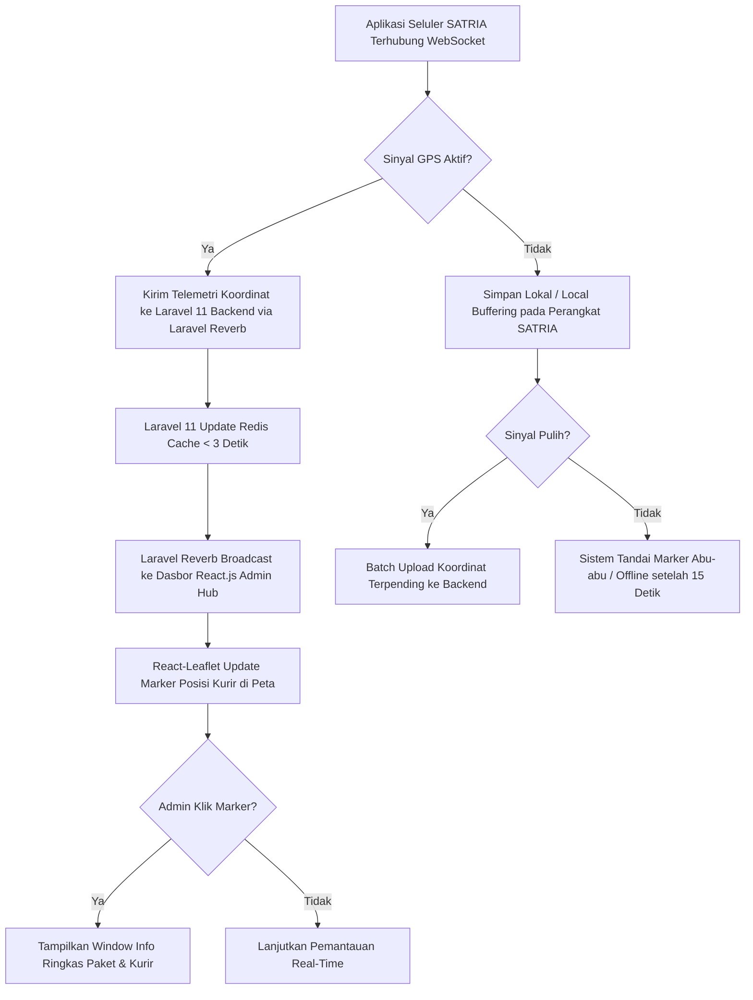

# Functional Requirement Document (FRD) — Live Monitoring Map

## 1. Konteks
Fitur **Live Monitoring Map** (Peta Pemantauan Langsung) dirancang untuk menyajikan visibilitas lokasi posisi kurir (SATRIA) dan sebaran titik tujuan pengiriman paket secara *real-time* pada satu antarmuka peta interaktif. Fitur ini merujuk langsung pada **00-PRD-courier-admin-mini-panel.md** Bagian 4 (*In-Scope MVP Core P0*) dan Bagian 7 (AC-01) untuk menyelesaikan akar masalah teknis ketiadaan visibilitas lokasi kurir di antara titik pemindaian. Tujuan utamanya adalah mendukung Admin Hub dalam mengidentifikasi potensi penumpukan paket dan pergerakan terhenti secara proaktif.

---

## 2. Peran & Hak Akses

| Peran (Role) | Lihat (Read) | Buat (Create) | Ubah (Update) | Setujui (Approve) | Field Terkunci (Locked Fields) |
| :--- | :---: | :---: | :---: | :---: | :--- |
| **Admin Hub Operasional** | ✅ Ya | ❌ Tidak | ✅ Ya (Filter/Zoom) | ❌ Tidak | `courier_live_lat`, `courier_live_long`, `Order_ID` |
| **Kurir SATRIA (Mobile App)** | ❌ Tidak | ✅ Ya (Kirim Telemetri) | ❌ Tidak | ❌ Tidak | `Store_Latitude`, `Drop_Latitude` |
| **System (Laravel / Reverb)** | ✅ Ya | ✅ Ya (Log GPS) | ✅ Ya (State Marker) | ✅ Ya | `order_timestamp` |
| **Customer Care / Manager** | ✅ Ya (Read-only) | ❌ Tidak | ❌ Tidak | ❌ Tidak | Semua Field |

---

## 3. Alur (Workflow & EARS Pattern)



### Pernyataan Alur Kebutuhan (EARS Pattern):
* **KETIKA** perangkat seluler kurir SATRIA terhubung ke internet, sistem **harus** mentransmisikan koordinat GPS (`latitude`, `longitude`) ke backend Laravel via Laravel Reverb setiap 5 detik.
* **KETIKA** backend Laravel menerima data telemetri GPS, sistem **harus** memperbarui penanda (*marker*) posisi kurir pada peta React-Leaflet Admin Hub dengan latensi maksimal 3 detik.
* **JIKA** koneksi internet perangkat kurir terputus > 15 detik, sistem **harus** mengubah warna ikon marker kurir menjadi abu-abu (*Offline*) dan mencatat status sinyal terputus.
* **JIKA** kurir mengaktifkan kembali koneksi internet, sistem **harus** melakukan pengiriman ulang data koordinat yang tersimpan di penyimpanan lokal (*local buffering*).
* **SELAMA** kurir berstatus *Active/On-Duty*, sistem **harus** menampilkan radius titik tujuan pengiriman paket (`Drop_Latitude`, `Drop_Longitude`) yang menjadi tanggung jawab kurir tersebut.

---

## 4. Aturan Bisnis (Business Rules)

| ID Rule | Kondisi / Pemicu | Hasil / Perilaku Sistem | Pengecualian |
| :--- | :--- | :--- | :--- |
| **BR-01** | Telemetri GPS diterima via Laravel Reverb. | Rendering pembaruan marker pada peta React.js selesai dalam latensi **≤ 3.0 detik**. | Jika koneksi jaringan lokal Admin Hub terputus. |
| **BR-02** | Tidak ada sinyal GPS dari kurir selama **> 15 detik**. | Sistem mengubah status visual marker kurir menjadi **Abu-abu (Offline)** dan memicu log peringatan koneksi. | Kurir berstatus *Off-Duty* atau *Shift Ended*. |
| **BR-03** | Admin mengklik marker kurir atau marker paket di peta. | Antarmuka menampilkan *Popup Info Window* berisi `Order_ID`, `Vehicle`, `Weather`, `Traffic`, dan sisa SLA. | Marker dalam kondisi *cluster* rapat (harus *zoom-in* dahulu). |
| **BR-04** | Kecepatan bergerak kurir terdeteksi **0 km/jam** selama **> 10 menit** saat paket aktif. | Sistem menandai ikon kurir dengan indikator **Idle Alert (Kuning Pulsasi)**. | Kurir sedang berada di lokasi penyerahan paket (`Drop_Latitude/Longitude`). |
| **BR-05** | Jumlah marker paket aktif pada area hub melampaui **100 titik**. | Peta menerapkan *Marker Clustering* otomatis untuk menjaga performa rendering UI **< 1.5 detik**. | Admin mematikan fitur pemfokusan area. |

---

## 5. Istilah

* **SATRIA:** Sebutan resmi untuk armada kurir lapangan Anteraja.
* **Telemetri GPS:** Aliran data koordinat lokasi (`latitude`, `longitude`) yang dikirimkan secara berkala dari perangkat kurir ke server.
* **Local Buffering:** Penyimpanan sementara data koordinat pada memori lokal ponsel kurir saat koneksi internet terputus.
* **Marker:** Ikon penanda visual pada peta interaktif yang menunjukkan posisi kurir atau lokasi tujuan paket.
* **Drop Point:** Koordinat lokasi penyerahan paket akhir kepada penerima (`Drop_Latitude`, `Drop_Longitude`).

---

## 6. Data Utama & Status

### Data Utama yang Disimpan:
* `Order_ID` (String - Unique Identifier)
* `Store_Latitude` & `Store_Longitude` (Float - Titik Hub)
* `Drop_Latitude` & `Drop_Longitude` (Float - Titik Tujuan)
* `courier_live_lat` & `courier_live_long` (Float - Telemetri Real-Time)
* `Vehicle` (`motorcycle`, `scooter`, `van`)

### Daftar Status Kurir & Perpindahan:

```
[OFFLINE / ABU-ABU] <---> [ONLINE / HIJAU] ---> [IDLE / KUNING] ---> [OFF-DUTY]
```

* **ONLINE (Hijau):** Sinyal GPS aktif, kurir bergerak mengirimkan paket.
* **IDLE (Kuning):** Sinyal GPS aktif, kurir terhenti > 10 menit di luar titik penyerahan.
* **OFFLINE (Abu-abu):** Sinyal GPS terputus > 15 detik saat *shift* berlangsung.

---

## 7. Daftar Fungsi

* **F-01.1 Telemetry Receiver Service:** Menerima dan memvalidasi paket data koordinat GPS dari seluler kurir via Laravel Reverb.
* **F-01.2 Interactive Map Renderer:** Menampilkan peta berbasis React-Leaflet dengan *custom marker* kurir dan *drop point*.
* **F-01.3 Info Popup Window Component:** Menampilkan detail paket dan kurir secara instan saat penanda peta diklik.
* **F-01.4 Connection & Offline Handler:** Mengelola status indikator sinyal kurir dan sinkronisasi data *local buffering*.

---

## 8. AC Alur Utama (Acceptance Criteria - Data Nyata)

### Skenario 1: Pemantauan Pergerakan Kurir Berjalan Lancar
* **Diberikan:** Admin Hub (Siti) membuka dasbor peta. Kurir Budi (`Agent_Age`: 37, `Agent_Rating`: 4.9, `Vehicle`: `motorcycle`) membawa paket resi `ialx566343618` di lokasi awal `Store_Latitude`: 22.745049, `Store_Longitude`: 75.892471.
* **Ketika:** Perangkat seluler Kurir Budi bergerak dan mengirimkan koordinat baru (`courier_live_lat`: 22.755049, `courier_live_long`: 75.902471) via Laravel Reverb pada pukul 11:46:00.
* **Maka:** Marker Kurir Budi di peta React-Leaflet berpindah lokasi ke titik koordinat baru secara mulus dalam durasi **2.1 detik** (memenuhi BR-01 ≤ 3 detik) tanpa perlu *reload* halaman.

### Skenario 2: Penanganan Sinyal GPS Terputus di Area Cuaca Buruk
* **Diberikan:** Kurir Agus (`Vehicle`: `scooter`) membawa paket resi `akqg208421122` di area *Metropolitan* dengan kondisi `Weather`: `Stormy` dan `Traffic`: `Jam`.
* **Ketika:** Sinyal seluler Kurir Agus terputus akibat badai dan tidak mengirimkan data telemetri selama **18 detik** (sejak 19:50:00 hingga 19:50:18).
* **Maka:** Sistem di backend Laravel 11 menaikkan *event* timeout, dan marker Kurir Agus di peta admin berubah dari warna **Hijau (Online)** menjadi **Abu-abu (Offline)** dengan label "Sinyal Terputus (18s)" pada pukul 19:50:15 (memenuhi BR-02).

---

## 9. Tidak Termasuk (Out-of-Scope)

* **Sistem Navigasi Turn-by-Turn:** Peta tidak menyediakan petunjuk arah rute jalan mendetail untuk kurir (kurir menggunakan aplikasi peta eksternal seperti Google Maps).
* **Pelacakan Publik Penerima Paket:** Peta ini hanya untuk penggunaan internal Admin Hub dan tidak dapat diakses oleh pelanggan/pembeli *e-commerce*.
* **Automatic Geofencing Lock:** Sistem tidak melakukan penguncian pintu hub otomatis berbasis lokasi koordinat kurir.
