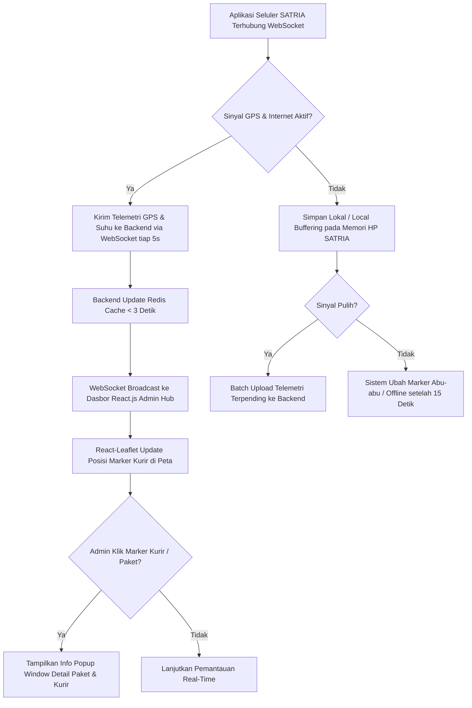

# Functional Requirement Document (FRD) — Live Monitoring Map

---

### 1. Konteks
Fitur **Live Monitoring Map** (Peta Pemantauan Langsung) dirancang untuk menyajikan visibilitas lokasi posisi kurir SATRIA, titik penyerahan paket, serta indikator suhu layanan dingin secara *real-time* pada satu antarmuka peta interaktif. Fitur ini merujuk langsung pada **00-PRD-courier-admin-mini-panel-v2.md** Bagian 4 (In-Scope F-01) dan Bagian 7 untuk menyelesaikan ketiadaan visibilitas lokasi kurir di antara titik pemindaian. Tujuan utamanya adalah mendukung Admin Hub dalam mengidentifikasi potensi penumpukan paket dan pergerakan terhenti secara proaktif.

---

### 2. Peran & Hak Akses

| Peran (Role) | Lihat (Read) | Buat (Create) | Ubah (Update) | Setujui (Approve) | Field Terkunci (Locked Fields) |
| :--- | :---: | :---: | :---: | :---: | :--- |
| **Admin Hub Operasional** | ✅ Ya | ❌ Tidak | ✅ Ya (Filter/Zoom/Cluster) | ❌ Tidak | `Courier_Live_Lat`, `Courier_Live_Long`, `Order_ID` |
| **Kurir SATRIA (Mobile App)** | ❌ Tidak | ✅ Ya (Kirim Telemetri) | ❌ Tidak | ❌ Tidak | `Store_Latitude`, `Drop_Latitude`, `Temperature_C` |
| **System (Backend & WebSocket)** | ✅ Ya | ✅ Ya (Log GPS) | ✅ Ya (State Marker / Cluster) | ✅ Ya | `Order_Date`, `Order_Time` |
| **Customer Care / Hub Manager** | ✅ Ya (Read-only) | ❌ Tidak | ❌ Tidak | ❌ Tidak | Semua Field Sistem |

---

### 3. Alur



#### Pernyataan Alur Kebutuhan (EARS Pattern):
* **KETIKA** perangkat seluler kurir SATRIA terhubung ke internet, sistem **harus** mentransmisikan koordinat GPS (`Courier_Live_Lat`, `Courier_Live_Long`) dan data suhu (`Temperature_C`) ke backend via WebSocket setiap 5 detik.
* **KETIKA** backend menerima data telemetri GPS, sistem **harus** memperbarui penanda (*marker*) posisi kurir pada peta React-Leaflet Admin Hub dengan latensi maksimal 3 detik.
* **JIKA** koneksi internet perangkat kurir terputus > 15 detik, sistem **harus** mengubah warna ikon *marker* kurir menjadi abu-abu (*Offline*) dan mencatat status sinyal terputus.
* **JIKA** kurir mengaktifkan kembali koneksi internet, sistem **harus** melakukan pengiriman ulang data koordinat yang tersimpan di penyimpanan lokal (*local buffering*).
* **SELAMA** kurir berstatus *ONLINE / Active*, sistem **harus** menampilkan radius titik tujuan pengiriman paket (`Drop_Latitude`, `Drop_Longitude`) yang menjadi tanggung jawab kurir tersebut.

---

### 4. Aturan Bisnis

| ID Rule | Kondisi / Pemicu | Hasil / Perilaku Sistem | Pengecualian |
| :--- | :--- | :--- | :--- |
| **BR-01** | Telemetri GPS diterima via WebSocket. | Rendering pembaruan *marker* pada peta React.js selesai dalam latensi **≤ 3.0 detik**. | Jika koneksi jaringan lokal Admin Hub terputus. |
| **BR-02** | Tidak ada sinyal GPS dari kurir selama **> 15 detik**. | Sistem mengubah status visual *marker* kurir menjadi **Abu-abu (Offline)** dan memicu log peringatan koneksi. | Kurir berstatus *OFF_DUTY* atau *Shift Ended*. |
| **BR-03** | Admin mengklik *marker* kurir atau paket di peta. | Antarmuka menampilkan *Info Popup Window* berisi `Order_ID`, `Courier_Name`, `Vehicle`, `Weather`, `Traffic`, `Temperature_C`, dan sisa SLA. | *Marker* dalam kondisi *cluster* rapat (wajib *zoom-in* dahulu). |
| **BR-04** | Kecepatan bergerak kurir terdeteksi **0 km/jam** selama **> 10 menit** saat paket aktif. | Sistem menandai ikon kurir dengan indikator **Idle Alert (Kuning Pulsasi)**. | Kurir sedang berada di lokasi penyerahan paket (`Drop_Latitude`, `Drop_Longitude`). |
| **BR-05** | Jumlah *marker* paket aktif pada area hub melampaui **100 titik**. | Peta menerapkan *Marker Clustering* otomatis untuk menjaga performa rendering UI **< 1.5 detik**. | Admin mematikan fitur pemfokusan area. |

---

### 5. Istilah

* **SATRIA:** Sebutan resmi untuk armada kurir lapangan Anteraja.
* **Telemetri GPS:** Aliran data koordinat lokasi (`latitude`, `longitude`) yang dikirimkan secara berkala dari perangkat kurir ke server.
* **Local Buffering:** Penyimpanan sementara data koordinat pada memori lokal ponsel kurir saat koneksi internet terputus.
* **Marker:** Ikon penanda visual pada peta interaktif yang menunjukkan posisi kurir atau lokasi tujuan paket.
* **Drop Point:** Koordinat lokasi penyerahan paket akhir kepada penerima (`Drop_Latitude`, `Drop_Longitude`).
* **Temperature Telemetry:** Transmisi angka suhu udara dingin (`Temperature_C`) untuk pemantauan kualitas paket *Frozen* (-2°C s/d 5°C).

---

### 6. Data Utama & Status

#### Data Utama yang Disimpan:
* `Order_ID` (String - Unique Identifier / Resi)
* `Service_Type` (Enum - Regular, Instant, Frozen, PHARMA, Cargo, etc.)
* `Store_Latitude` & `Store_Longitude` (Decimal - Titik Hub)
* `Drop_Latitude` & `Drop_Longitude` (Decimal - Titik Tujuan)
* `Courier_Live_Lat` & `Courier_Live_Long` (Decimal - Telemetri Real-Time)
* `Vehicle` (Enum - Motorcycle, Scooter, Van, Blind Van, Cargo Truck, Cooler Box Van)
* `Temperature_C` (Decimal - Suhu Paket Cold-Chain)

#### Daftar Status Kurir & Perpindahan:
```
[OFFLINE / ABU-ABU] <---> [ONLINE / HIJAU] ---> [IDLE / KUNING] ---> [OFF-DUTY]
```
* **ONLINE (Hijau):** Sinyal GPS aktif, kurir bergerak mengirimkan paket.
* **IDLE (Kuning):** Sinyal GPS aktif, kurir terhenti > 10 menit di luar titik penyerahan.
* **OFFLINE (Abu-abu):** Sinyal GPS terputus > 15 detik saat *shift* berlangsung.

---

### 7. Daftar Fungsi

* **F-01.1 Telemetry Receiver Service:** Menerima dan memvalidasi paket data koordinat GPS dan suhu dari seluler kurir via WebSocket.
* **F-01.2 Interactive Map Renderer:** Menampilkan peta berbasis React-Leaflet dengan *custom marker* kurir dan *drop point*.
* **F-01.3 Info Popup Window Component:** Menampilkan detail paket, kendaraan, cuaca, dan suhu secara instan saat penanda peta diklik.
* **F-01.4 Connection & Offline Handler:** Mengelola status indikator sinyal kurir dan sinkronisasi data *local buffering*.

---

### 8. AC Alur Utama (Acceptance Criteria - Data Nyata `delivery.txt`)

#### Skenario 1: Pemantauan Pergerakan Kurir Paket Instant Berjalan Lancar
* **Diberikan:** Admin Hub (Siti) membuka dasbor peta di `HUB-JAKSEL-TEBET`. Kurir Budi Santoso (`STR-JKT-001`, Vehicle: `Motorcycle`) membawa paket resi `100024000101` (Layanan: `Instant`, Makanan Siap Saji) di lokasi awal `Store_Latitude: -6.225588, Store_Longitude: 106.855324`.
* **Ketika:** Perangkat seluler Kurir Budi Santoso bergerak dan mengirimkan koordinat baru (`Courier_Live_Lat: -6.228145, Courier_Live_Long: 106.835210`) via WebSocket pada pukul 08:35:00.
* **Maka:** Marker Kurir Budi Santoso di peta React-Leaflet berpindah lokasi ke titik koordinat baru secara mulus dalam durasi **2.1 detik** (memenuhi BR-01 ≤ 3 detik) tanpa perlu *reload* halaman.

#### Skenario 2: Deteksi Sinyal GPS Terputus pada Layanan Frozen di Area Banjir
* **Diberikan:** Kurir Surya Darma (`STR-JKT-007`, Vehicle: `Cooler Box Van`) membawa paket resi `100024000107` (Layanan: `Frozen`, Suhu: `1.5°C`, Daging & Seafood Beku) di `HUB-JAKUT-SUNTER` dengan kondisi `Weather: Banjir` dan `Traffic: Tersendat`.
* **Ketika:** Sinyal seluler Kurir Surya Darma terputus di area Sunter akibat banjir dan tidak mengirimkan data telemetri selama **18 detik** (sejak 15:40:00 hingga 15:40:18).
* **Maka:** Backend menaikkan *event* timeout, dan marker Kurir Surya Darma di peta admin berubah dari warna **Hijau (Online)** menjadi **Abu-abu (Offline)** dengan label "Sinyal Terputus (18s)" pada pukul 15:40:15 (memenuhi BR-02).

---

### 9. Tidak Termasuk (Out-of-Scope)

* **Sistem Navigasi Turn-by-Turn:** Peta tidak menyediakan petunjuk arah rute jalan mendetail untuk kurir (kurir menggunakan aplikasi peta eksternal seperti Google Maps).
* **Pelacakan Publik Penerima Paket:** Peta ini hanya untuk penggunaan internal Admin Hub dan tidak dapat diakses oleh pelanggan/pembeli *e-commerce*.
* **Automatic Geofencing Lock:** Sistem tidak melakukan penguncian pintu hub otomatis berbasis lokasi koordinat kurir.
