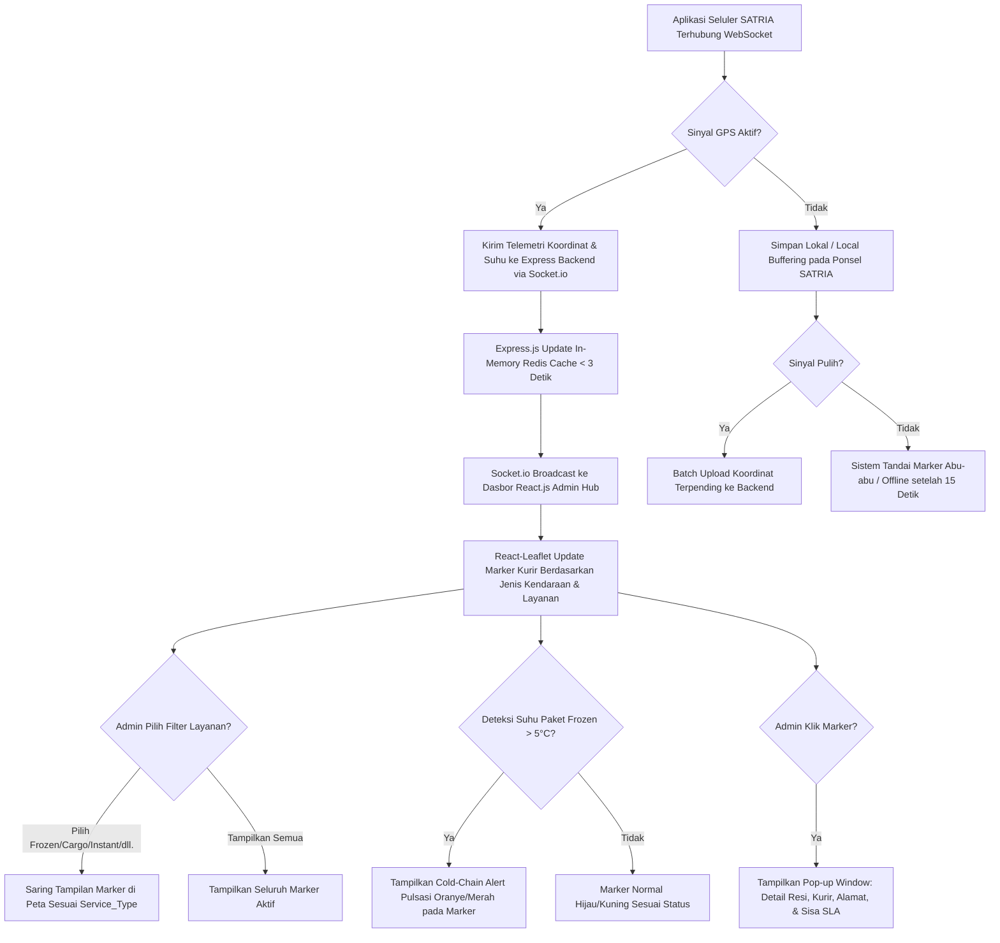

# Functional Requirement Document (FRD) — Live Monitoring Map

## 1. Konteks
Fitur **Live Monitoring Map** (Peta Pemantauan Langsung) dirancang untuk menyajikan visibilitas lokasi posisi kurir (SATRIA) dan sebaran titik tujuan pengiriman paket secara *real-time* pada satu antarmuka peta interaktif di lingkungan operasional Anteraja Indonesia. Fitur ini merujuk langsung pada [`docs/00-PRD-courier-admin-mini-panel.md`] Bagian 4 (*In-Scope MVP Core P0*) dan Bagian 7 (AC-01) untuk menyelesaikan masalah ketiadaan visibilitas pergerakan kurir di antara titik pemindaian.

Modul ini mendukung pemantauan **9 jenis layanan pengiriman Anteraja** (*Regular*, *Same Day*, *Next Day*, *Instant*, *Dokumen*, *Cargo*, *Mini Cargo*, *PHARMA*, dan *Frozen*) dengan pembedaan ikon armada kendaraan (*Motorcycle*, *Van*, *Cargo Truck*) serta indikator khusus anomali suhu rantai dingin (*Cold-Chain Alert*).

---

## 2. Peran & Hak Akses

| Peran (Role) | Lihat (Read) | Buat (Create) | Ubah (Update) | Setujui (Approve) | Field Terkunci (Locked Fields) |
| :--- | :---: | :---: | :---: | :---: | :--- |
| **Admin Hub Operasional** | ✅ Ya | ❌ Tidak | ✅ Ya (Filter Layanan, Zoom, Select Marker) | ❌ Tidak | `Courier_Live_Lat`, `Courier_Live_Long`, `Order_ID`, `Temperature_C` |
| **Kurir SATRIA (Mobile App)** | ❌ Tidak | ✅ Ya (Kirim Telemetri GPS & Suhu) | ❌ Tidak | ❌ Tidak | `Store_Latitude`, `Drop_Latitude`, `Service_Type` |
| **System (Express / Socket.io)** | ✅ Ya | ✅ Ya (Log Telemetri) | ✅ Ya (State Marker, Cluster) | ✅ Ya | `Order_Date`, `Order_Time`, `Pickup_Time` |
| **Customer Care / Manager** | ✅ Ya (Read-only) | ❌ Tidak | ❌ Tidak | ❌ Tidak | Semua Field |

---

## 3. Alur (Workflow & EARS Pattern)



### Pernyataan Alur Kebutuhan (EARS Pattern):
* **KETIKA** perangkat seluler kurir SATRIA terhubung ke internet di wilayah operasional Indonesia, sistem **harus** mentransmisikan koordinat GPS (`Courier_Live_Lat`, `Courier_Live_Long`) dan data suhu pendingin (`Temperature_C`) ke backend Express.js via Socket.io setiap 5 detik.
* **KETIKA** backend Express.js menerima data telemetri, sistem **harus** memperbarui penanda (*marker*) posisi kurir pada peta React-Leaflet Admin Hub dengan latensi maksimal 3.0 detik.
* **KETIKA** Admin Hub memilih filter jenis layanan (*Service Type Filter*), sistem **harus** menyaring marker kurir dan titik tujuan pengiriman di peta sesuai layanan yang dipilih (*Regular*, *Same Day*, *Next Day*, *Instant*, *Dokumen*, *Cargo*, *Mini Cargo*, *PHARMA*, *Frozen*).
* **JIKA** sensor suhu paket *Frozen* mencatat suhu > 5.0°C atau < -2.0°C, sistem **harus** memunculkan animasi peringatan termal (*Cold-Chain Alert*) pada marker kurir terkait.
* **JIKA** koneksi internet perangkat kurir terputus > 15 detik, sistem **harus** mengubah warna ikon marker kurir menjadi abu-abu (*Offline*) dan menampilkan durasi pemutusan sinyal.
* **SELAMA** kurir bertugas, sistem **harus** menampilkan radius titik tujuan pengiriman paket (`Drop_Latitude`, `Drop_Longitude`) dengan garis rute penghubung (*polyline*) dari posisi kurir saat ini.

---

## 4. Aturan Bisnis (Business Rules)

| ID Rule | Kondisi / Pemicu | Hasil / Perilaku Sistem | Pengecualian |
| :--- | :--- | :--- | :--- |
| **BR-01** | Telemetri GPS diterima via Socket.io. | Rendering pembaruan marker pada peta React-Leaflet selesai dalam latensi **≤ 3.0 detik**. | Jika koneksi jaringan lokal Admin Hub terputus. |
| **BR-02** | Tidak ada sinyal GPS dari kurir selama **> 15 detik**. | Sistem mengubah status visual marker kurir menjadi **Abu-abu (Offline)** dan memicu log peringatan koneksi. | Kurir berstatus *Off-Duty* atau telah menyelesaikan pengiriman. |
| **BR-03** | Admin mengklik marker kurir atau marker paket di peta. | Antarmuka menampilkan *Popup Info Window* berisi `Order_ID`, `Service_Type`, `Courier_Name`, `Vehicle`, `Destination_Address`, `Temperature_C`, `Weather`, `Traffic`, dan `SLA_Remaining_Minutes`. | Marker dalam kondisi *cluster* rapat (harus *zoom-in* dahulu). |
| **BR-04** | Kecepatan kurir terdeteksi **0 km/jam** selama **> 10 menit** saat membawa paket aktif di luar titik tujuan. | Sistem menandai ikon kurir dengan indikator **Idle Alert (Kuning Pulsasi)**. | Kurir sedang berada di koordinat titik penyerahan (`Drop_Latitude`/`Drop_Longitude`). |
| **BR-05** | Jumlah marker paket aktif pada area hub melampaui **100 titik**. | Peta menerapkan *Marker Clustering* otomatis untuk menjaga performa rendering antarmuka **< 1.5 detik**. | Admin mematikan fitur *clustering* pada pengaturan peta. |
| **BR-06** | Pemantauan anomali rantai dingin layanan *Frozen*. | Jika `Temperature_C > 5.0°C`, marker kurir otomatis diberi cincin berkedip warna Oranye/Merah dan memicu *toast notification* ke admin. | Layanan non-Frozen. |

---

## 5. Istilah

* **SATRIA:** Sebutan resmi untuk armada kurir lapangan Anteraja.
* **Marker:** Ikon visual interaktif pada peta yang merepresentasikan posisi kurir (dengan simbol motor, van, atau truk kargo) atau lokasi tujuan paket (*drop point*).
* **Cold-Chain Alert:** Peringatan visual otomatis jika suhu pada paket berlayanan Frozen keluar dari batas aman (-2°C s/d 5°C).
* **Service Type Filter:** Fitur penyaring visual untuk memilah marker berdasarkan salah satu dari 9 layanan Anteraja.
* **Marker Clustering:** Pengelompokan sejumlah marker berdekatan menjadi satu lingkaran angka untuk mengoptimalkan performa grafis peta.

---

## 6. Data Utama & Status

### Data Utama yang Ditampilkan:
* `Order_ID` (String - Nomor Resi simulasi Anteraja)
* `Service_Type` (`Regular`, `Same Day`, `Next Day`, `Instant`, `Dokumen`, `Cargo`, `Mini Cargo`, `PHARMA`, `Frozen`)
* `Courier_ID` & `Courier_Name` (String - Kurir SATRIA Simulasi)
* `Store_Latitude` & `Store_Longitude` (Float - Titik Hub di Indonesia)
* `Drop_Latitude` & `Drop_Longitude` (Float - Titik Tujuan di Indonesia)
* `Courier_Live_Lat` & `Courier_Live_Long` (Float - Posisi Terkini Kurir)
* `Vehicle` (`Motorcycle`, `Van`, `Cargo_Truck`)
* `Temperature_C` (Suhu produk beku/obat)
* `SLA_Remaining_Minutes` & `SLA_Status` (`SAFE`, `MEDIUM_RISK`, `HIGH_RISK`, `BREACHED`)

### Daftar Status Kurir pada Peta:
```
[OFFLINE / ABU-ABU] <---> [ONLINE / HIJAU] ---> [IDLE / KUNING] ---> [COLD_CHAIN_ALERT / ORANYE] ---> [OFF-DUTY]
```

---

## 7. Daftar Fungsi

* **F-01.1 Telemetry Receiver Service:** Menerima dan memvalidasi paket data koordinat GPS kurir dan data sensor suhu via Socket.io.
* **F-01.2 Interactive Multi-Service Map Renderer:** Menampilkan peta berbasis React-Leaflet wilayah Indonesia dengan kontrol layer dan filter 9 layanan pengiriman.
* **F-01.3 Info Popup Window Component:** Menampilkan detail resi, nama kurir SATRIA, tipe layanan, suhu, dan sisa SLA secara instan saat marker diklik.
* **F-01.4 Cold-Chain & Offline Handler:** Mengelola deteksi anomali suhu produk beku dan indikator pemutusan sinyal kurir (*Offline*).

---

## 8. AC Alur Utama (Acceptance Criteria)

### Skenario 1: Pemantauan Pergerakan Kurir Motor di Jakarta Selatan
* **Diberikan:** Admin Hub (Siti) membuka dasbor peta untuk wilayah Hub Jakarta Selatan (Tebet). Kurir Budi Santoso (`Vehicle`: `Motorcycle`) membawa paket layanan *Same Day* resi `100024000000` dari Hub Tebet (`Store_Latitude`: -6.225588, `Store_Longitude`: 106.855324) menuju Jl. Gatot Subroto Kav. 22.
* **Ketika:** Kurir Budi bergerak dan perangkat selulernya mengirimkan koordinat baru (`Courier_Live_Lat`: -6.221384, `Courier_Live_Long`: 106.849093) via Socket.io pada pukul 14:10:00 WIB.
* **Maka:** Marker ikon motor Kurir Budi di peta React-Leaflet berpindah ke titik koordinat baru secara mulus dalam durasi **2.1 detik** (memenuhi BR-01 ≤ 3.0 detik) tanpa perlu memuat ulang halaman.

### Skenario 2: Peringatan Suhu Rantai Dingin pada Kurir Frozen
* **Diberikan:** Kurir Rizky Pratama (`Vehicle`: `Motorcycle`) membawa paket layanan *Frozen* resi `100024000009` dengan isi daging & makanan beku di area Jakarta Barat.
* **Ketika:** Sensor suhu di tas termal mendeteksi lonjakan suhu menjadi **6.2°C** (> 5.0°C) pada pukul 14:15:00 WIB akibat paparan cuaca terik dan kemacetan.
* **Maka:** Marker Kurir Rizky di peta secara otomatis memunculkan cincin peringatan berkedip warna **Oranye/Merah** (*Cold-Chain Alert*) dalam waktu **2.3 detik**, dan saat diklik memunculkan info suhu "Suhu Kritis: 6.2°C (Batas: -2°C s/d 5°C)" (memenuhi BR-06).

---

## 9. Tidak Termasuk (Out-of-Scope)

* **Sistem Navigasi Turn-by-Turn:** Peta tidak menyediakan pemandu arah belokan demi belokan (kurir menggunakan aplikasi peta eksternal).
* **Pelacakan Terbuka Konsumen:** Peta ini didesain khusus untuk visibilitas internal Admin Hub dan tidak dipublikasikan ke pelacakan penerima e-commerce.
* **Geofencing Otomatis Pengunci Gerbang Hub:** Sistem tidak mengendalikan portal fisik stasiun layanan secara otomatis.
