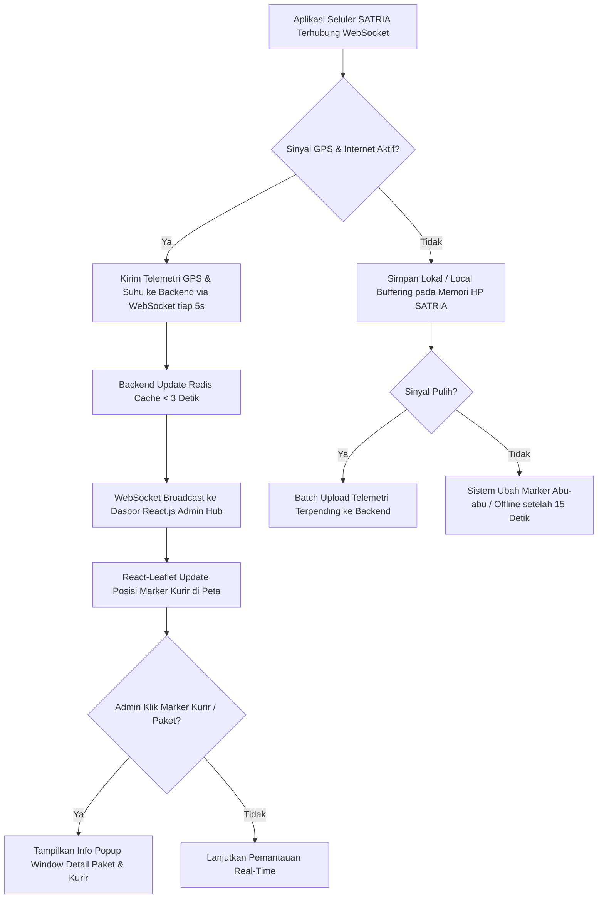

# Functional Requirement Document (FRD) — Live Monitoring Map

--------------------------------------------------------------------------------

## 1. Konteks
Fitur **Live Monitoring Map** (Peta Pemantauan Langsung) dirancang untuk menyajikan visibilitas lokasi posisi kurir SATRIA, titik penyerahan paket, serta indikator suhu layanan dingin secara *real-time* pada satu antarmuka peta interaktif berbasis React-Leaflet. Fitur ini merujuk langsung pada **00-PRD-courier-admin-mini-panel.md** Bagian 4 (In-Scope F-01) untuk menyelesaikan ketiadaan visibilitas lokasi kurir di antara titik pemindaian. Tujuan utamanya adalah mendukung Admin Hub dalam mengidentifikasi potensi penumpukan paket, pergerakan terhenti, dan anomali suhu dingin secara proaktif.

--------------------------------------------------------------------------------

## 2. Peran & Hak Akses
| Peran (Role) | Lihat (Read) | Buat (Create) | Ubah (Update) | Setujui (Approve) | Field Terkunci (Locked Fields) |
| ------ | ------ | ------ | ------ | ------ | ------ |
| **Admin Hub Operasional (Siti)** | ✅ Ya | ❌ Tidak | ✅ Ya (Filter/Zoom/Cluster) | ❌ Tidak | courier_live_lat, courier_live_long, waybill_number |
| **Kurir SATRIA (Mobile App)** | ❌ Tidak | ✅ Ya (Kirim Telemetri) | ❌ Tidak | ❌ Tidak | store_latitude, drop_latitude, temperature_c |
| **System (Backend & WebSocket)** | ✅ Ya | ✅ Ya (Log GPS) | ✅ Ya (State Marker / Cluster) | ✅ Ya | order_date, order_time |

--------------------------------------------------------------------------------

## 3. Alur

```mermaid
graph TD
    A[Aplikasi Seluler SATRIA Terhubung WebSocket] --> B{Sinyal GPS & Internet Aktif?}
    B -- Ya --> C[Kirim Telemetri GPS & Suhu ke Backend via WebSocket tiap 5s]
    B -- Tidak --> D[Simpan Lokal / Local Buffering pada Memori HP SATRIA]
    C --> E[Backend Update Redis Cache < 3 Detik]
    E --> F[WebSocket Broadcast ke Dasbor React.js Admin Hub]
    F --> G[React-Leaflet Update Posisi Marker Kurir di Peta]
    G --> H{Admin Klik Marker Kurir / Paket?}
    H -- Ya --> I[Tampilkan Info Popup Window Detail Paket & Kurir]
    H -- Tidak --> J[Lanjutkan Pemantauan Real-Time]
    D --> K{Sinyal Pulih?}
    K -- Ya --> L[Batch Upload Telemetri Terpending ke Backend]
    K -- Tidak --> M[Sistem Ubah Marker Abu-abu / Offline setelah 15 Detik]

```
### Pernyataan Alur Kebutuhan (EARS Pattern):
*   **KETIKA** perangkat seluler kurir SATRIA terhubung ke internet, sistem **harus** mentransmisikan koordinat GPS (courier_live_lat, courier_live_long) dan data suhu (temperature_c) ke backend via WebSocket setiap 5 detik.
*   **KETIKA** backend menerima data telemetri GPS, sistem **harus** memperbarui penanda (*marker*) posisi kurir pada peta React-Leaflet Admin Hub dengan latensi maksimal 3 detik.
*   **JIKA** koneksi internet perangkat kurir terputus > 15 detik, sistem **harus** mengubah warna ikon *marker* kurir menjadi abu-abu (*Offline*) dan mencatat status sinyal terputus.
*   **JIKA** kurir mengaktifkan kembali koneksi internet, sistem **harus** melakukan pengiriman ulang data koordinat yang tersimpan di penyimpanan lokal (*local buffering*).
*   **SELAMA** kurir berstatus *ONLINE / Active*, sistem **harus** menampilkan radius titik tujuan pengiriman paket (drop_latitude, drop_longitude) yang menjadi tanggung jawab kurir tersebut.

--------------------------------------------------------------------------------

## 4. Aturan Bisnis
| ID Rule | Kondisi / Pemicu | Hasil / Perilaku Sistem | Pengecualian |
| ------ | ------ | ------ | ------ |
| **BR-01** | Telemetri GPS diterima via WebSocket. | Rendering pembaruan *marker* pada peta React.js selesai dalam latensi **≤ 3.0 detik**. | Jika koneksi jaringan lokal Admin Hub terputus. |
| **BR-02** | Tidak ada sinyal GPS dari kurir selama **> 15 detik**. | Sistem mengubah status visual *marker* kurir menjadi **Abu-abu (Offline)** dan memicu log peringatan koneksi. | Kurir berstatus *OFF_DUTY* atau *Shift Ended*. |
| **BR-03** | Admin mengklik *marker* kurir atau paket di peta. | Antarmuka menampilkan *Info Popup Window* berisi waybill_number, courier_name, vehicle, weather, traffic, temperature_c, dan sisa SLA. | *Marker* dalam kondisi *cluster* rapat (wajib *zoom-in* dahulu). |
| **BR-04** | Kecepatan bergerak kurir terdeteksi **0 km/jam** selama **> 10 menit** saat paket aktif. | Sistem menandai ikon kurir dengan indikator **Idle Alert (Kuning Pulsasi)**. | Kurir sedang berada di lokasi penyerahan paket (drop_latitude, drop_longitude). |
| **BR-05** | Suhu paket dingin (*Frozen*) terdeteksi di luar ambang batas **-2.0°C s/d 5.0°C**. | Sistem memicu *Toast Alert* suhu dingin warna **Merah Flashing** di pojok kanan bawah dasbor. | Paket bukan kategori layanan *Frozen*. |
| **BR-06** | Jumlah *marker* paket aktif pada area hub melampaui **100 titik**. | Peta menerapkan *Marker Clustering* otomatis untuk menjaga performa rendering UI **< 1.5 detik**. | Admin mematikan fitur pemfokusan area. |

--------------------------------------------------------------------------------

## 5. Istilah
*   **SATRIA:** Sebutan resmi untuk armada kurir lapangan Anteraja.
*   **Telemetri GPS:** Aliran data koordinat lokasi (latitude, longitude) yang dikirimkan secara berkala dari perangkat kurir ke server.
*   **Local Buffering:** Penyimpanan sementara data koordinat pada memori lokal ponsel kurir saat koneksi internet terputus.
*   **Marker:** Ikon penanda visual pada peta interaktif yang menunjukkan posisi kurir atau lokasi tujuan paket.
*   **Drop Point:** Koordinat lokasi penyerahan paket akhir kepada penerima (drop_latitude, drop_longitude).
*   **Temperature Telemetry:** Transmisi angka suhu udara dingin (temperature_c) untuk pemantauan kualitas paket *Frozen* (-2°C s/d 5°C).

--------------------------------------------------------------------------------

## 6. Data Utama & Status
### Data Utama yang Disimpan:
*  waybill_number (VARCHAR(20) - Primary Key / Resi)
*  service_type (ENUM - Regular, Instant, Frozen, PHARMA, Cargo, etc.)
*  store_latitude & store_longitude (DECIMAL(10,8) - Titik Hub)
*  drop_latitude & drop_longitude (DECIMAL(10,8) - Titik Tujuan)
*  courier_live_lat & courier_live_long (DECIMAL(10,8) - Telemetri Real-Time)
*  vehicle (ENUM - Motorcycle, Scooter, Van, Blind Van, Cargo Truck, Cooler Box Van)
*  temperature_c (DECIMAL - Suhu Paket Cold-Chain)
### Daftar Status Kurir & Perpindahan:
```
[OFFLINE / ABU-ABU] <---> [ONLINE / HIJAU] ---> [IDLE / KUNING] ---> [OFF-DUTY]

```
*   **ONLINE (Hijau):** Sinyal GPS aktif, kurir bergerak mengirimkan paket.
*   **IDLE (Kuning):** Sinyal GPS aktif, kurir terhenti > 10 menit di luar titik penyerahan.
*   **OFFLINE (Abu-abu):** Sinyal GPS terputus > 15 detik saat *shift* berlangsung.

--------------------------------------------------------------------------------

## 7. Daftar Fungsi
*   **F-01.1 Telemetry Receiver Service:** Menerima dan memvalidasi paket data koordinat GPS dan suhu dari seluler kurir via WebSocket Laravel Reverb.
*   **F-01.2 Interactive Map Renderer:** Menampilkan peta berbasis React-Leaflet dengan *custom marker* kurir, *cluster point*, dan *drop point*.
*   **F-01.3 Info Popup Window Component:** Menampilkan detail paket, kendaraan, cuaca, dan suhu secara instan saat penanda peta diklik.
*   **F-01.4 Connection & Offline Handler:** Mengelola status indikator sinyal kurir dan sinkronisasi data *local buffering*.

--------------------------------------------------------------------------------

## 8. AC Alur Utama (Acceptance Criteria - Data Nyata delivery.csv)
### Skenario 1: Pemantauan Pergerakan Kurir Paket Instant Berjalan Lancar
*   **Diberikan:** Admin Hub (Siti) membuka dasbor peta di HUB-JAKTIM-HALIM. Kurir Budi Santoso (HLM-001, Vehicle: Motorcycle) membawa paket resi 100024000101 (Layanan: Instant, Makanan Siap Saji) di lokasi awal store_latitude: -6.225588, store_longitude: 106.855324.
*   **Ketika:** Perangkat seluler Kurir Budi Santoso bergerak dan mengirimkan koordinat baru (courier_live_lat: -6.228145, courier_live_long: 106.835210) via WebSocket pada pukul 08:35:00.
*   **Maka:** Marker posisi Kurir Budi Santoso di peta React-Leaflet berpindah secara halus dalam latensi **2.1 detik** (memenuhi BR-01 ≤ 3.0s), status kurir berwarna **Hijau (Online)**, dan sisa SLA terhitung aman.
### Skenario 2: Deteksi Sinyal GPS Terputus & Anomali Suhu Cold-Chain Layanan Frozen
*   **Diberikan:** Kurir Rizky Pratama (HLM-008, Vehicle: Motorcycle thermal box) membawa paket resi 100024000107 (Layanan: Frozen, Daging Beku) di area Kramat Jati.
*   **Ketika:** Suhu *Cooler Box* terdeteksi naik menjadi **6.2°C** (> 5.0°C) pada pukul 10:15:00, dan 20 detik kemudian sinyal GPS terputus akibat area *dead-zone* banjir.
*   **Maka:**
    1. Pada pukul 10:15:02, *Toast Alert* berkedip merah "Anomali Suhu Cold-Chain (6.2°C) - Resi 100024000107" muncul di pojok kanan bawah dasbor Admin Siti.
    2. Pada pukul 10:15:35 (> 15 detik), marker Kurir Rizky Pratama berubah warna menjadi **Abu-Abu (Offline)** di peta (memenuhi BR-02).
    3. Perangkat HP kurir mengaktifkan *Local Buffering* untuk menyimpan koordinat lokal hingga jaringan pulih.

--------------------------------------------------------------------------------

## 9. Tidak Termasuk (Out-of-Scope)
*   **Public Customer Live Map:** Antarmuka peta tidak dapat diakses publik atau penerima paket.
*   **3D Building / Traffic Layer Processing:** Peta tidak merender bangunan 3D atau lapisan lalu lintas resolusi tinggi yang memberatkan GPU.
*   **Automated GPS Fake Detection:** Pemodelan kecerdasan buatan untuk mendeteksi *fake GPS* canggih tidak termasuk dalam scope MVP.
