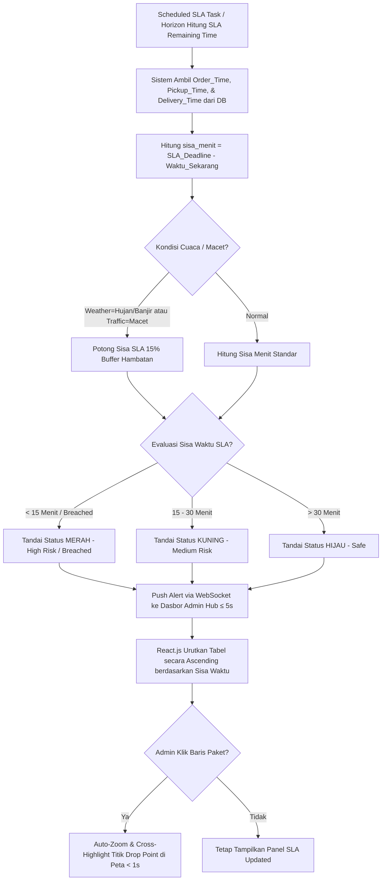

# Functional Requirement Document (FRD) — SLA Risk Indicator Panel

---

### 1. Konteks
Fitur **SLA Risk Indicator Panel** (Panel Indikator Risiko SLA) berfungsi untuk menampilkan dan mengurutkan seluruh paket yang belum terkirim secara otomatis berdasarkan sisa waktu SLA terdekat. Fitur ini merujuk langsung pada **00-PRD-courier-admin-mini-panel.md** Bagian 4 (In-Scope F-02) dan Bagian 7 untuk menekan angka *SLA Breached* di bawah 2.5% dan mempercepat identifikasi keterlambatan yang sebelumnya bersifat reaktif.

---

### 2. Peran & Hak Akses

| Peran (Role) | Lihat (Read) | Buat (Create) | Ubah (Update) | Setujui (Approve) | Field Terkunci (Locked Fields) |
| :--- | :---: | :---: | :---: | :---: | :--- |
| **Admin Hub Operasional** | ✅ Ya | ❌ Tidak | ✅ Ya (Filter/Highlight) | ❌ Tidak | `Order_Time`, `Pickup_Time`, `SLA_Deadline` |
| **Kurir SATRIA (Mobile App)** | ❌ Tidak | ❌ Tidak | ❌ Tidak | ❌ Tidak | Semua Field Sistem |
| **System (Backend & Horizon)** | ✅ Ya | ✅ Ya (Hitung SLA) | ✅ Ya (Update Status) | ✅ Ya | `Order_ID`, `SLA_Remaining_Minutes` |
| **Customer Care / Hub Manager** | ✅ Ya (Read-only) | ❌ Tidak | ❌ Tidak | ❌ Tidak | Semua Field Sistem |

---

### 3. Alur



#### Pernyataan Alur Kebutuhan (EARS Pattern):
* **KETIKA** paket dipindai dan dibawa kurir (`Pickup_Time`), sistem **harus** menghitung `SLA_Deadline` berdasarkan estimasi `Delivery_Time_Minutes` dan waktu penjemputan.
* **KETIKA** sisa waktu SLA paket mengalami perubahan setiap menit, sistem **harus** memperbarui daftar urutan paket secara *Ascending* (terkritis berada di posisi paling atas).
* **JIKA** sisa waktu SLA paket kurang dari 15 menit atau telah melampaui batas (`SLA_Remaining_Minutes <= 15`), sistem **harus** memberikan penanda warna **Merah** dan mentrigger peringatan visual di dasbor admin dalam waktu < 5 detik.
* **JIKA** Admin Hub mengklik salah satu baris paket pada panel SLA, sistem **harus** melakukan *auto-zoom* dan menyorot titik tujuan pengiriman (`Drop_Latitude`, `Drop_Longitude`) pada Peta Pemantauan Langsung dalam waktu < 1.0 detik.
* **SELAMA** paket berstatus *In-Transit / Out_For_Delivery / Assigned*, sistem **harus** memperbarui nilai sisa waktu SLA secara otomatis tanpa perlu *reload* halaman secara manual.

---

### 4. Aturan Bisnis

| ID Rule | Kondisi / Pemicu | Hasil / Perilaku Sistem | Pengecualian |
| :--- | :--- | :--- | :--- |
| **BR-01** | Hitungan `SLA_Remaining_Minutes` **< 15 menit** atau **< 0 menit**. | Kategori risiko di-set **HIGH_RISK / BREACHED** dengan warna latar tabel **Merah Flashing**. | Paket yang sudah berstatus *Delivered* atau *Returned*. |
| **BR-02** | Hitungan `SLA_Remaining_Minutes` antara **15 hingga 30 menit**. | Kategori risiko di-set **MEDIUM_RISK** dengan warna latar tabel **Kuning**. | Paket berstatus *Delivered*. |
| **BR-03** | Hitungan `SLA_Remaining_Minutes` **> 30 menit**. | Kategori risiko di-set **SAFE** dengan warna latar tabel **Hijau**. | - |
| **BR-04** | Paket mengalami kondisi `Weather = Hujan Deras / Banjir` ATAU `Traffic = Macet Total`. | Sistem memotong kalkulasi sisa SLA sebesar **15% (Buffer Waktu Hambatan)** secara otomatis. | Paket dikirim menggunakan moda van pada area *Urban*. |
| **BR-05** | Terjadi perubahan status risiko paket menjadi Merah. | Peringatan suara/visual dikirimkan ke dasbor admin via WebSocket dalam latensi **≤ 5.0 detik**. | Admin mematikan suara notifikasi di pengaturan UI. |

---

### 5. Istilah

* **SLA (Service Level Agreement):** Batas waktu maksimal penyelesaian pengiriman paket yang dijanjikan kepada pelanggan.
* **SLA Breached:** Kondisi di mana durasi pengiriman paket telah melewati batas waktu SLA yang ditentukan (`SLA_Remaining_Minutes < 0`).
* **At-Risk Package:** Paket yang berada dalam ambang batas rawan terlambat (`SLA_Remaining_Minutes <= 15`).
* **Cross-Highlighting:** Fitur interaksi di mana memilih data pada tabel akan otomatis menyorot dan melakukan *auto-zoom* pada objek terkait di peta.

---

### 6. Data Utama & Status

#### Data Utama yang Disimpan:
* `Order_ID` (String - Unique Identifier / Resi)
* `Service_Type` (Enum - Regular, Same Day, Next Day, Instant, Frozen, PHARMA, etc.)
* `Order_Date` & `Order_Time` (Timestamp)
* `Pickup_Time` (Timestamp)
* `Delivery_Time_Minutes` (Integer - Menit)
* `Weather` & `Traffic` (String - Hambatan Lingkungan)
* `SLA_Remaining_Minutes` (Computed Integer - Menit)
* `SLA_Status` (Enum - SAFE, MEDIUM_RISK, HIGH_RISK, BREACHED, CRITICAL)

#### Daftar Status Risiko SLA:
```
[SAFE / HIJAU (>30m)] ---> [MEDIUM RISK / KUNING (15-30m)] ---> [HIGH RISK / MERAH (<15m)] ---> [BREACHED (<0m)]
```

---

### 7. Daftar Fungsi

* **F-02.1 Dynamic SLA Calculator Engine:** Menghitung sisa waktu SLA secara *real-time* berbasis waktu server dan variabel hambatan lingkungan.
* **F-02.2 Auto-Sorting Risk List Component:** Komponen UI React.js yang menampilkan dan mengurutkan paket secara *ascending* berdasarkan sisa waktu.
* **F-02.3 Visual Risk Color Coder:** Menerapkan pengkodean warna dinamis (Merah, Kuning, Hijau) pada baris tabel paket.
* **F-02.4 Map Cross-Highlight Synchronizer:** Menghubungkan kejadian klik baris tabel dengan aksi *auto-zoom* penanda peta.

---

### 8. AC Alur Utama (Acceptance Criteria - Data Nyata `delivery.txt`)

#### Skenario 1: Penandaan Otomatis Paket Same Day Berisiko Terlambat
* **Diberikan:** Admin Hub (Siti) memantau paket resi `100024000102` (Layanan: `Same Day`, Rian Kusuma / `STR-BKS-002`, `HUB-BKS-HARAPANINDAH`, `Order_Time: 09:20:00`, `Pickup_Time: 09:50:00`, `SLA_Deadline: 2026-09-20 17:50:00`, `Weather: Berawan`, `Traffic: Sedang`).
* **Ketika:** Waktu server menunjukkan pukul 17:35:00 (sisa waktu SLA tinggal **15 menit** sebelum batas 17:50:00 terlampaui).
* **Maka:** Backend memperbarui `SLA_Remaining_Minutes` menjadi 15 menit, menetapkan kategori risiko **HIGH_RISK**, dan menampilkan baris resi `100024000102` di baris teratas panel SLA dengan warna latar **Merah** dalam latensi **2.2 detik** (memenuhi BR-05 ≤ 5 detik).

#### Skenario 2: Interaksi Cross-Highlighting dari Panel SLA ke Peta
* **Diberikan:** Admin Hub melihat paket resi `100024000107` (Layanan: `Frozen`, Surya Darma, `Drop_Latitude: -6.134512`, `Drop_Longitude: 106.871240`, status: `CRITICAL` akibat `Weather: Banjir`, sisa SLA: 60 menit).
* **Ketika:** Admin Hub mengklik baris resi `100024000107` pada tabel panel SLA.
* **Maka:** Antarmuka peta React-Leaflet secara instan melakukan *auto-zoom* ke koordinat `-6.134512, 106.871240` dan menampilkan *popup window* detail pengiriman paket Frozen tersebut dalam waktu **0.8 detik**.

---

### 9. Tidak Termasuk (Out-of-Scope)

* **Otomatisasi Pembatalan Paket:** Sistem tidak membatalkan paket secara otomatis jika status SLA mengalami *Breached*.
* **Prediksi Machine Learning SLA:** Kalkulasi sisa waktu menggunakan rumus aritmatika konstan dan faktor hambatan linier, bukan model kecerdasan buatan (*AI/ML*).
* **Notifikasi Langsung ke Konsumen:** Sistem tidak mengirimkan pesan peringatan keterlambatan SLA ke nomor WhatsApp/SMS penerima barang.
