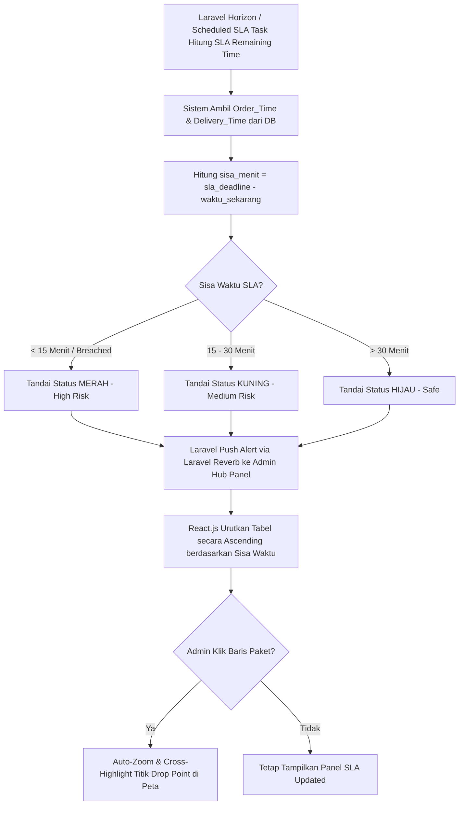

# Functional Requirement Document (FRD) — SLA Risk Indicator Panel

## 1. Konteks
Fitur **SLA Risk Indicator Panel** (Panel Indikator Risiko SLA) berfungsi untuk menampilkan dan mengurutkan seluruh paket yang belum terkirim secara otomatis berdasarkan sisa waktu SLA terdekat. Fitur ini merujuk langsung pada **00-PRD-courier-admin-mini-panel.md** Bagian 4 (*In-Scope MVP Core P0*) dan Bagian 7 (AC-02) untuk menekan angka *SLA Breached* di bawah 2.5% dan mempercepat identifikasi keterlambatan yang sebelumnya bersifat reaktif.

---

## 2. Peran & Hak Akses

| Peran (Role) | Lihat (Read) | Buat (Create) | Ubah (Update) | Setujui (Approve) | Field Terkunci (Locked Fields) |
| :--- | :---: | :---: | :---: | :---: | :--- |
| **Admin Hub Operasional** | ✅ Ya | ❌ Tidak | ✅ Ya (Filter/Highlight) | ❌ Tidak | `Order_Time`, `Pickup_Time`, `sla_deadline` |
| **Kurir SATRIA (Mobile App)** | ❌ Tidak | ❌ Tidak | ❌ Tidak | ❌ Tidak | Semua Field |
| **System (Laravel / Horizon)** | ✅ Ya | ✅ Ya (Hitung SLA) | ✅ Ya (Update Status) | ✅ Ya | `Order_ID` |
| **Customer Care / Manager** | ✅ Ya (Read-only) | ❌ Tidak | ❌ Tidak | ❌ Tidak | Semua Field |

---

## 3. Alur (Workflow & EARS Pattern)



### Pernyataan Alur Kebutuhan (EARS Pattern):
* **KETIKA** paket dipindai dan dibawa kurir (`Pickup_Time`), sistem **harus** menghitung `sla_deadline` berdasarkan estimasi `Delivery_Time` dan waktu penjemputan.
* **KETIKA** sisa waktu SLA paket mengalami perubahan setiap menit, sistem **harus** memperbarui daftar urutan paket secara *Ascending* (terkritis di paling atas).
* **JIKA** sisa waktu SLA paket kurang dari 15 menit atau telah melampaui batas, sistem **harus** memberikan penanda warna **Merah** dan mentrigger peringatan visual di dasbor admin < 5 detik.
* **JIKA** Admin Hub mengklik salah satu baris paket pada panel SLA, sistem **harus** melakukan *auto-zoom* dan menyorot titik tujuan pengiriman (`Drop_Latitude`, `Drop_Longitude`) pada Peta Pemantauan Langsung.
* **SELAMA** paket berstatus *In-Transit / Unassigned*, sistem **harus** memperbarui nilai sisa waktu SLA secara otomatis tanpa perlu *reload* halaman secara manual.

---

## 4. Aturan Bisnis (Business Rules)

| ID Rule | Kondisi / Pemicu | Hasil / Perilaku Sistem | Pengecualian |
| :--- | :--- | :--- | :--- |
| **BR-01** | Hitungan `sla_remaining_time` **< 15 menit** atau **< 0 menit**. | Kategori risiko di-set **HIGH_RISK / BREACHED** dengan warna latar tabel **Merah Flashing**. | Paket yang sudah berstatus *Delivered / Returned*. |
| **BR-02** | Hitungan `sla_remaining_time` antara **15 hingga 30 menit**. | Kategori risiko di-set **MEDIUM_RISK** dengan warna latar tabel **Kuning**. | - |
| **BR-03** | Hitungan `sla_remaining_time` **> 30 menit**. | Kategori risiko di-set **SAFE** dengan warna latar tabel **Hijau**. | - |
| **BR-04** | Paket mengalami kondisi `Weather = Stormy` ATAU `Traffic = Jam`. | Sistem memotong kalkulasi sisa SLA sebesar **15% (Buffer Waktu Hambatan)** secara otomatis. | Paket dikirim menggunakan moda `van` pada area Urban. |
| **BR-05** | Terjadi perubahan status risiko paket menjadi Merah. | Peringatan suara/visual dikirimkan ke dasbor admin via Laravel Reverb dalam latensi **≤ 5.0 detik**. | Admin mematikan suara notifikasi di pengaturan UI. |

---

## 5. Istilah

* **SLA (Service Level Agreement):** Batas waktu maksimal penyelesaian pengiriman paket yang dijanjikan kepada pelanggan.
* **SLA Breached:** Kondisi di mana durasi pengiriman paket telah melewati batas waktu SLA yang ditentukan.
* **At-Risk Package:** Paket yang berada dalam ambang batas rawan terlambat (sisa SLA < 15 menit).
* **Cross-Highlighting:** Fitur interaksi di mana memilih data pada tabel akan otomatis menyorot objek terkait pada elemen peta.

---

## 6. Data Utama & Status

### Data Utama yang Disimpan:
* `Order_ID` (String - Resi)
* `Order_Date` & `Order_Time` (Timestamp)
* `Pickup_Time` (Timestamp)
* `Delivery_Time` (Integer - Menit)
* `Weather` & `Traffic` (String - Hambatan Lingkungan)
* `sla_remaining_time` (Computed Integer - Menit)

### Daftar Status Risiko SLA:

```
[SAFE / HIJAU (>30m)] ---> [MEDIUM RISK / KUNING (15-30m)] ---> [HIGH RISK / MERAH (<15m)] ---> [BREACHED]
```

---

## 7. Daftar Fungsi

* **F-02.1 Dynamic SLA Calculator Engine:** Menghitung sisa waktu SLA secara *real-time* berbasis waktu server dan variabel hambatan lingkungan.
* **F-02.2 Auto-Sorting Risk List Component:** Komponen UI React.js yang menampilkan dan mengurutkan paket secara *ascending*.
* **F-02.3 Visual Risk Color Coder:** Menerapkan pengkodean warna dinamis (Merah, Kuning, Hijau) pada baris tabel paket.
* **F-02.4 Map Cross-Highlight Synchronizer:** Menghubungkan kejadian klik baris tabel dengan aksi *auto-zoom* penanda peta.

---

## 8. AC Alur Utama (Acceptance Criteria - Data Nyata)

### Skenario 1: Penandaan Otomatis Paket Kritis Berisiko Terlambat
* **Diberikan:** Admin Hub (Siti) memantau paket resi `akqg208421122` (`Order_Date`: 2022-03-25, `Order_Time`: 19:45:00, `Pickup_Time`: 19:50:00, `Weather`: `Stormy`, `Traffic`: `Jam`, estimasi `Delivery_Time`: 165 menit).
* **Ketika:** Waktu server menunjukkan pukul 22:25:00 (sisa waktu SLA tinggal **10 menit** sebelum batas 165 menit terlampaui).
* **Maka:** Sistem di backend Laravel 11 memperbarui `sla_remaining_time` menjadi 10 menit, menetapkan kategori risiko **HIGH_RISK**, dan menampilkan baris resi `akqg208421122` di baris teratas panel SLA dengan warna **Merah Flashing** dalam latensi **2.4 detik** (memenuhi BR-05 ≤ 5 detik).

### Skenario 2: Interaksi Cross-Highlighting dari Panel SLA ke Peta
* **Diberikan:** Admin Hub melihat paket resi `njpu434582536` (`Weather`: `Sandstorms`, `Traffic`: `Low`, `Drop_Latitude`: 12.924264, `Drop_Longitude`: 77.6884) berada di urutan ke-2 panel SLA dengan status Kuning (sisa SLA 22 menit).
* **Ketika:** Admin Hub mengklik baris resi `njpu434582536` pada tabel panel SLA.
* **Maka:** Antarmuka peta React-Leaflet secara instan melakukan *auto-zoom* ke koordinat `12.924264, 77.6884` dan menampilkan *popup window* detail pengiriman paket tersebut di peta.

---

## 9. Tidak Termasuk (Out-of-Scope)

* **Otomatisasi Pembatalan Paket:** Sistem tidak membatalkan paket secara otomatis jika status SLA mengalami *Breached*.
* **Prediksi Machine Learning SLA:** Kalkulasi sisa waktu menggunakan rumus aritmatika konstan dan faktor hambatan linier, bukan model kecerdasan buatan (*AI/ML*).
* **Notifikasi Langsung ke Konsumen:** Sistem tidak mengirimkan pesan peringatan keterlambatan SLA ke nomor WhatsApp penerima barang.
