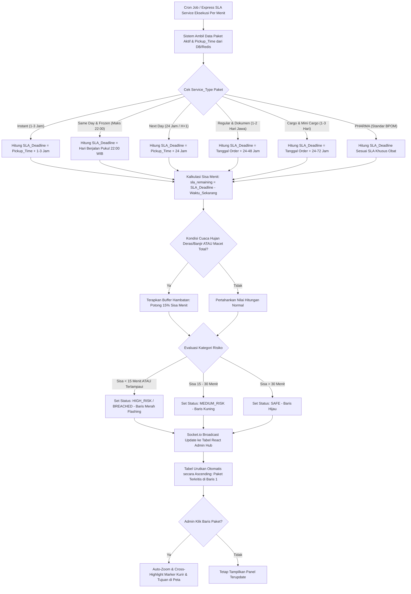

# Functional Requirement Document (FRD) — SLA Risk Indicator Panel

## 1. Konteks
Fitur **SLA Risk Indicator Panel** (Panel Indikator Risiko SLA) berfungsi untuk menyajikan dan mengurutkan seluruh paket yang sedang dalam proses pengiriman secara otomatis berdasarkan sisa waktu SLA terdekat. Fitur ini merujuk langsung pada [`docs/00-PRD-courier-admin-mini-panel.md`](file:///c:/maxy/anteraja-capstone-naufalrakanramadhan/docs/00-PRD-courier-admin-mini-panel.md) Bagian 4 (*In-Scope MVP Core P0*) dan Bagian 7 (AC-02) untuk menekan angka keterlambatan pengiriman (*SLA Breached*) di bawah 2.5% pada jaringan Stasiun Layanan Anteraja di Indonesia.

Panel ini mengintegrasikan mesin kalkulasi dinamis untuk **9 Jenis Layanan Pengiriman Anteraja** (*Regular*, *Same Day*, *Next Day*, *Instant*, *Dokumen*, *Cargo*, *Mini Cargo*, *PHARMA*, dan *Frozen*) dengan penyesuaian bobot hambatan lingkungan tropis Indonesia (hujan deras, banjir, dan macet total).

---

## 2. Peran & Hak Akses

| Peran (Role) | Lihat (Read) | Buat (Create) | Ubah (Update) | Setujui (Approve) | Field Terkunci (Locked Fields) |
| :--- | :---: | :---: | :---: | :---: | :--- |
| **Admin Hub Operasional** | ✅ Ya | ❌ Tidak | ✅ Ya (Filter Layanan, Cross-Highlight) | ❌ Tidak | `Order_Time`, `Pickup_Time`, `SLA_Deadline`, `Service_Type` |
| **Kurir SATRIA (Mobile App)** | ❌ Tidak | ❌ Tidak | ❌ Tidak | ❌ Tidak | Semua Field Panel |
| **System (Express / Node.js Engine)** | ✅ Ya | ✅ Ya (Hitung SLA Dinamis) | ✅ Ya (Update Status Risiko & Urutan) | ✅ Ya | `Order_ID`, `Order_Date` |
| **Customer Care / Hub Manager** | ✅ Ya (Read-only) | ❌ Tidak | ❌ Tidak | ❌ Tidak | Semua Field |

---

## 3. Alur (Workflow & EARS Pattern)



### Pernyataan Alur Kebutuhan (EARS Pattern):
* **KETIKA** paket dipindai oleh kurir SATRIA (`Pickup_Time`), sistem **harus** menetapkan `SLA_Deadline` sesuai formula layanan (`Service_Type`) yang bersangkutan.
* **KETIKA** interval penghitungan SLA berjalan setiap 60 detik, sistem **harus** memperbarui nilai `SLA_Remaining_Minutes` untuk seluruh paket yang berstatus aktif (*Assigned* atau *In_Transit*).
* **JIKA** sisa waktu SLA paket kurang dari 15 menit atau telah melampaui batas waktu, sistem **harus** memberikan penanda visual warna **Merah Flashing** dan memposisikan paket tersebut pada urutan teratas tabel dalam waktu < 5 detik.
* **JIKA** Admin Hub mengklik baris paket pada panel SLA, sistem **harus** memicu aksi *cross-highlighting* dengan memperbesar (*auto-zoom*) peta dan menyorot titik tujuan pengiriman di peta React-Leaflet.
* **SELAMA** paket berstatus dalam perjalanan (*In_Transit*), sistem **harus** menampilkan lencana (*badge*) tipe layanan (misal: `Frozen`, `PHARMA`, `Cargo`, `Same Day`) untuk memudahkan identifikasi prioritas penanganan.

---

## 4. Aturan Bisnis (Business Rules)

| ID Rule | Kondisi / Pemicu | Hasil / Perilaku Sistem | Pengecualian |
| :--- | :--- | :--- | :--- |
| **BR-01** | Kalkulasi SLA berbasis Layanan (*Service-Based SLA Formula*):<br>• **Instant:** 120–180 menit dari `Pickup_Time`.<br>• **Same Day & Frozen:** Wajib selesai maksimal pukul **22.00 WIB** hari berjalan.<br>• **Next Day:** Maksimal **24 jam** dari `Pickup_Time`.<br>• **Regular & Dokumen:** 24–48 jam (Jabodetabek/Jawa), 48–96 jam (antarprovinsi).<br>• **Cargo & Mini Cargo:** 24–72 jam (1–3 hari). | Sistem menghitung selisih waktu terhadap waktu server secara otomatis setiap menit. | Paket dengan status *Delivered* atau *Returned*. |
| **BR-02** | Penetapan Kategori Risiko Layanan Durasi Pendek (*Instant*, *Same Day*, *Frozen*):<br>• `SLA_Remaining_Minutes < 15`: **HIGH_RISK / BREACHED** (Merah Flashing).<br>• `SLA_Remaining_Minutes 15 – 30`: **MEDIUM_RISK** (Kuning).<br>• `SLA_Remaining_Minutes > 30`: **SAFE** (Hijau). | Warna latar belakang baris tabel dan lencana status berubah seketika. | - |
| **BR-03** | Penetapan Kategori Risiko Layanan Durasi Panjang (*Next Day*, *Regular*, *Dokumen*, *Cargo*, *Mini Cargo*). | Paket dinaikkan statusnya menjadi **MEDIUM_RISK** jika sisa waktu menuju *cutoff* harian < 4 jam, dan **HIGH_RISK** jika < 2 jam. | Rute pengiriman transit antarpulau terjadwal. |
| **BR-04** | Hambatan Cuaca Ekstrem atau Kemacetan (`Weather = Hujan Deras/Banjir` ATAU `Traffic = Macet Total`). | Sistem memotong kalkulasi sisa SLA sebesar **15% (Buffer Waktu Hambatan)** secara otomatis untuk memberikan sinyal peringatan lebih awal kepada admin. | Pengiriman menggunakan moda `Cargo_Truck` pada rute jalan tol bebas hambatan. |
| **BR-05** | Terjadi perpindahan status risiko menjadi **HIGH_RISK** atau **BREACHED**. | Sistem memicu nada peringatan audio singkat dan notifikasi visual di dasbor admin via Socket.io dalam latensi **≤ 5.0 detik**. | Admin menonaktifkan suara notifikasi pada pengaturan antarmuka. |

---

## 5. Istilah

* **SLA (Service Level Agreement):** Komitmen batas waktu penyelesaian pengantaran paket oleh Anteraja sesuai paket layanan yang dibeli pelanggan.
* **SLA Breached:** Kondisi keterlambatan di mana paket belum diserahkan melampaui batas waktu SLA yang dijanjikan.
* **High-Risk SLA Package:** Paket yang berada pada fase kritis berisiko terlambat (sisa waktu < 15 menit atau < 2 jam sebelum cutoff).
* **Cross-Highlighting:** Aksi interaksi otomatis di mana memilih baris pada tabel panel SLA akan langsung memfokuskan dan memperbesar tampilan lokasi kurir dan tujuan di peta.
* **Buffer Waktu Hambatan:** Pengurangan kalkulasi durasi estimasi secara otomatis untuk mengantisipasi keterlambatan akibat cuaca banjir atau kemacetan lalu lintas perkotaan.

---

## 6. Data Utama & Status

### Data Utama yang Disimpan & Ditampilkan:
* `Order_ID` (String - Nomor Resi simulasi Anteraja)
* `Service_Type` (`Regular`, `Same Day`, `Next Day`, `Instant`, `Dokumen`, `Cargo`, `Mini Cargo`, `PHARMA`, `Frozen`)
* `Courier_Name` (Nama Kurir SATRIA Simulasi)
* `Destination_Address` & `Destination_City`
* `Order_Date`, `Order_Time`, `Pickup_Time`
* `SLA_Deadline` (Timestamp Batas Akhir)
* `SLA_Remaining_Minutes` (Computed Integer - Menit)
* `SLA_Status` (`SAFE`, `MEDIUM_RISK`, `HIGH_RISK`, `BREACHED`)
* `Weather` & `Traffic` (Kondisi Lingkungan)
* `Temperature_C` (Khusus Frozen & Pharma)

### Daftar Status Risiko SLA:
```
[SAFE / HIJAU (>30m)] ---> [MEDIUM_RISK / KUNING (15-30m)] ---> [HIGH_RISK / MERAH (<15m)] ---> [BREACHED / MERAH FLASHING (<0m)]
```

---

## 7. Daftar Fungsi

* **F-02.1 Multi-Service SLA Calculator Engine:** Menghitung sisa durasi SLA secara *real-time* berbasis formula dinamis 9 layanan dan variabel hambatan lingkungan Indonesia.
* **F-02.2 Auto-Sorting Risk List Component:** Komponen tabel React.js yang secara otomatis menyusun daftar paket secara *ascending* (paket terkritis berada di atas).
* **F-02.3 Visual Risk Color Coder:** Menerapkan pengkodean warna dinamis (Merah, Kuning, Hijau) serta lencana layanan pada baris tabel paket.
* **F-02.4 Map Cross-Highlight Synchronizer:** Menghubungkan interaksi klik baris tabel dengan aksi pemfokusan (*auto-zoom*) pada peta pemantauan.

---

## 8. AC Alur Utama (Acceptance Criteria)

### Skenario 1: Penandaan Otomatis Paket Layanan Instant yang Kritis
* **Diberikan:** Admin Hub (Siti) memantau paket layanan *Instant* resi `100024000000` (`Pickup_Time`: 07:22:00 WIB, durasi SLA: 180 menit, `SLA_Deadline`: 10:22:00 WIB, tujuan: Jl. Ir. H. Djuanda No. 120, Jakarta Selatan).
* **Ketika:** Waktu operasional menunjukkan pukul 10:10:00 WIB (sisa waktu SLA tinggal **12 menit** sebelum batas SLA terlampaui).
* **Maka:** Sistem di backend Express memperbarui `SLA_Remaining_Minutes` menjadi 12 menit, menetapkan status **HIGH_RISK**, dan menampilkan baris resi `100024000000` di baris teratas panel SLA dengan lencana *Instant* dan warna **Merah Flashing** dalam latensi **2.4 detik** (memenuhi BR-02 & BR-05).

### Skenario 2: Interaksi Cross-Highlighting ke Titik Tujuan di Jakarta Timur
* **Diberikan:** Admin Hub melihat paket layanan *Next Day* resi `100024000011` (`Service_Type`: `Next Day`, tujuan: Jl. Raya Darmo No. 55, Jakarta Timur, kurir: Aris Munandar) berada di panel SLA.
* **Ketika:** Admin Hub mengklik baris resi `100024000011` pada tabel panel SLA.
* **Maka:** Antarmuka peta React-Leaflet secara instan melakukan *auto-zoom* ke koordinat tujuan Jakarta Timur (`Drop_Latitude`: -6.263255, `Drop_Longitude`: 106.814779) dan memunculkan jendela info ringkas detail paket tersebut di peta dalam waktu **< 1.0 detik**.

---

## 9. Tidak Termasuk (Out-of-Scope)

* **Otomatisasi Pembatalan Paket:** Sistem tidak membatalkan paket secara sepihak jika telah berstatus *Breached*.
* **Prediksi AI/Machine Learning SLA:** Kalkulasi sisa waktu menggunakan formula deterministik berbasis SLA layanan dan koefisien hambatan linier.
* **Notifikasi SMS Pribadi ke Penerima:** Peringatan keterlambatan hanya ditampilkan di dasbor admin hub internal.
