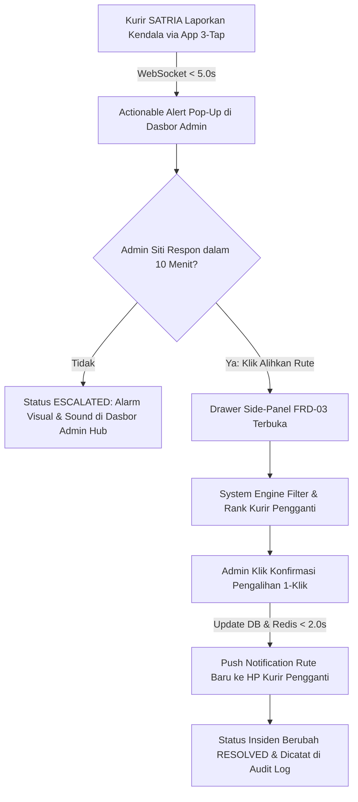

# Functional Requirement Document (FRD) — Incident & Reassignment Center

--------------------------------------------------------------------------------

## 1. Konteks
Modul **Incident & Reassignment Center** menggabungkan fungsi penerimaan laporan kendala *real-time* dari kurir SATRIA dan eksekusi pengalihan tugas paket ke dalam satu antarmuka kontrol terpadu (*Single-Screen Workflow*). Modul ini merujuk langsung pada **00-PRD-courier-admin-mini-panel.md** Bagian 4 (In-Scope F-03 & F-04) untuk merespon insiden lapangan dalam durasi **≤ 5.0 detik** serta merampungkan pengalihan rute paket secara instan dalam waktu **< 30.0 detik** tanpa mengharuskan Admin Hub berpindah halaman. Modul ini menjadi penggerak utama pencapaian KPI bisnis: Kepatuhan SLA **≥ 97.5%**, percepatan penanganan kendala hingga **75%**, dan penekanan pesan koordinasi manual **< 25 pesan/hari**.

--------------------------------------------------------------------------------

## 2. Peran & Hak Akses
| Peran (Role) | Lihat (Read) | Buat (Create) | Ubah (Update) | Setujui (Approve) | Field Terkunci (Locked Fields) |
| ------ | ------ | ------ | ------ | ------ | ------ |
| **Admin Hub Operasional** | ✅ Ya | ✅ Ya (Terima Insiden) | ✅ Ya (Pilih Kurir Pengganti) | ✅ Ya (Konfirmasi 1-Klik) | incident_id, reported_at, waybill_number, original_courier_id |
| **Kurir SATRIA (Mobile App)** | ❌ Tidak | ✅ Ya (Lapor Kendala 3-Tap) | ❌ Tidak | ❌ Tidak | assigned_by_admin_id, reassignment_timestamp |
| **System (Backend & WebSocket)** | ✅ Ya | ✅ Ya (Log Audit) | ✅ Ya (State Insiden & DB Sync) | ✅ Ya (Auto-Matching & Escalation) | incident_id, audit_hash |

--------------------------------------------------------------------------------

## 3. Alur

### Pernyataan Alur Kebutuhan (EARS Pattern):
*   **KETIKA** kurir SATRIA menekan tombol kirim kendala pada aplikasi seluler, sistem **harus** menyiarkan sinyal *alert* dan menampilkan *pop-up* berkedip merah di dasbor Admin Hub dalam waktu ≤ 5.0 detik.
*   **KETIKA** Admin Hub mengklik tombol **Alihkan Rute** pada baris kendala aktif, sistem **harus** membuka *Drawer Side-Panel* dan menyajikan daftar kurir pengganti teratas hasil penyaringan otomatis dalam waktu ≤ 1.5 detik.
*   **JIKA** laporan kendala tidak ditanggapi Admin Hub dalam rentang waktu > 10.0 menit, sistem **harus** mengubah status insiden menjadi ESCALATED dan membunyikan alarm audio/visual pada dasbor Admin Hub.
*   **JIKA** kurir kandidat pengganti memiliki beban paket aktif ≥ 20 paket atau jenis armada tidak kompatibel dengan syarat layanan paket (misal paket *Frozen* tanpa tas termal), sistem **harus** mengecualikan kurir tersebut dari daftar rekomendasi.
*   **SELAMA** insiden berstatus REPORTED atau ACKNOWLEDGED, sistem **harus** menampilkan tombol aksi cepat **Alihkan Rute** dan penghitung waktu (*timer*) durasi insiden di dasbor admin.

--------------------------------------------------------------------------------

## 4. Aturan Bisnis
| ID Rule | Kondisi / Pemicu | Hasil / Perilaku Sistem | Pengecualian |
| ------ | ------ | ------ | ------ |
| **BR-01** | Pengiriman sinyal kendala dari HP Kurir via WebSocket. | Pop-up alert terisi data resi, lokasi GPS, & jenis kendala muncul di layar admin dalam **≤ 5.0 detik**. | Jika kurir offline, laporan disimpan di *local buffer* dan dikirim saat jaringan pulih. |
| **BR-02** | Penyaringan kurir pengganti (*System Matching Engine*). | Menampilkan maksimal 5 kandidat kurir teratas dengan kualifikasi: Status ONLINE, Beban aktif **< 20 paket**, Jenis armada kompatibel (*Cargo* =Van, *Frozen* =Thermal Bag, *PHARMA* =BPOM), dan Jarak terdekat. | Jika tidak ada kurir yang memenuhi kriteria, sistem menampilkan peringatan *"Tidak ada kurir ideal"* dan mengizinkan pemilihan manual. |
| **BR-03** | Eksekusi Pengalihan 1-Klik. | Memperbarui courier_id paket di database PostgreSQL & Redis (**< 2.0 detik**), mengirim push notification ke kurir pengganti, dan mengubah status insiden ke RESOLVED. | Jika paket sudah berstatus DELIVERED, transaksi pengalihan ditolak sistem. |
| **BR-04** | SLA Eskalasi Insiden Lapangan. | Jika insiden berstatus REPORTED tidak ditindaklanjuti selama **> 10.0 menit**, status otomatis berubah menjadi ESCALATED dan membunyikan alert khusus pada dasbor Admin Hub. | Kendala berkategori *Low Priority* (Weather = Berawan). |
| **BR-05** | Total Durasi Reassignment Workflow. | Keseluruhan alur dari klik Alihkan Rute hingga rute baru diterima di ponsel kurir pengganti wajib selesai dalam waktu **< 30.0 detik**. | Terjadi kegagalan jaringan total (*network blackout*). |

--------------------------------------------------------------------------------

## 5. Istilah
*   **Actionable Alert:** Pop-up notifikasi visual dan audio pada dasbor web admin yang menyediakan tombol tindakan instan (*One-Click Action*).
*   **System Matching Engine:** Algoritma backend yang menyaring dan mengurutkan kandidat kurir pengganti berdasarkan kelayakan armada, batas kapasitas paket, dan kedekatan jarak geospasial.
*   **Compatibility Matching:** Aturan validasi yang memastikan fasilitas armada kurir pengganti sesuai dengan persyaratan khusus paket (misal: suhu dingin untuk *Frozen* atau lisensi untuk *PHARMA*).
*   **Escalation Alert:** Peringatan susulan yang dipicu secara otomatis jika suatu kendala tidak ditanggapi admin dalam rentang waktu yang ditentukan.

--------------------------------------------------------------------------------

## 6. Data Utama & Status
### Data Utama yang Disimpan:
*  incident_id (UUID - Unique Identifier / Primary Key)
*  waybill_number (String - Foreign Key orders / Nomor Resi)
*  reporter_courier_id (String - Foreign Key users / Kurir Pelapor)
*  incident_type (Enum - BAN_BOCOR, MOGOK, BANJIR, MACET_TOTAL, ANOMALI_SUHU)
*  latitude & longitude (Decimal - Lokasi Geospasial Kendala)
*  status (Enum - REPORTED, ACKNOWLEDGED, REASSIGNING, RESOLVED, ESCALATED)
*  assigned_replacement_courier_id (String - Foreign Key users / Kurir Pengganti)
*  resolved_at (Timestamp - Waktu Penyelesaian)
### Diagram Transisi Status:
```
[REPORTED] ---> [ACKNOWLEDGED] ---> [REASSIGNING] ---> [RESOLVED]
      |
      +---> [ESCALATED] (Jika > 10 menit tidak direspon)

```

--------------------------------------------------------------------------------

## 7. Daftar Fungsi
*   **F-03.1 Active Incident Monitoring Table:** Menampilkan tabel daftar kendala aktif terurut berdasarkan tingkat urgensi SLA dan durasi insiden secara *real-time*.
*   **F-03.2 Actionable Alert Pop-Up & Sound System:** Memunculkan notifikasi melayang dan alarm audio instan saat ada laporan insiden baru masuk via WebSocket.
*   **F-03.3 Smart Courier Recommendation Drawer:** Menampilkan *slide-over panel* berisi daftar kurir pengganti teratas hasil kalkulasi *System Matching Engine*.
*   **F-03.4 One-Click Reassignment Executor:** Memproses pemindahan tugas paket di database, mengirim push notification ke HP kurir baru, serta mencatat transaksi pengalihan ke audit log.

--------------------------------------------------------------------------------

## 8. AC Alur Utama (Acceptance Criteria - Data Nyata delivery.csv)
### Skenario 1: Penanganan Kendala Cuaca & Pengalihan Resi 100024000104 (Indra Gunawan -> Eko Prasetyo)
*   **Diberikan:** Kurir Indra Gunawan (HLM-002) membawa paket resi 100024000104 (Next Day, Jl. Tebet Raya No. 45) dan melaporkan kendala *Hujan Deras & Macet Total*.
*   **Ketika:** Indra menekan tombol kirim kendala pada aplikasi SATRIA, lalu Admin Siti di dasbor mengklik tombol **Alihkan Rute**, memilih Kurir Eko Prasetyo (HLM-003, Pick Up Box, Beban 10/20 paket), dan menekan **Konfirmasi Pengalihan 1-Klik**.
*   **Maka:**
    1. Pop-up alert muncul di dasbor Siti dalam 2.8 detik.
    2. Drawer rekomendasi menyajikan Eko Prasetyo di peringkat #1.
    3. Dalam 1.1 detik pasca konfirmasi, courier_id resi 100024000104 di database berubah menjadi HLM-003.
    4. Push notification rute baru diterima di ponsel Eko Prasetyo, dan status insiden berubah menjadi RESOLVED.
### Skenario 2: Penanganan Kendala Paket Makanan Beku Resi 100024000107 (Rizky Pratama -> Budi Santoso)
*   **Diberikan:** Kurir Rizky Pratama (HLM-008) membawa paket *Frozen* resi 100024000107 (SLA tersisa 45 menit) dan melaporkan anomali suhu/ban bocor.
*   **Ketika:** Admin Siti membuka drawer pengalihan tugas untuk resi 100024000107.
*   **Maka:** Sistem menyaring hanya kurir yang memiliki fasilitas Tas Termal (*Cold Chain*) yaitu Budi Santoso (HLM-001), mengecualikan kurir tanpa fasilitas pendingin, dan mengeksekusi pengalihan dalam waktu < 20 detik.

--------------------------------------------------------------------------------

## 9. Tidak Termasuk (Out-of-Scope)
*   **Automated AI Auto-Reassignment:** Sistem tidak melakukan pemindahan tugas otomatis secara mandiri tanpa konfirmasi manual dari Admin Hub.
*   **Direct Multi-User Chat Engine:** Sistem tidak menyediakan ruang percakapan *chatting* langsung di dalam aplikasi (seluruh koordinasi berbasis sinyal alert dan pengalihan 1-klik).
*   **Insurance / Claims Processing:** Sistem tidak mengkalkulasi skema klaim ganti rugi barang rusak akibat insiden di jalan.
*   **Production iOS/Android Mobile App:** Sistem tidak membangun aplikasi seluler kurir produksi baru dari nol (menggunakan simulator telemetri/insiden untuk pengujian MVP).
