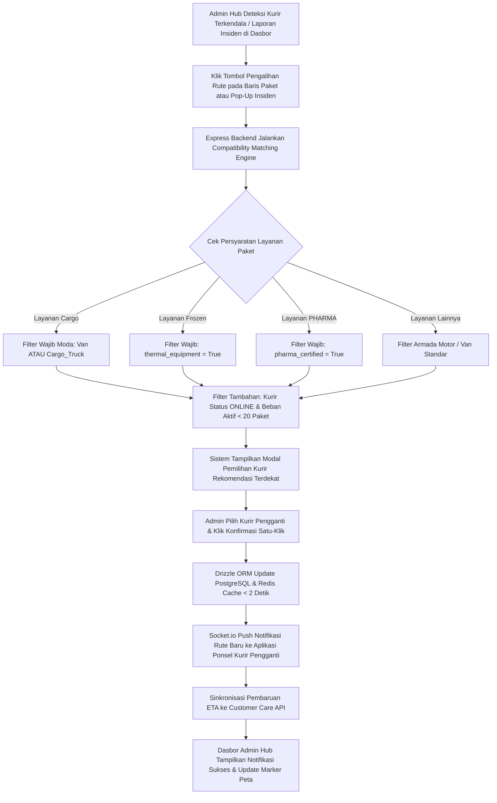

# Functional Requirement Document (FRD) — One-Click Task Reassignment

## 1. Konteks
Fitur **One-Click Task Reassignment** (Pengalihan Tugas Satu-Klik) dirancang untuk memfasilitasi Admin Hub Anteraja dalam memindahkan paket dari kurir SATRIA yang mengalami kendala ke kurir lain yang tersedia secara instan di lapangan. Fitur ini merujuk pada [`docs/00-PRD-courier-admin-mini-panel.md`] Bagian 4 (*In-Scope MVP Extension P1*) dan Bagian 7 (AC-03) untuk memangkas durasi penugasan ulang rute dari hitungan belasan menit menjadi **< 30 detik** per rute.

Dengan adanya **9 Jenis Layanan Pengiriman Anteraja**, modul ini dilengkapi mesin pencocokan kualifikasi (*Compatibility Matching Engine*) untuk memastikan paket hanya dialihkan ke kurir dengan jenis kendaraan dan sertifikasi yang sesuai (khususnya untuk paket *Cargo*, *Frozen*, dan *PHARMA*).

---

## 2. Peran & Hak Akses

| Peran (Role) | Lihat (Read) | Buat (Create) | Ubah (Update) | Setujui (Approve) | Field Terkunci (Locked Fields) |
| :--- | :---: | :---: | :---: | :---: | :--- |
| **Admin Hub Operasional** | ✅ Ya | ✅ Ya (Pemicu Reassign) | ✅ Ya (Pilih Kurir Pengganti) | ✅ Ya (Konfirmasi Eksekusi) | `Order_ID`, `original_courier_id`, `Service_Type` |
| **Kurir SATRIA (Mobile App)** | ✅ Ya (Rute Baru Diterima) | ❌ Tidak | ❌ Tidak | ❌ Tidak | `assigned_by_admin_id`, `Weight_Kg` |
| **System (Express / Drizzle ORM)** | ✅ Ya | ✅ Ya (Audit Log) | ✅ Ya (Status Rute & Pemilik Resi) | ✅ Ya | `reassignment_timestamp` |
| **Customer Care / Hub Manager** | ✅ Ya (Read-only) | ❌ Tidak | ❌ Tidak | ❌ Tidak | Semua Field |

---

## 3. Alur (Workflow & EARS Pattern)



### Pernyataan Alur Kebutuhan (EARS Pattern):
* **KETIKA** Admin Hub mengklik tombol "Pengalihan Rute" pada paket yang terkendala, sistem **harus** menjalankan evaluasi kompatibilitas (*Compatibility Matching Engine*) dan menampilkan modal rekomendasi kurir yang memenuhi syarat.
* **KETIKA** Admin Hub mengonfirmasi pengalihan tugas dengan mengklik tombol "Konfirmasi Pengalihan", sistem **harus** memperbarui penugasan paket pada database PostgreSQL via Drizzle ORM dan Redis Cache dalam waktu < 2.0 detik.
* **JIKA** paket bertipe layanan `Cargo` (> 40 kg atau berdimensi besar), sistem **harus** menolak kurir yang mengoperasikan sepeda motor (*Motorcycle*) dan hanya menampilkan kurir dengan kendaraan *Van* atau *Cargo Truck*.
* **JIKA** paket bertipe layanan `Frozen`, sistem **harus** hanya merekomendasikan kurir yang memiliki perlengkapan tas pendingin aktif (*thermal equipment*).
* **JIKA** paket bertipe layanan `PHARMA`, sistem **harus** hanya merekomendasikan kurir SATRIA yang memiliki sertifikasi SOP penanganan farmasi BPOM.
* **JIKA** kurir kandidat memiliki beban kerja ≥ 20 paket aktif atau sedang *Offline*, sistem **harus** menonaktifkan tombol pemilihan untuk kurir tersebut.
* **SELAMA** proses pengalihan dieksekusi, sistem **harus** mencatat jejak audit komprehensif (*Audit Log*) yang merekam ID admin pengesahkan, ID kurir asal, ID kurir pengganti, tipe layanan, serta stempel waktu eksekusi.

---

## 4. Aturan Bisnis (Business Rules)

| ID Rule | Kondisi / Pemicu | Hasil / Perilaku Sistem | Pengecualian |
| :--- | :--- | :--- | :--- |
| **BR-01** | Total waktu eksekusi dari klik konfirmasi admin hingga rute baru diterima kurir pengganti. | Seluruh alur pengalihan tugas wajib selesai dalam durasi **< 30.0 detik** (proses transaksi database & cache **< 2.0 detik**). | Terjadi gangguan koneksi internet total (*total network blackout*). |
| **BR-02** | Kelaikan Beban Kerja Kurir (*Workload Capacity Limit*). | Sistem hanya merekomendasikan kurir berstatus **ONLINE** dengan jumlah paket aktif **< 20 paket**. | Admin mengaktifkan opsi *Super Admin Force Override* untuk situasi darurat. |
| **BR-03** | Matriks Kompatibilitas Armada & Kualifikasi Layanan (*Compatibility Matrix*):<br>• `Cargo`: Wajib kendaraan `Van` atau `Cargo_Truck`.<br>• `Frozen`: Wajib `thermal_equipment = True`.<br>• `PHARMA`: Wajib `pharma_certified = True`.<br>• `Dokumen`: Wajib kurir membawa kantong segel (*tamper-evident pouch*). | Kurir yang tidak memenuhi salah satu syarat di atas otomatis didiskualifikasi dari daftar rekomendasi. | - |
| **BR-04** | Pengalihan Massal (*Bulk Reassignment*). | Admin dapat memindahkan maksimal **10 paket sekaligus** dalam 1 kali eksekusi untuk satu kurir pengganti yang sama. | Kapasitas maksimal kendaraan kurir pengganti terlampaui. |
| **BR-05** | Sinkronisasi ETA ke Customer Care. | Setiap kali pengalihan berhasil dieksekusi, sistem secara otomatis memperbarui estimasi waktu tiba (*ETA*) paket di sistem antarmuka **Customer Care Anteraja** dalam waktu ≤ 3.0 detik. | - |

---

## 5. Istilah

* **Task Reassignment:** Proses memindahkan tanggung jawab penyerahan paket dari satu kurir ke kurir lainnya saat terjadi kendala operasional di lapangan.
* **Assignee Courier:** Kurir pengganti yang menerima limpahan paket baru.
* **Compatibility Matching Engine:** Mesin validasi sistem yang menyaring kurir kandidat berdasarkan tipe kendaraan, peralatan pendingin, dan sertifikasi khusus.
* **Audit Log:** Rekam jejak digital yang mencatat identitas penugasan ulang, alasan kendala, dan stempel waktu eksekusi.
* **Force Override:** Hak akses darurat supervisor untuk mengalihkan paket di luar ambang batas rekomendasi sistem.

---

## 6. Data Utama & Status

### Data Utama yang Disimpan:
* `Order_ID` (String - Nomor Resi simulasi Anteraja)
* `Service_Type` (`Regular`, `Same Day`, `Next Day`, `Instant`, `Dokumen`, `Cargo`, `Mini Cargo`, `PHARMA`, `Frozen`)
* `original_courier_id` (String - Kurir Asal Terkendala Simulasi)
* `new_courier_id` (String - Kurir Penerima Limpahan Simulasi)
* `admin_id` (String - Admin Eksekutor)
* `reassignment_reason` (String - Penyebab Pengalihan: Ban Bocor, Macet Total, Banjir, Suhu Rusak)
* `reassignment_timestamp` (Timestamp Eksekusi)

### Siklus Status Pengalihan Tugas:
```
[ASSIGNED] ---> [REASSIGNMENT_INITIATED] ---> [REASSIGNED_SUCCESS] ---> [ACKNOWLEDGED_BY_NEW_COURIER]
```

---

## 7. Daftar Fungsi

* **F-03.1 Compatibility Matching Evaluator:** Algoritma penyaring kurir yang memvalidasi ketersediaan, kapasitas beban (<20 paket), kesesuaian armada, ketersediaan pendingin (*Frozen*), dan sertifikasi BPOM (*PHARMA*).
* **F-03.2 One-Click Execution Controller:** Pengontrol transaksi database yang memperbarui tabel tugas paket di PostgreSQL via Drizzle ORM dan memperbarui cache Redis dalam waktu < 2.0 detik.
* **F-03.3 Mobile Route Push Dispatcher:** Modul komunikasi Socket.io yang mentransmisikan kartu rute pengiriman baru ke aplikasi seluler kurir penerima.
* **F-03.4 Customer Care ETA Synchronizer:** Modul integrasi yang memperbarui kalkulasi estimasi waktu tiba (*ETA*) ke Customer Care API secara otomatis.

---

## 8. AC Alur Utama (Acceptance Criteria)

### Skenario 1: Penolakan Otomatis Kurir Motor untuk Pengalihan Paket Kargo Berat
* **Diberikan:** Admin Hub (Siti) di Hub Jakarta Barat (Kebon Jeruk) menangani paket layanan *Cargo* resi `100024000012` (berat: 186.8 kg, kategori: *Otomotif & Mesin*) yang dibawa oleh Kurir Teguh Wibowo (`Vehicle`: `Cargo_Truck`) yang mengalami kerusakan kopling di Jl. Panjang, Jakarta Barat.
* **Ketika:** Admin Siti mengklik tombol "Pengalihan Rute" untuk resi `100024000012`.
* **Maka:** Sistem menjalankan *Compatibility Matching Engine*, mendiskualifikasi seluruh kurir motor di sekitar area, dan hanya memunculkan kurir armada mobil/truk kargo yang memenuhi syarat (misal: Kurir Fajar Ramadhan dengan armada *Van* dan Kurir Ahmad Fauzi dengan armada *Cargo_Truck* yang berstatus *Online* dan beban < 20 paket) (memenuhi BR-03).

### Skenario 2: Pengalihan Paket Vaksin PHARMA ke Kurir SATRIA Tersertifikasi BPOM
* **Diberikan:** Kurir Budi Santoso mengalami mogok motor saat membawa paket layanan *PHARMA* resi `100024000015` (obat resep / vaksin) di Bekasi. Di radius 1.2 km, terdapat Kurir Aditya Putra (motor standar, non-sertifikasi) dan Kurir Indra Gunawan (`pharma_certified = True`, beban 8 paket).
* **Ketika:** Admin Siti membuka modal penugasan ulang.
* **Maka:** Modal secara eksklusif merekomendasikan Kurir Indra Gunawan dengan label hijau "Tersertifikasi SOP BPOM", dan saat admin mengklik "Konfirmasi Pengalihan", database diperbarui dalam **1.1 detik**, serta rute baru masuk ke ponsel Kurir Indra dalam **7.8 detik** (total < 30 detik, memenuhi BR-01 & BR-03).

---

## 9. Tidak Termasuk (Out-of-Scope)

* **Otomatisasi Penuh Berbasis AI/ML:** Sistem tidak memindahkan rute secara otonom tanpa persetujuan Admin Hub.
* **Kalkulasi Skema Bonus Finansial:** Modul tidak menghitung penyesuaian gaji atau insentif kurir akibat pemindahan paket.
* **Konfirmasi Penerima Barang:** Alur pengalihan adalah prosedur internal hub logistik dan tidak memerlukan persetujuan dari pembeli paket.
