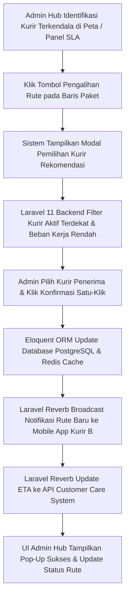

# Functional Requirement Document (FRD) — One-Click Task Reassignment

## 1. Konteks
Fitur **One-Click Task Reassignment** (Pengalihan Tugas Satu-Klik) dirancang untuk memfasilitasi Admin Hub dalam memindahkan paket dari kurir yang mengalami kendala ke kurir lain yang tersedia secara instan. Fitur ini merujuk pada **00-PRD-courier-admin-mini-panel.md** Bagian 4 (*In-Scope MVP Extension P1*) dan Bagian 7 (AC-03) untuk memangkas durasi penugasan ulang rute dari hitungan menit menjadi **< 30 detik** per rute.

---

## 2. Peran & Hak Akses

| Peran (Role) | Lihat (Read) | Buat (Create) | Ubah (Update) | Setujui (Approve) | Field Terkunci (Locked Fields) |
| :--- | :---: | :---: | :---: | :---: | :--- |
| **Admin Hub Operasional** | ✅ Ya | ✅ Ya (Trigger) | ✅ Ya (Reassign) | ✅ Ya (Eksekusi) | `Order_ID`, `original_courier_id` |
| **Kurir SATRIA (Mobile App)** | ✅ Ya (Rute Baru) | ❌ Tidak | ❌ Tidak | ❌ Tidak | `assigned_by_admin_id` |
| **System (Laravel/ Eloquent ORM)**| ✅ Ya | ✅ Ya (Audit Log) | ✅ Ya (Status Rute) | ✅ Ya | `reassignment_timestamp` |
| **Customer Care / Manager** | ✅ Ya (Read-only) | ❌ Tidak | ❌ Tidak | ❌ Tidak | Semua Field |

---

## 3. Alur (Workflow & EARS Pattern)



### Pernyataan Alur Kebutuhan (EARS Pattern):
* **KETIKA** Admin Hub mengklik tombol "Pengalihan Rute" pada satu atau sekumpulan paket, sistem **harus** menampilkan modal daftar rekomendasi kurir penerima tugas terdekat.
* **KETIKA** Admin Hub mengonfirmasi pengalihan tugas dengan mengklik tombol "Konfirmasi Pengalihan", sistem **harus** memindahkan alokasi paket di PostgreSQL dan Redis Cache dalam waktu < 2 detik.
* **JIKA** kurir penerima tugas berada dalam status *Off-Duty* atau beban kerja melampaui batas maksimal (20 paket), sistem **harus** menolak pengalihan dan menampilkan pesan peringatan "Kurir Tidak Tersedia".
* **JIKA** pengalihan tugas berhasil dieksekusi, sistem **harus** mengirimkan push notification rute baru ke aplikasi seluler kurir penerima via Laravel Reverb dan memperbarui estimasi waktu tiba (*ETA*) di sistem Customer Care.
* **SELAMA** proses pengalihan berlangsung, sistem **harus** mencatat jejak audit (*audit log*) berisi ID admin, ID kurir asal, ID kurir tujuan, dan stempel waktu eksekusi.

---

## 4. Aturan Bisnis (Business Rules)

| ID Rule | Kondisi / Pemicu | Hasil / Perilaku Sistem | Pengecualian |
| :--- | :--- | :--- | :--- |
| **BR-01** | Total waktu eksekusi dari input klik admin hingga rute baru diterima kurir. | Seluruh alur pengalihan tugas wajib selesai dalam durasi **< 30.0 detik**. | Jika terjadi kerusakan total jaringan internet (*total blackout*). |
| **BR-02** | Pemilihan kurir penerima pengalihan (*assignee*). | Sistem hanya merekomendasikan kurir berstatus **ONLINE / ACTIVE** dengan beban paket aktif **< 20 paket**. | Admin memilih opsi *Override Force Assign* dengan alasan darurat. |
| **BR-03** | Pengalihan tugas kelompok (*bulk reassignment*). | Admin dapat memindahkan maksimal **10 paket sekaligus** dalam 1 aksi pengalihan. | - |
| **BR-04** | Eksekusi pengalihan sukses dicatat di database. | Sistem secara otomatis mengirimkan panggilan webhook/socket untuk memperbarui status *ETA* paket pada antarmuka **Customer Care**. | - |
| **BR-05** | Kurir asal mengalami kendala `Vehicle = Breakdown` atau `Weather = Stormy`. | Sistem memprioritaskan kurir rekomendasi yang mengoperasikan tipe kendaraan `van` atau `motorcycle`. | - |

---

## 5. Istilah

* **Task Reassignment:** Proses memindahkan hak pengiriman paket dari kurir pertama ke kurir kedua di lapangan.
* **Assignee Courier:** Kurir yang ditunjuk untuk menerima alokasi beban pengiriman paket baru.
* **ETA (Estimated Time of Arrival):** Perkiraan jam penyerahan paket sampai ke tangan penerima.
* **Audit Log:** Catatan riwayat aktivitas sistem yang merekam siapa, kapan, dan perubahan apa yang dilakukan.

---

## 6. Data Utama & Status

### Data Utama yang Disimpan:
* `Order_ID` (String - Resi)
* `original_courier_id` (String - Kurir Asal)
* `new_courier_id` (String - Kurir Tujuan)
* `admin_id` (String - Pengeskusi)
* `reassignment_reason` (String - Alasan)
* `reassignment_timestamp` (Timestamp)

### Daftar Status Pengalihan Tugas:

```
[ASSIGNED] ---> [REASSIGNMENT_PENDING] ---> [REASSIGNED_SUCCESS] ---> [ACKNOWLEDGED_BY_COURIER]
```

---

## 7. Daftar Fungsi

* **F-03.1 Reassignment Recommendation Modal:** Menampilkan daftar kurir terdekat yang tersedia berdasarkan lokasi GPS dan beban kerja.
* **F-03.2 One-Click Execution Controller:** Memproses pembaruan data penugasan paket pada PostgreSQL via Eloquent ORM dan Redis Cache.
* **F-03.3 Mobile Route Push Dispatcher:** Mengirimkan sinyal pembaruan rute pengiriman ke aplikasi seluler kurir penerima via Laravel Reverb.
* **F-03.4 Customer Care ETA Synchronizer:** Mengirimkan pembaruan *ETA* paket secara otomatis ke sistem Customer Care.

---

## 8. AC Alur Utama (Acceptance Criteria - Data Nyata)

### Skenario 1: Pengalihan Paket Akibat Kurir Terkendala Cuaca Buruk
* **Diberikan:** Admin Hub (Siti) menerima laporan kendala dari Kurir Budi (`Vehicle`: `scooter`) yang membawa paket resi `uaeb808891380` di area *Metropolitan* dengan kondisi `Weather`: `Stormy` dan `Traffic`: `Jam`.
* **Ketika:** Admin Siti memilih resi `uaeb808891380`, mengklik tombol "Pengalihan Rute", memilih Kurir Eko (`Vehicle`: `motorcycle`, lokasi 800m dari Kurir Budi, beban 8 paket), dan mengklik "Konfirmasi Pengalihan" pada pukul 21:06:00.
* **Maka:** Database PostgreSQL ter-update via Eloquent ORM, rute resi `uaeb808891380` berpindah ke Kurir Eko, notifikasi rute baru muncul di ponsel Kurir Eko, dan status *ETA* di Customer Care ter-update dalam total waktu **8.5 detik** (memenuhi BR-01 < 30 detik).

### Skenario 2: Penolakan Pengalihan ke Kurir dengan Beban Kerja Penuh
* **Diberikan:** Admin Hub mencoba memindahkan paket resi `bgvc052754213` ke Kurir Rudi.
* **Ketika:** Kurir Rudi terdeteksi di database memiliki beban pengiriman aktif sebanyak **22 paket** (`> 20 paket`).
* **Maka:** Sistem menolak tindakan pengalihan, menonaktifkan tombol konfirmasi untuk Kurir Rudi, dan menampilkan pesan peringatan merah "Kurir Rudi Memiliki Beban Kerja Maksimal (22/20 Paket)" (memenuhi BR-02).

---

## 9. Tidak Termasuk (Out-of-Scope)

* **Otomatisasi Pengalihan Berbasis AI/ML:** Pengalihan wajib dikonfirmasi oleh Admin Hub secara manual, bukan dipindahkan secara otomatis oleh algoritma kecerdasan buatan.
* **Kalkulasi Insentif Pengalihan:** Sistem tidak menghitung pembagian skema bonus/penalti keuangan akibat pemindahan paket antar-kurir.
* **Persetujuan dari Penerima Paket:** Pengalihan tugas internal tidak memerlukan persetujuan dari penerima barang *e-commerce*.
