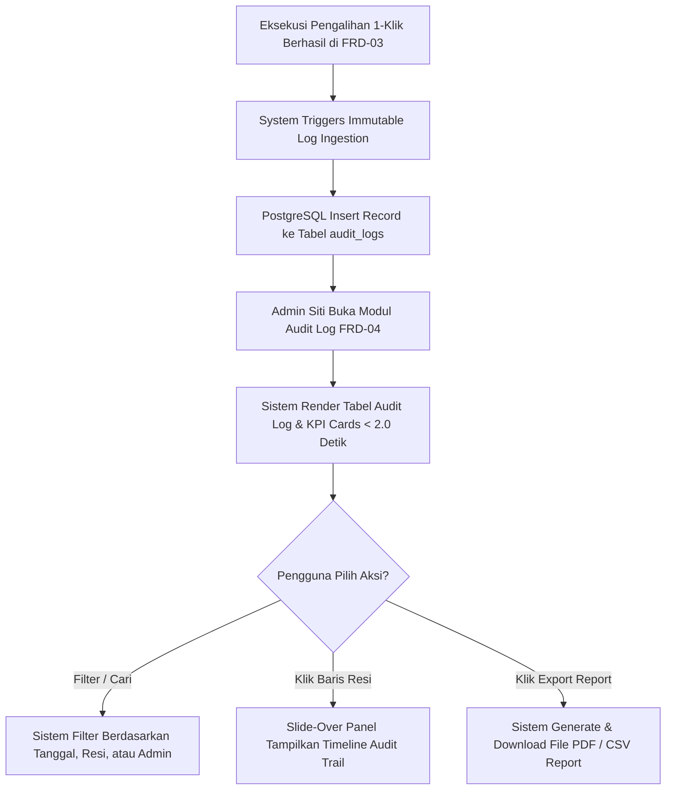

# Functional Requirement Document (FRD) — Audit Log & Riwayat Operasional

--------------------------------------------------------------------------------

## 1. Konteks
Modul **Audit Log & Riwayat Operasional** berfungsi sebagai pusat rekapitulasi, penelusuran (*audit trail*), dan pelaporan histori seluruh insiden pengiriman serta eksekusi pengalihan tugas yang telah selesai ditangani di Hub Anteraja. Modul ini merujuk langsung pada **00-PRD-courier-admin-mini-panel.md** Bagian 4 (In-Scope F-04 Baru) untuk menyediakan rekam jejak digital yang akuntabel dan *immutable* bagi Admin Hub Operasional. Fitur ini memandu evaluasi kinerja harian, audit kepatuhan SLA (target **≥ 97.5%**), serta analisis pola hambatan lapangan tanpa ketergantungan pada pencatatan manual.

--------------------------------------------------------------------------------

## 2. Peran & Hak Akses
| Peran (Role) | Lihat (Read) | Buat (Create) | Ubah (Update) | Setujui (Approve) | Field Terkunci (Locked Fields) |
| ------ | ------ | ------ | ------ | ------ | ------ |
| **Admin Hub Operasional** | ✅ Ya | ❌ Tidak | ❌ Tidak (Read-Only) | ❌ Tidak | log_id, created_at, executor_admin_id, audit_hash |
| **System (Backend Engine)** | ✅ Ya | ✅ Ya (Auto-Append Log) | ❌ Tidak | ✅ Ya (Audit Integrity) | log_id, created_at, audit_hash |

--------------------------------------------------------------------------------

## 3. Alur

### Pernyataan Alur Kebutuhan (EARS Pattern):
*   **KETIKA** transaksi pengalihan tugas paket berhasil dieksekusi pada FRD-03, sistem **harus** secara otomatis mencatat *immutable record* ke tabel log audit dalam waktu ≤ 1.0 detik.
*   **KETIKA** pengguna membuka halaman Audit Log & Riwayat Operasional, sistem **harus** menampilkan tabel histori dan kartu metrik KPI rekapitulasi dengan latensi pemuatan ≤ 2.0 detik.
*   **JIKA** pengguna memasukkan kata kunci pencarian (nomor resi, nama kurir, atau ID admin), sistem **harus** memfilter data tabel secara responsif dalam durasi < 1.0 detik.
*   **JIKA** pengguna mengklik tombol **Export Laporan**, sistem **harus** menghasilkan berkas laporan terformat (PDF atau CSV) sesuai rentang tanggal yang dipilih dalam waktu < 3.0 detik.
*   **SELAMA** data log tersimpan di database, sistem **harus** mengunci seluruh *record* sehingga tidak dapat diubah (*update*) atau dihapus (*delete*) oleh peran manapun.

--------------------------------------------------------------------------------

## 4. Aturan Bisnis
| ID Rule | Kondisi / Pemicu | Hasil / Perilaku Sistem | Pengecualian |
| ------ | ------ | ------ | ------ |
| **BR-01** | Transaksi pengalihan selesai di FRD-03. | Sistem mencatat log permanen berisi log_id, waybill_number, original_courier_id, new_courier_id, incident_type, executor_admin_id, reassigned_at, dan resolution_time_seconds. | Jika database mengalami *rollback*, pencatatan log ikut dibatalkan. |
| **BR-02** | Retensi Penyimpanan Data Log. | Data histori audit log wajib disimpan secara aktif di database PostgreSQL selama minimal **365 hari (1 tahun)**. | Data arsip di atas 1 tahun dipindahkan ke *cold storage*. |
| **BR-03** | Ekspor Laporan Laporan Operasional. | Berkas ekspor (PDF/CSV) memuat rekapitulasi KPI (*Total Incidents, Reassignment Rate, Avg Resolution Time, SLA Saved Rate*) dan tabel rincian transaksi maksimal 10.000 baris per unduhan. | Ekspor > 10.000 baris dikirimkan via tautan unduhan email. |
| **BR-04** | Performa Pencarian Multi-Parameter. | Pencarian gabungan berdasarkan nomor resi, rentang tanggal, dan nama admin wajib menyelesaikan query database dalam waktu **≤ 2.0 detik**. | Jika koneksi internet pengguna terputus. |
| **BR-05** | Perlindungan Anti-Tamper Audit Log. | Seluruh baris tabel audit log bersifat *append-only*; perintah SQL UPDATE atau DELETE ditolak oleh *database constraint*. | Tidak ada pengecualian (keamanan data mutlak). |

--------------------------------------------------------------------------------

## 5. Istilah
*   **Audit Trail:** Urutan kronologis stempel waktu (*timestamp*) dan rekaman aktivitas digital yang membuktikan perjalanan suatu paket dan tindakan penanganannya.
*   **Immutable Log:** Catatan data yang hanya bisa ditambah (*append-only*) dan dijamin tidak dapat dimodifikasi atau dihapus setelah dibuat.
*   **Executor Admin ID:** Identitas unik Admin Hub (misal: Siti / ADM-JKT-001) yang melakukan otorisasi pengalihan rute paket.
*   **SLA Saved Rate:** Persentase keberhasilan penyelamatan paket berisiko keterlambatan (*High Risk / Breached*) yang berhasil terkirim tepat waktu setelah dialihkan.

--------------------------------------------------------------------------------

## 6. Data Utama & Status
### Data Utama yang Disimpan:
*  log_id (UUID - Primary Key / Unique Log Identifier)
*  waybill_number (String - Foreign Key orders / Nomor Resi)
*  original_courier_id & new_courier_id (String - Identitas Kurir Asal & Pengganti)
*  incident_type (Enum - BAN_BOCOR, MOGOK, BANJIR, MACET_TOTAL, ANOMALI_SUHU)
*  executor_admin_id (String - Foreign Key users / Admin Siti)
*  reassigned_at (Timestamp - Waktu Eksekusi Pengalihan)
*  resolution_time_seconds (Integer - Kecepatan Respon Penanganan dalam Detik)
*  audit_hash (String - Cryptographic Hash Integritas Log)
### Diagram Transisi Status Audit:
```
[INCIDENT_LOGGED] ---> [REASSIGNMENT_EXECUTED] ---> [AUDIT_RECORDED_IMMUTABLE]

```

--------------------------------------------------------------------------------

## 7. Daftar Fungsi
*   **F-04.1 Histori Audit Log Table:** Menampilkan tabel rekapitulasi seluruh pengalihan dan penanganan kendala yang telah selesai dieksekusi di Hub.
*   **F-04.2 Filter & Multi-Param Search Engine:** Menyediakan sarana pencarian data berdasarkan nomor resi, rentang tanggal, jenis kendala, dan nama admin eksekutor.
*   **F-04.3 Detail Timeline Audit Trail:** Menampilkan *slide-over panel* kronologi kejadian dari penyerahan awal, kemunculan kendala, hingga penyerahan ke kurir pengganti.
*   **F-04.4 Audit Report Exporter:** Menggenerasi dan mengunduh laporan rekapitulasi operasional dalam format PDF atau CSV.

--------------------------------------------------------------------------------

## 8. AC Alur Utama (Acceptance Criteria - Data Nyata delivery.csv)
### Skenario 1: Verifikasi Audit Log Pengalihan Resi 100024000104 (Indra Gunawan -> Eko Prasetyo)
*   **Diberikan:** Admin Siti telah sukses mengeksekusi pengalihan resi 100024000104 dari Indra Gunawan ke Eko Prasetyo akibat kendala *Banjir/Macet* di FRD-03.
*   **Ketika:** Admin Siti membuka modul FRD-04: Audit Log dan memasukkan nomor resi 100024000104 pada kotak pencarian.
*   **Maka:**
    1. Dalam **0.8 detik**, sistem menampilkan 1 baris *record* audit log.
    2. Data menunjukkan original_courier_id: HLM-002, new_courier_id: HLM-003, executor_admin_id: ADM-JKT-001 (Siti), dan resolution_time_seconds: 18.0.
    3. Saat baris diklik, *slide-over panel* menampilkan *timeline* kronologis lengkap dengan stempel waktu presisi.
### Skenario 2: Ekspor Laporan Mingguan Evaluasi SLA oleh Admin Hub
*   **Diberikan:** Admin Siti ingin menarik laporan rekapitulasi pengalihan operasional Hub Halim untuk periode 21 Sep 2026 – 24 Sep 2026.
*   **Ketika:** Admin Siti memilih rentang tanggal pada *filter picker* dan mengklik tombol **Export PDF Report**.
*   **Maka:** Dalam waktu **2.1 detik**, sistem mengunduh berkas Audit_Report_HUB-HALIM_20260924.pdf yang berisi ringkasan metrik KPI (142 Total Pengalihan, Avg Resolution Time 18.4s, SLA Saved Rate 98.2%) dan tabel rincian transaksi.

--------------------------------------------------------------------------------

## 9. Tidak Termasuk (Out-of-Scope)
*   **Manual Log Modification / Deletion:** Sistem tidak menyediakan fitur penyuntingan atau penghapusan catatan log audit oleh peran manapun.
*   **Scheduled Auto-Email Reports:** Sistem tidak mengirimkan laporan mingguan secara otomatis via email (pengunduhan dilakukan secara manual via tombol ekspor).
*   **Driver Payroll / Penalty Calculation:** Sistem tidak menghitung pemotongan gaji atau denda secara langsung dari log kendala kurir.
