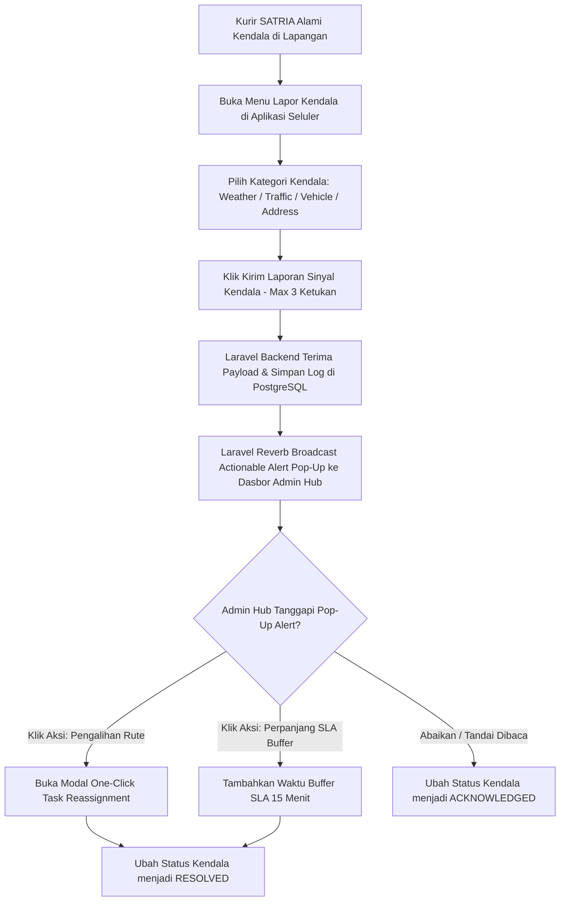

# Functional Requirement Document (FRD) — Quick Incident Reporting

## 1. Konteks
Fitur **Quick Incident Reporting** (Pelapor Kendala Cepat) berfungsi memfasilitasi kurir di lapangan untuk melaporkan hambatan fisik (seperti cuaca buruk, kemacetan, kendaraan mogok, atau alamat tidak ditemukan) secara ringkas dari aplikasi seluler SATRIA. Sinyal kendala ini langsung dikirimkan ke dasbor Admin Hub untuk memunculkan notifikasi aksi instan (*actionable alert*). Fitur ini merujuk pada **00-PRD-courier-admin-mini-panel.md** Bagian 4 (*In-Scope MVP Extension P1*) dan Bagian 7 (AC-04) untuk menekan pesan *chat* manual hingga **< 25 pesan/hari** dan mempercepat penanganan kendala hingga **75%**.

---

## 2. Peran & Hak Akses

| Peran (Role) | Lihat (Read) | Buat (Create) | Ubah (Update) | Setujui (Approve) | Field Terkunci (Locked Fields) |
| :--- | :---: | :---: | :---: | :---: | :--- |
| **Admin Hub Operasional** | ✅ Ya | ❌ Tidak | ✅ Ya (Tanggapi/Aksi) | ✅ Ya (Selesaikan) | `incident_timestamp`, `courier_id` |
| **Kurir SATRIA (Mobile App)** | ✅ Ya (Status) | ✅ Ya (Kirim Sinyal) | ❌ Tidak | ❌ Tidak | `incident_id` |
| **System (Laravel / Reverb)** | ✅ Ya | ✅ Ya (Log Alert) | ✅ Ya (Broadcasting) | ✅ Ya | `location_lat_long` |
| **Customer Care / Manager** | ✅ Ya (Read-only) | ❌ Tidak | ❌ Tidak | ❌ Tidak | Semua Field |

---

## 3. Alur (Workflow & EARS Pattern)



### Pernyataan Alur Kebutuhan (EARS Pattern):
* **KETIKA** kurir memilih kategori kendala dan mengklik "Kirim Laporan" pada aplikasi seluler SATRIA, sistem **harus** mentransmisikan sinyal kendala beserta titik lokasi GPS saat itu ke Laravel 11 backend via Laravel Reverb.
* **KETIKA** backend Laravel 11 menerima sinyal laporan kendala, sistem **harus** memunculkan notifikasi *pop-up* aksi (*actionable alert*) pada antarmuka Admin Hub dalam waktu < 5 detik tanpa perlu *reload* halaman.
* **JIKA** kategori kendala yang dipilih adalah `Vehicle_Breakdown` atau `Accident`, sistem **harus** menandai tingkat keparahan sebagai **CRITICAL (Merah Pulsasi)** dan membunyikan nada peringatan di dasbor admin.
* **JIKA** Admin Hub mengklik salah satu opsi tindakan cepat (*Quick Action Button*) pada notifikasi *pop-up*, sistem **harus** mengeksekusi aksi terkait (pengalihan tugas atau perpanjangan buffer SLA) dan memperbarui status kendala menjadi **RESOLVED**.
* **SELAMA** kendala belum ditanggapi oleh admin, sistem **harus** mempertahankan penanda sinyal kendala pada baris paket dan marker kurir terkait di peta.

---

## 4. Aturan Bisnis (Business Rules)

| ID Rule | Kondisi / Pemicu | Hasil / Perilaku Sistem | Pengecualian |
| :--- | :--- | :--- | :--- |
| **BR-01** | Pengiriman sinyal kendala dari aplikasi seluler kurir. | Mekanisme pelaporan di aplikasi mobile wajib diselesaikan dalam **maksimal 3 ketukan layar (clicks/taps)**. | Kurir perlu menambahkan foto bukti kendala fisik. |
| **BR-02** | Sinyal kendala berhasil dikirimkan oleh kurir. | Notifikasi *pop-up* aksi wajib muncul di dasbor Admin Hub dalam durasi **≤ 5.0 detik**. | Koneksi jaringan lokal Admin Hub terputus. |
| **BR-03** | Kategori kendala yang diizinkan (*pre-defined categories*). | Kategori wajib memilih salah satu: `Weather` (`Stormy`, `Fog`), `Traffic` (`Jam`), `Vehicle_Breakdown`, atau `Address_NotFound`. | - |
| **BR-04** | Kendala tidak ditanggapi admin dalam waktu **> 10 menit**. | Sistem menaikkan skala notifikasi (*escalation alert*) ke warna Merah Berkedip dan mengirim log ke Manager Hub. | Kendala berkategori *Low Priority* (`Weather = Cloudy`). |
| **BR-05** | Admin mengklik tombol "Tandai Selesai / Resolved". | Status kendala diubah menjadi **RESOLVED**, log dicatat di database, dan notifikasi konfirmasi terkirim ke ponsel kurir. | - |

---

## 5. Istilah

* **Incident Signal:** Sinyal elektronik yang dikirimkan kurir dari ponsel untuk memberitahukan adanya masalah di lokasi pengiriman.
* **Actionable Alert:** Pop-up notifikasi pada dasbor admin yang tidak hanya berisi informasi, tetapi menyediakan tombol tindakan langsung (misal: tombol Pengalihan Rute).
* **Escalation Alert:** Peringatan susulan yang muncul jika suatu laporan kendala tidak mendapatkan respon dalam batas waktu tertentu.

---

## 6. Data Utama & Status

### Data Utama yang Disimpan:
* `incident_id` (String - Unique Identifier)
* `Order_ID` (String - Resi)
* `courier_id` (String - Kurir Laporkan)
* `incident_category` (`Weather`, `Traffic`, `Vehicle_Breakdown`, `Address_NotFound`)
* `incident_timestamp` (Timestamp)
* `incident_status` (`REPORTED`, `ACKNOWLEDGED`, `RESOLVED`)

### Daftar Status Kendala Lapangan:

```
[REPORTED / BARU] ---> [ACKNOWLEDGED / DIBACA ADMIN] ---> [RESOLVED / SELESAI]
```

---

## 7. Daftar Fungsi

* **F-04.1 Mobile Incident Dispatcher:** Antarmuka ringkas di aplikasi seluler kurir untuk mengirim sinyal kendala dalam 3 ketukan.
* **F-04.2 Real-time Actionable Alert Engine:** Layanan Laravel Reverb di backend yang memicu *pop-up notification* di dasbor admin secara instan.
* **F-04.3 Quick Action Handler:** Modul pemroses tombol aksi cepat pada *pop-up alert* (Pengalihan Rute / Adjust SLA).
* **F-04.4 Incident History Logger:** Pencatat riwayat pelaporan dan penyelesaian kendala di PostgreSQL via Eloquent ORM.

---

## 8. AC Alur Utama (Acceptance Criteria - Data Nyata)

### Skenario 1: Pelaporan Kendala Ban Bocor dan Eksekusi Respon Cepat
* **Diberikan:** Kurir Budi (`Agent_Age`: 37, `Vehicle`: `motorcycle`) sedang membawa paket resi `ialx566343618` di area *Urban*.
* **Ketika:** Motor Kurir Budi mengalami ban bocor pada pukul 11:45:00. Budi membuka aplikasi SATRIA, mengklik menu "Kendala" -> "Kendalan Motor/Ban Bocor" -> "Kirim" (3 ketukan layar).
* **Maka:** Sinyal dikirim via Laravel Reverb ke Laravel 11 backend. Pada pukul 11:45:03 (durasi **3.0 detik**, memenuhi BR-02 ≤ 5s), *pop-up alert* warna Merah "Kendalan Motor - Kurir Budi (Resi ialx566343618)" muncul di dasbor Admin Siti dilengkapi tombol aksi "Pengalihan Rute Instan".

### Skenario 2: Eskalasi Kendala Cuaca Buruk yang Keterlambatan Ditanggapi
* **Diberikan:** Kurir Agus membawa paket resi `akqg208421122` mengirimkan sinyal kendala `Weather = Stormy` pada pukul 19:50:00.
* **Ketika:** Admin Hub tidak mengklik atau memproses notifikasi kendala tersebut hingga pukul 20:00:01 (**10 menit 1 detik** kemudian).
* **Maka:** Sistem di backend secara otomatis menaikkan status menjadi **ESCALATED**, mengubah bingkai *pop-up* menjadi berkedip Merah, dan membunyikan alarm peringatan di dasbor admin (memenuhi BR-04).

---

## 9. Tidak Termasuk (Out-of-Scope)

* **Integrasi Panggilan Darurat Polisi/Ambulans:** Sistem tidak terhubung ke layanan panggilan darurat pihak ketiga.
* **Klaim Asuransi Otomatis Kendaraan:** Pelaporan kendala kendaraan tidak memicu klaim asuransi pergantian biaya bengkel secara otomatis.
* **Pesan Balasan Otomatis Bot ke Kurir:** Sistem tidak menyediakan *chat bot* percakapan interaktif otomatis pada aplikasi seluler kurir.
