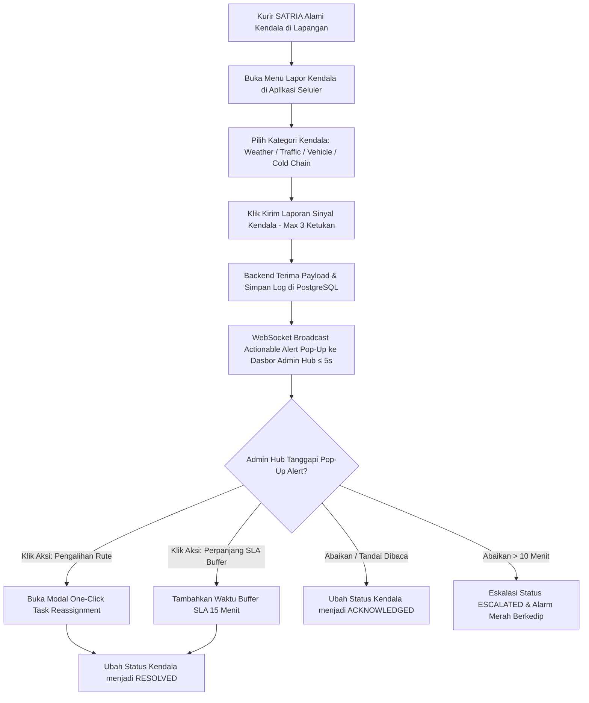

# Functional Requirement Document (FRD) — Quick Incident Reporting

---

### 1. Konteks
Fitur **Quick Incident Reporting** (Pelapor Kendala Cepat) berfungsi memfasilitasi kurir di lapangan untuk melaporkan hambatan fisik (seperti cuaca buruk, kemacetan, kendaraan mogok, atau anomali suhu) secara ringkas dari aplikasi seluler SATRIA. Sinyal kendala ini langsung dikirimkan ke dasbor Admin Hub untuk memunculkan notifikasi aksi instan (*actionable alert*). Fitur ini merujuk pada **00-PRD-courier-admin-mini-panel.md** Bagian 4 (In-Scope F-04) dan Bagian 7 untuk menekan pesan *chat* manual hingga **< 25 pesan/hari** dan mempercepat penanganan kendala hingga **75%**.

---

### 2. Peran & Hak Akses

| Peran (Role) | Lihat (Read) | Buat (Create) | Ubah (Update) | Setujui (Approve) | Field Terkunci (Locked Fields) |
| :--- | :---: | :---: | :---: | :---: | :--- |
| **Admin Hub Operasional** | ✅ Ya | ❌ Tidak | ✅ Ya (Tanggapi/Aksi) | ✅ Ya (Selesaikan) | `incident_timestamp`, `courier_id` |
| **Kurir SATRIA (Mobile App)** | ✅ Ya (Status) | ✅ Ya (Kirim Sinyal) | ❌ Tidak | ❌ Tidak | `incident_id` |
| **System (Backend & WebSocket)** | ✅ Ya | ✅ Ya (Log Alert) | ✅ Ya (Broadcasting) | ✅ Ya | `location_lat_long` |
| **Customer Care / Hub Manager** | ✅ Ya (Read-only) | ❌ Tidak | ❌ Tidak | ❌ Tidak | Semua Field Sistem |

---

### 3. Alur



#### Pernyataan Alur Kebutuhan (EARS Pattern):
* **KETIKA** kurir mengalami kendala di lapangan, sistem **harus** menyediakan mekanisme pelaporan cepat di aplikasi mobile dalam maksimal 3 ketukan layar (*taps*).
* **KETIKA** sinyal kendala dikirimkan dari perangkat kurir, sistem **harus** memunculkan notifikasi *pop-up* aksi (*actionable alert*) pada dasbor Admin Hub dalam waktu ≤ 5.0 detik.
* **JIKA** kendala tidak ditanggapi atau diproses oleh Admin Hub dalam rentang waktu > 10 menit, sistem **harus** meningkatkan status menjadi `ESCALATED`, membunyikan alarm visual Merah Berkedip, dan mengirim log peringatan ke Manager Hub.
* **JIKA** Admin Hub mengklik tombol aksi cepat ("Pengalihan Rute" / "Perpanjang SLA Buffer"), sistem **harus** membuka modul terkait dan memperbarui status kendala menjadi `RESOLVED` setelah aksi dikonfirmasi.
* **SELAMA** laporan kendala aktif (`REPORTED` / `ACKNOWLEDGED`), sistem **harus** memunculkan indikator status kendala pada baris paket dan penanda kurir di peta.

---

### 4. Aturan Bisnis

| ID Rule | Kondisi / Pemicu | Hasil / Perilaku Sistem | Pengecualian |
| :--- | :--- | :--- | :--- |
| **BR-01** | Pengiriman sinyal kendala dari aplikasi seluler kurir. | Mekanisme pelaporan di aplikasi mobile wajib diselesaikan dalam **maksimal 3 ketukan layar (clicks/taps)**. | Kurir perlu menambahkan foto bukti kendala fisik. |
| **BR-02** | Sinyal kendala berhasil dikirimkan oleh kurir. | Notifikasi *pop-up* aksi wajib muncul di dasbor Admin Hub dalam durasi **≤ 5.0 detik**. | Koneksi jaringan lokal Admin Hub terputus. |
| **BR-03** | Kategori kendala yang diizinkan (*pre-defined categories*). | Kategori wajib memilih salah satu: `Weather` (Hujan Deras, Banjir), `Traffic` (Macet Total), `Vehicle_Breakdown` (Ban Bocor, Mogok), `Cold_Chain_Anomaly` (Anomali Suhu), atau `Address_NotFound`. | - |
| **BR-04** | Kendala tidak ditanggapi admin dalam waktu **> 10 menit**. | Sistem menaikkan skala notifikasi (*escalation alert*) ke warna Merah Berkedip + alarm suara dan mengirim log ke Manager Hub. | Kendala berkategori *Low Priority* (`Weather = Berawan`). |
| **BR-05** | Admin mengklik tombol "Tandai Selesai / Resolved". | Status kendala diubah menjadi **RESOLVED**, log dicatat di database, dan notifikasi konfirmasi terkirim ke ponsel kurir. | - |

---

### 5. Istilah

* **Incident Signal:** Sinyal elektronik yang dikirimkan kurir dari ponsel untuk memberitahukan adanya masalah di lokasi pengiriman.
* **Actionable Alert:** Pop-up notifikasi pada dasbor admin yang tidak hanya berisi informasi, tetapi menyediakan tombol tindakan langsung (misal: tombol "Pengalihan Rute Instan").
* **Escalation Alert:** Peringatan susulan yang muncul jika suatu laporan kendala tidak mendapatkan respon dalam batas waktu tertentu (> 10 menit).
* **Cold Chain Anomaly:** Pelaporan khusus untuk paket *Frozen / PHARMA* saat suhu berada di luar batas toleransi (-2°C s/d 5°C).

---

### 6. Data Utama & Status

#### Data Utama yang Disimpan:
* `incident_id` (String - Unique Identifier / Resi)
* `Order_ID` (String - Nomor Resi Paket)
* `courier_id` (String - ID Kurir Pelapor)
* `incident_category` (Enum - Weather, Traffic, Vehicle_Breakdown, Cold_Chain_Anomaly, Address_NotFound)
* `incident_timestamp` (Timestamp - Waktu Laporan)
* `incident_status` (Enum - REPORTED, ACKNOWLEDGED, RESOLVED, ESCALATED)
* `resolution_action` (Enum - REASSIGNED, SLA_BUFFER_ADDED, DISMISSED)
* `handled_by_admin_id` (String - ID Admin Penangan)

#### Daftar Status Kendala Lapangan:
```
[REPORTED / BARU] ---> [ACKNOWLEDGED / DIBACA ADMIN] ---> [RESOLVED / SELESAI] / [ESCALATED / ABAIKAN >10M]
```

---

### 7. Daftar Fungsi

* **F-04.1 Mobile Incident Dispatcher:** Antarmuka ringkas di aplikasi seluler kurir untuk mengirim sinyal kendala dalam 3 ketukan layar.
* **F-04.2 Real-Time Actionable Alert Engine:** Layanan WebSocket di backend yang memicu *pop-up notification* interaktif di dasbor admin secara instan (≤ 5s).
* **F-04.3 Quick Action Handler:** Modul pemroses tombol aksi cepat pada *pop-up alert* (Pengalihan Rute Instan / Adjust SLA Buffer).
* **F-04.4 Incident History & Escalation Logger:** Pencatat riwayat pelaporan, eskalasi waktu, dan penyelesaian kendala di database.

---

### 8. AC Alur Utama (Acceptance Criteria - Data Nyata `delivery.txt`)

#### Skenario 1: Pelaporan Kendala Banjir Paket Frozen & Akselerasi Respon Cepat
* **Diberikan:** Kurir Surya Darma (`STR-JKT-007`, Vehicle: `Cooler Box Van`) membawa paket resi `100024000107` (Layanan: `Frozen`, `HUB-JAKUT-SUNTER`, `Weather: Banjir`, Suhu: 1.5°C).
* **Ketika:** Kendaraan Kurir Surya Darma terjebak banjir di Sunter pada pukul 15:40:00. Surya Darma membuka aplikasi SATRIA, menekan "Lapor Kendala" -> "Banjir / Cold Chain Anomaly" -> "Kirim" (3 ketukan layar, memenuhi BR-01).
* **Maka:** Sinyal terkirim ke backend, dan pada pukul 15:40:03 (durasi **3.0 detik**, memenuhi BR-02 ≤ 5s), *pop-up alert* warna Merah "Kendala Banjir & Suhu - Kurir Surya Darma (Resi 100024000107)" muncul di dasbor Admin Siti dilengkapi tombol aksi "Pengalihan Rute Instan". Admin Siti mengklik tombol aksi dan menyelesaikan mitigasi dalam waktu < 2 menit.

#### Skenario 2: Eskalasi Kendala Hujan Petir Paket PHARMA yang Keterlambatan Ditanggapi
* **Diberikan:** Kurir Agus Prayitno (`STR-JKT-008`, Vehicle: `Motor Box Khusus`) membawa paket resi `100024000108` (Layanan: `PHARMA`, `HUB-JAKBAR-KEBONJERUK`) mengirimkan sinyal kendala `Weather = Hujan Petir` & `Traffic = Sangat Padat` pada pukul 16:50:00.
* **Ketika:** Admin Hub tidak mengklik atau memproses *pop-up alert* kendala tersebut hingga pukul 17:00:01 (**10 menit 1 detik** kemudian).
* **Maka:** Backend secara otomatis menaikkan status kendala menjadi **ESCALATED**, mengubah bingkai *pop-up alert* menjadi berkedip Merah Flashing, membunyikan alarm peringatan di dasbor admin, dan mengirimkan log peringatan ke Hub Manager (memenuhi BR-04).

---

### 9. Tidak Termasuk (Out-of-Scope)

* **Integrasi Panggilan Darurat Polisi/Ambulans:** Sistem tidak terhubung ke layanan panggilan darurat pihak ketiga.
* **Klaim Asuransi Otomatis Kendaraan:** Pelaporan kendala kendaraan tidak memicu klaim asuransi pergantian biaya bengkel secara otomatis.
* **Pesan Balasan Otomatis Bot ke Kurir:** Sistem tidak menyediakan *chat bot* percakapan interaktif otomatis pada aplikasi seluler kurir.
