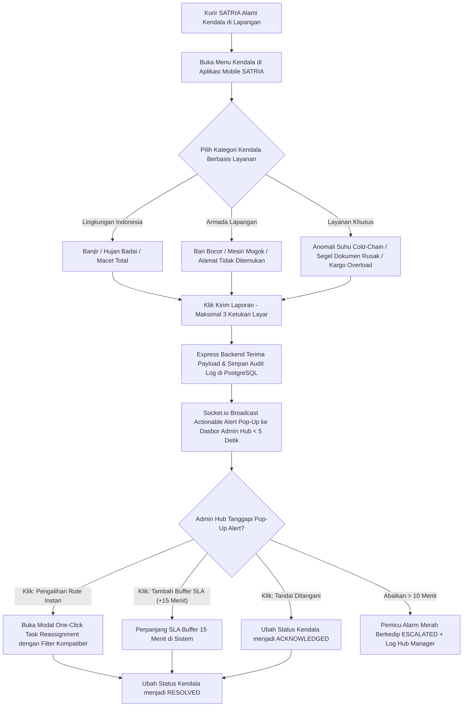

# Functional Requirement Document (FRD) — Quick Incident Reporting

## 1. Konteks
Fitur **Quick Incident Reporting** (Pelapor Kendala Cepat) berfungsi memfasilitasi kurir SATRIA di lapangan untuk melaporkan hambatan fisik (seperti banjir, kemacetan jalanan Indonesia, kendaraan mogok, anomali suhu pendingin, atau segel dokumen cacat) secara ringkas dalam maksimal 3 ketukan dari aplikasi seluler SATRIA. Sinyal kendala ini langsung dikirimkan ke dasbor Admin Hub untuk memunculkan notifikasi aksi instan (*actionable alert*). Fitur ini merujuk pada [`docs/00-PRD-courier-admin-mini-panel.md`] Bagian 4 (*In-Scope MVP Extension P1*) dan Bagian 7 (AC-04) untuk menekan pesan koordinasi manual menjadi **< 25 pesan/hari/hub** dan mempercepat respon penanganan kendala hingga **75%**.

Dengan adanya **9 Jenis Layanan Pengiriman Anteraja**, modul ini mencakup jenis insiden spesifik untuk penanganan produk sensitif suhu (*Frozen* dan *PHARMA*), segel dokumen resmi (*Dokumen*), dan kargo muatan berat (*Cargo* & *Mini Cargo*).

---

## 2. Peran & Hak Akses

| Peran (Role) | Lihat (Read) | Buat (Create) | Ubah (Update) | Setujui (Approve) | Field Terkunci (Locked Fields) |
| :--- | :---: | :---: | :---: | :---: | :--- |
| **Admin Hub Operasional** | ✅ Ya | ❌ Tidak | ✅ Ya (Tanggapi, Eksekusi Aksi) | ✅ Ya (Tandai Selesai) | `incident_timestamp`, `courier_id`, `Service_Type` |
| **Kurir SATRIA (Mobile App)** | ✅ Ya (Status Laporan) | ✅ Ya (Kirim Sinyal Kendala) | ❌ Tidak | ❌ Tidak | `incident_id`, `sla_adjusted_minutes` |
| **System (Express / Socket.io)** | ✅ Ya | ✅ Ya (Log Alert & Escalation) | ✅ Ya (Broadcasting, Audit Status) | ✅ Ya | `location_lat_long` |
| **Customer Care / Hub Manager** | ✅ Ya (Read-only) | ❌ Tidak | ❌ Tidak | ❌ Tidak | Semua Field |

---

## 3. Alur (Workflow & EARS Pattern)



### Pernyataan Alur Kebutuhan (EARS Pattern):
* **KETIKA** kurir SATRIA memilih kategori kendala dan mengklik "Kirim Laporan" pada aplikasi seluler, sistem **harus** mentransmisikan sinyal kendala beserta posisi GPS saat itu ke Express backend via Socket.io.
* **KETIKA** backend Express menerima sinyal laporan kendala, sistem **harus** memunculkan notifikasi *pop-up* aksi (*actionable alert*) pada antarmuka dasbor Admin Hub dalam durasi maksimal 5.0 detik tanpa perlu memuat ulang halaman.
* **JIKA** kategori kendala yang dilaporkan adalah `Anomali Suhu Cold-Chain` (suhu > 5°C pada layanan *Frozen* atau deviasi *PHARMA*) atau `Kendaraan Mogok / Rusak Berat`, sistem **harus** menetapkan tingkat keparahan sebagai **CRITICAL (Merah Pulsasi)** dan membunyikan nada peringatan darurat.
* **JIKA** Admin Hub mengklik salah satu opsi tombol tindakan cepat (*Quick Action Button*):
  * **"Pengalihan Rute Instan":** Sistem **harus** langsung membuka modal *One-Click Task Reassignment* dengan filter armada yang kompatibel.
  * **"Perpanjang Buffer SLA":** Sistem **harus** menambahkan kompensasi waktu buffer 15 menit pada batas SLA paket.
* **JIKA** laporan kendala status `REPORTED` tidak ditanggapi admin dalam waktu > 10 menit, sistem **harus** menaikkan status menjadi **ESCALATED** dan mengirimkan log peringatan ke Hub Manager.
* **SELAMA** kendala belum ditandai selesai (*Resolved*), sistem **harus** mempertahankan penanda visual peringatan pada baris paket dan marker kurir terkait di peta.

---

## 4. Aturan Bisnis (Business Rules)

| ID Rule | Kondisi / Pemicu | Hasil / Perilaku Sistem | Pengecualian |
| :--- | :--- | :--- | :--- |
| **BR-01** | Mekanisme Pelaporan Kendala Seluler Kurir. | Seluruh proses pelaporan kendala di aplikasi SATRIA wajib diselesaikan dalam **maksimal 3 ketukan layar (taps)**. | Kasus khusus di mana kurir diwajibkan menyertakan foto bukti kerusakan fisik/kecelakaan. |
| **BR-02** | Latensi Notifikasi Aksi Cepat (*Actionable Alert*). | Notifikasi *pop-up* aksi wajib muncul pada layar dasbor Admin Hub dalam durasi **≤ 5.0 detik** setelah sinyal dikirim kurir. | Koneksi jaringan lokal Admin Hub terputus. |
| **BR-03** | Daftar Kategori Kendala Resmi (*Pre-Defined Categories*):<br>1. **Lingkungan & Cuaca:** `Banjir`, `Hujan Deras / Badai`, `Macet Total`.<br>2. **Kendaraan & Alamat:** `Ban Bocor`, `Kendaraan Mogok`, `Alamat Tidak Ditemukan`.<br>3. **Spesifik Layanan:** `Anomali Suhu Pendingin` (*Frozen/Pharma*), `Segel Dokumen Cacat/Rusak` (*Dokumen*), `Kargo Overload` (*Cargo*). | Kurir wajib memilih salah satu dari daftar kategori resmi yang telah disediakan. | - |
| **BR-04** | Eskalasi Kendala Terabaikan (*Escalation Rule*). | Jika kendala tidak ditanggapi admin dalam waktu **> 10 menit**, sistem secara otomatis menaikkan status menjadi **ESCALATED (Alarm Berkedip)** dan memicu log ke Hub Manager. | Kendala bertingkat prioritas rendah (`Weather = Berawan`). |
| **BR-05** | Eksekusi Tombol Tindakan Cepat (*Quick Action Execution*). | Admin dapat memilih "Pengalihan Rute" atau "Perpanjang SLA Buffer (+15m)", yang secara otomatis mengubah status kendala menjadi **RESOLVED** dan mengirim konfirmasi ke kurir. | Paket yang telah mencapai status *Breached*. |

---

## 5. Istilah

* **Incident Signal:** Sinyal elektronik terstruktur yang dikirimkan kurir SATRIA dari ponsel untuk memberitahukan masalah fisik atau teknis di lapangan.
* **Actionable Alert:** Pop-up interaktif pada dasbor admin yang tidak hanya memberi info kendala, tetapi langsung menyediakan tombol tindakan solutif (*One-Click Actions*).
* **Cold-Chain Breach:** Kejadian di mana suhu penyimpanan barang beku/vaksin melampaui rentang aman (-2°C s/d 5°C).
* **Escalation Alert:** Sinyal darurat berkedip yang dipicu jika respons penanganan admin melampaui ambang batas 10 menit.
* **Audit Trail:** Catatan log kronologis yang merekam riwayat penerimaan, eskalasi, dan penyelesaian laporan insiden.

---

## 6. Data Utama & Status

### Data Utama yang Disimpan:
* `incident_id` (String - ID Unik Insiden Simulasi, misal: `INC-20260920-001`)
* `Order_ID` (String - Nomor Resi simulasi Anteraja)
* `Service_Type` (`Regular`, `Same Day`, `Next Day`, `Instant`, `Dokumen`, `Cargo`, `Mini Cargo`, `PHARMA`, `Frozen`)
* `courier_id` & `courier_name` (Kurir Pelapor Simulasi)
* `incident_category` (`Banjir`, `Hujan_Deras`, `Macet_Total`, `Ban_Bocor`, `Kendaraan_Mogok`, `Alamat_Tidak_Ditemukan`, `Anomali_Suhu_Dingin`, `Segel_Dokumen_Rusak`, `Kargo_Overload`)
* `incident_timestamp` (Timestamp Pengiriman)
* `incident_status` (`REPORTED`, `ACKNOWLEDGED`, `RESOLVED`, `ESCALATED`)
* `resolution_action` (`REASSIGNED`, `SLA_BUFFER_ADDED`, `DISMISSED`)

### Siklus Status Kendala Lapangan:
```
[REPORTED / BARU] ---> [ACKNOWLEDGED / DIBACA ADMIN] ---> [RESOLVED / SELESAI]
         |
         v (Jika Terabaikan > 10 Menit)
   [ESCALATED / ALARM BERKEDIP]
```

---

## 7. Daftar Fungsi

* **F-04.1 Mobile Incident Dispatcher:** Antarmuka ringkas di aplikasi seluler SATRIA untuk mengirim sinyal kendala lapangan dalam 3 ketukan layar.
* **F-04.2 Real-time Actionable Alert Engine:** Layanan Socket.io di Express backend yang memicu *pop-up actionable alert* di dasbor admin secara instan (latensi ≤ 5.0 detik).
* **F-04.3 Quick Action Handler:** Modul pengeksekusi tombol aksi cepat pada *pop-up* (*Pengalihan Rute Instan* via F-03 dan *Penambahan Buffer SLA*).
* **F-04.4 Incident History & Escalation Logger:** Pencatat audit log kendala dan eskalasi otomatis di PostgreSQL via Drizzle ORM.

---

## 8. AC Alur Utama (Acceptance Criteria)

### Skenario 1: Pelaporan Kendala Genangan Banjir di Jakarta Barat
* **Diberikan:** Kurir Eko Prasetyo (`Vehicle`: `Motorcycle`) sedang membawa paket layanan *Same Day* resi `100024000000` di area Jakarta Barat.
* **Ketika:** Terjadi genangan air banjir setinggi 40 cm di Jl. Panjang pada pukul 14:20:00 WIB. Kurir Eko membuka aplikasi SATRIA, memilih "Lapor Kendala" -> "Banjir / Genangan Air" -> "Kirim" (3 ketukan layar, memenuhi BR-01).
* **Maka:** Sinyal ditransmisikan via Socket.io, dan pada pukul 14:20:03 WIB (durasi **3.0 detik**, memenuhi BR-02 ≤ 5.0s), notifikasi *actionable alert* warna Oranye muncul di dasbor Admin Siti: "Kendala Banjir - Kurir Eko Prasetyo (Resi 100024000000)" dengan tombol aksi "Pengalihan Rute Instan" dan "Tambah Buffer SLA (+15 Menit)".

### Skenario 2: Eskalasi Otomatis Kendala Suhu Layanan Frozen yang Tidak Direspons
* **Diberikan:** Kurir Rizky Pratama mengirimkan sinyal kendala `Anomali Suhu Dingin` untuk paket layanan *Frozen* resi `100024000009` pada pukul 14:15:00 WIB.
* **Ketika:** Admin Hub tidak mengklik tombol tindakan ataupun menutup notifikasi hingga pukul 14:25:01 WIB (**10 menit 1 detik** kemudian).
* **Maka:** Sistem Express backend secara otomatis mengubah status kendala menjadi **ESCALATED**, mengubah bingkai *pop-up* menjadi berkedip **Merah Flashing**, membunyikan nada alarm eskalasi di dasbor admin, dan mencatat log eskalasi darurat ke Hub Manager (memenuhi BR-04).

---

## 9. Tidak Termasuk (Out-of-Scope)

* **Integrasi Panggilan Darurat Luar:** Sistem tidak terhubung langsung dengan nomor darurat kepolisian, ambulans, atau layanan derek kendaraan.
* **Klaim Asuransi Kendaraan Otomatis:** Pelaporan kerusakan ban/mesin tidak memicu pengajuan klaim asuransi bengkel secara otomatis.
* **Chatbot Balasan Otomatis ke Kurir:** Sistem menggunakan tombol konfirmasi status, bukan bot obrolan berbasis teks bebas.
