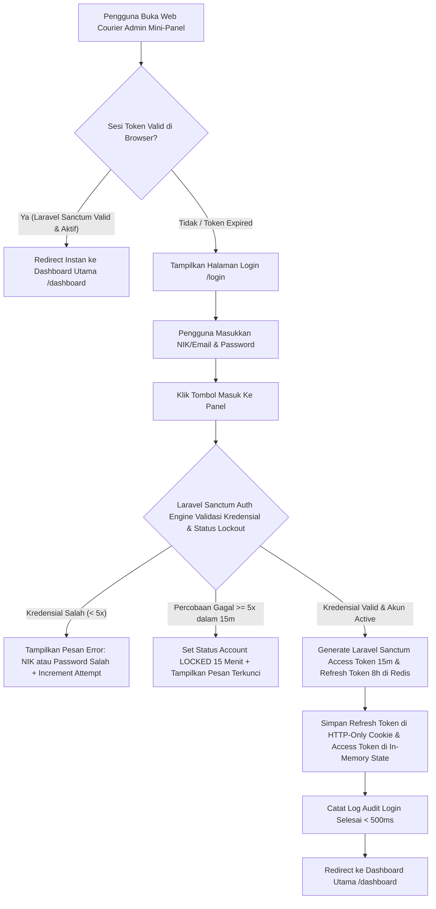

# Functional Requirement Document (FRD) — Login & Authentication Page
## Courier Admin Mini-Panel Anteraja

### 1. Konteks
Fitur **Login & Authentication Page** dirancang untuk menyediakan gerbang masuk terenkripsi dan manajemen sesi terproteksi bagi petugas Admin Hub Operasional, Hub Manager, dan Customer Care sebelum mengakses antarmuka *Courier Admin Mini-Panel Anteraja*. Fitur ini merujuk langsung pada `00-PRD-courier-admin-mini-panel.md` Bagian 5 (Pondasi & Arsitektur Data) dan Bagian 6 (Kebutuhan Non-Fungsional Keamanan) untuk menjamin perlindungan data internal pengiriman logistik Anteraja serta memvalidasi hak akses berbasis peran (*Role-Based Access Control / RBAC*).

---

### 2. Peran & Hak Akses (Access Matrix)

| Peran (Role) | Lihat (Read) | Buat (Create) | Ubah (Update) | Setujui (Approve) | Field Terkunci (Locked Fields) |
| :--- | :---: | :---: | :---: | :---: | :--- |
| **Admin Hub Operasional** | ✅ Ya | ✅ Ya (Form Login) | ✅ Ya (Ubah Password Sendiri) | ❌ Tidak | `user_id`, `nik`, `role`, `hub_id`, `password_hash` |
| **Hub Manager** | ✅ Ya | ✅ Ya (Form Login) | ✅ Ya (Ubah Password Sendiri) | ✅ Ya | `user_id`, `nik`, `role`, `hub_id`, `password_hash` |
| **Customer Care / Support** | ✅ Ya | ✅ Ya (Form Login) | ❌ Tidak | ❌ Tidak | Semua field identitas pengguna |
| **System (Laravel / Sanctum Auth Engine)** | ✅ Ya | ✅ Ya (Generate Token & Audit Log) | ✅ Ya (Update Last Login & Failed Attempts) | ✅ Ya (Validate Laravel Sanctum) | `created_at`, `password_hash` |

---

### 3. Alur (Workflow & EARS Pattern)



#### Pernyataan Alur Kebutuhan (EARS Pattern):
* **KETIKA** pengguna membuka URL aplikasi tanpa memiliki sesi token yang valid, sistem **harus** mengarahkan pengguna secara otomatis ke Halaman Login (`/login`) dalam durasi < 1.0 detik.
* **KETIKA** pengguna menginput NIK/Email dan Password lalu mengklik tombol "Masuk ke Panel", sistem **harus** memverifikasi kredensial ke database PostgreSQL via Eloquent ORM dalam durasi < 500 ms.
* **JIKA** otentikasi berhasil, sistem **harus** menerbitkan *Access Token* (Laravel Sanctum berdurasi 15 menit) dan *Refresh Token* (berdurasi 8 jam di Redis Cache) serta mengarahkan pengguna ke Dasbor Utama (`/dashboard`).
* **JIKA** pengguna memasukkan kombinasi NIK/Password yang salah sebanyak 5 kali berturut-turut dalam rentang 15 menit, sistem **harus** mengunci akun sementara (*Temporary Account Lockout*) selama 15 menit.
* **SELAMA** sesi pengguna aktif di dasbor, sistem **harus** memperbarui *Access Token* secara transparan (*Silent Refresh*) di latar belakang setiap 14 menit tanpa mengganggu aktivitas Admin Hub.

---

### 4. Aturan Bisnis (Business Rules)

| ID Rule | Kondisi / Pemicu | Hasil / Perilaku Sistem | Pengecualian |
| :--- | :--- | :--- | :--- |
| **BR-01** | Pengisian Formulir Otentikasi. | Pengguna wajib mengisi `nik_or_email` (Format NIK: `ADM-XXXXX` atau Email: `@anteraja.id`) dan `password` (Minimal 8 karakter). | - |
| **BR-02** | Masa Berluku Sesi Otentikasi. | *Access Token* Laravel Sanctum berlaku selama **15 menit**. *Refresh Token* berlaku selama **8 jam** (1 *shift* kerja Admin Hub). | Pengguna melakukan klik "Logout" secara manual. |
| **BR-03** | Proteksi Serangan Brute-Force (Rate Limiting). | Batas maksimal percobaan login gagal adalah **5 kali per 15 menit** per akun/IP. Setelah 5x gagal, sistem mengunci login selama **15 menit**. | Reset manual oleh IT Administrator Pusat. |
| **BR-04** | Keamanan Sesi Tunggal (*Single Active Session*). | Satu NIK Admin Hub hanya boleh memiliki **1 sesi aktif**. Jika login dari peramban/perangkat baru, sesi di perangkat lama otomatis dicabut (*invalidated*). | Sesi Supervisor/Manager yang memiliki otorisasi *Multi-Device Monitor*. |
| **BR-05** | Penguncian Sesi Otomatis (*Auto Inactivity Timeout*). | Jika peramban tidak mendeteksi aktivitas kursor/keyboard selama **15 menit**, sistem menampilkan modal *Inactivity Warning* selama 60 detik sebelum otomatis mengunci sesi (*Auto Lock*). | Dasbor sedang dalam mode *TV Wall / Live Display* dengan izin khusus. |
| **BR-06** | Kebijakan Enkripsi Kredensial. | Seluruh password disimpan menggunakan algoritma *hashing* **Argon2id / bcrypt** dengan *cost factor* 12. Password mentah dilarang dicatat dalam log apapun. | - |

---

### 5. Istilah

* **Laravel Sanctum (Stateful/Bearer Token):** Standar industri token ringkas bertanda tangan digital untuk mentransmisikan klaim otentikasi secara aman antara peramban dan server Laravel 11.
* **Refresh Token:** Token jangka panjang yang disimpan di *HTTP-Only Cookie* terenkripsi untuk mendapatkan *Access Token* baru tanpa meminta pengguna menginput password kembali.
* **Silent Refresh:** Mekanisme pembaruan token di latar belakang (*background fetch*) sebelum *Access Token* kedaluwarsa.
* **Account Lockout:** Mekanisme keamanan yang membekukan sementara formulir masuk saat terdeteksi indikasi percobaan peretasan *brute-force*.
* **HTTP-Only Cookie:** Biskuit peramban terproteksi yang tidak dapat dibaca oleh skrip JavaScript pihak ketiga (*XSS Protection*).

---

### 6. Data Utama & Status

#### Data Utama yang Disimpan (`users` table):
* `user_id` (UUID - Primary Key)
* `nik` (String - NIK Karyawan Anteraja, contoh: `ADM-TB381`)
* `full_name` (String - Nama Lengkap Karyawan)
* `email` (String - Email Resmi `@anteraja.id`)
* `password_hash` (String - Hasil Hashing Password bcrypt/Argon2id)
* `role` (Enum: `ADMIN_HUB`, `HUB_MANAGER`, `CUSTOMER_CARE`)
* `hub_id` (String - ID Stasiun Layanan, contoh: `HUB-TEBET-01`)
* `hub_name` (String - Nama Stasiun Layanan, contoh: `Hub Jakarta Selatan - Tebet`)
* `account_status` (Enum: `ACTIVE`, `LOCKED`, `SUSPENDED`, `INACTIVE`)
* `failed_login_attempts` (Integer - Jumlah Kegagalan Login)
* `lockout_until` (Timestamp - Waktu Berakhir Penguncian Akun)
* `last_login_at` (Timestamp - Stempel Waktu Login Terakhir)

#### Diagram Transisi Status Akun:
```
[ACTIVE] ---> (5x Gagal Login) ---> [LOCKED (15m)] ---> (Waktu Habis / Reset) ---> [ACTIVE]
   |
   +--------> (Pelanggaran / Resign) ---> [SUSPENDED / INACTIVE]
```

---

### 7. Daftar Fungsi

* **F-05.1 Credential Authenticator Service:** Memvalidasi kombinasi NIK/Email dan Password terhadap hash database PostgreSQL via Eloquent ORM.
* **F-05.2 Laravel Sanctum Session Generator & Silent Refresher:** Menerbitkan pasangan *Access Token* dan *Refresh Token* serta mengelola siklus pembaruan sesi otomatis di Redis Cache.
* **F-05.3 Brute-Force Rate Limiter & Lockout Handler:** Memantau jumlah kegagalan masuk dan mengunci akses sementara jika melampaui batas 5 kali.
* **F-05.4 Single Active Session Controller:** Menjamin ketiadaan duplikasi sesi aktif untuk satu ID pengguna pada beberapa perangkat berbeda.

---

### 8. Acceptance Criteria (AC) Alur Utama

#### Skenario 1: Otentikasi Berhasil Admin Hub Siti (Data Nyata Anteraja)
* **Diberikan:** 
  * Admin Hub Siti (`nik`: `ADM-TB381`, `email`: `siti.admin@anteraja.id`, `role`: `ADMIN_HUB`, `hub_id`: `HUB-TEBET-01`, status: `ACTIVE`).
  * Peramban mengarahkan ke halaman `/login`.
* **Ketika:** 
  1. Siti memasukkan email `siti.admin@anteraja.id` dan password `Anteraja2026!`.
  2. Siti mengklik tombol "Masuk ke Panel".
* **Maka:** 
  1. Server Laravel 11 memverifikasi kredensial dalam durasi **280 ms** (memenuhi BR-01 & BR-06).
  2. Laravel 11 menerbitkan *Access Token* Laravel Sanctum dan menyimpan *Refresh Token* di Redis Cache.
  3. Peramban menerima respon sukses, menyimpannya di *state React*, dan melakukan *redirect* ke Dasbor Utama (`/dashboard`) dalam durasi **450 ms**.
  4. Header Dasbor menampilkan nama "Siti Admin", NIK "ADM-TB381", dan lokasi "Hub Jakarta Selatan - Tebet".

#### Skenario 2: Penanganan Penguncian Akun (Account Lockout) akibat 5x Gagal
* **Diberikan:** Admin Budi (`nik`: `ADM-KJ202`) berada di Halaman Login `/login`.
* **Ketika:** Budi memasukkan password yang salah sebanyak 5 kali berturut-turut dalam kurun waktu 3 menit.
* **Maka:** 
  1. Pada percobaan ke-5, sistem mengubah status akun menjadi `LOCKED` dan menetapkan `lockout_until` ke +15 menit dari waktu saat ini.
  2. Halaman Login menampilkan notifikasi merah: *"Akun Anda terkunci sementara selama 15 menit karena 5 kali percobaan gagal. Silakan coba lagi pada 14:30 WIB atau hubungi IT Support."* (memenuhi BR-03).
  3. Tombol "Masuk ke Panel" dinonaktifkan (*disabled*) secara otomatis.

---

### 9. Tidak Termasuk (Out-of-Scope)

* **Pendaftaran Mandiri (*Self-Registration*):** Sistem tidak menyediakan formulir registrasi publik. Seluruh akun Admin Hub dibuat secara terpusat oleh IT Administrator.
* **Social OAuth2 Login:** Tidak mendukung login menggunakan akun Google, Facebook, atau platform pihak ketiga publik lainnya.
* **Biometric Auth (Fingerprint/FaceID):** Otentikasi difokuskan pada kredensial NIK/Email dan Password berbasis web desktop.
