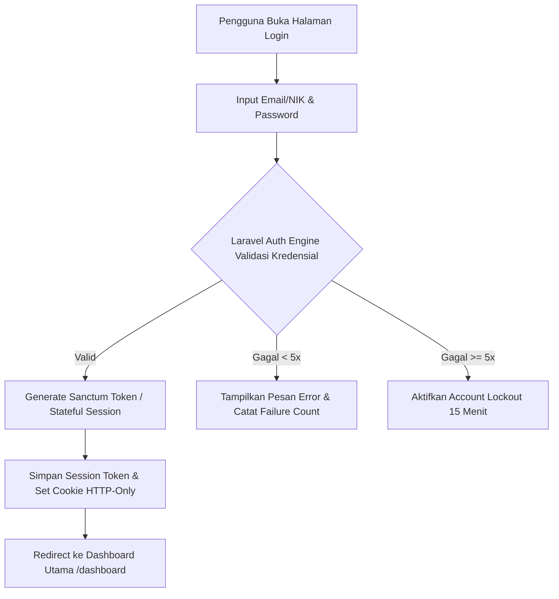

# Functional Requirement Document (FRD) — Login & Authentication

---

### 1. Konteks
Fitur **Login & Authentication** menyediakan gerbang masuk terenkripsi dan manajemen sesi terproteksi bagi petugas Admin Hub Operasional, Hub Manager, dan Customer Care sebelum mengakses antarmuka *Courier Admin Mini-Panel Anteraja*. Fitur ini merujuk langsung pada **00-PRD-courier-admin-mini-panel.md** Bagian 5 (Batasan Tech Stack Laravel Sanctum) dan Bagian 7 (Fitur F-05) untuk menjamin perlindungan data operasional internal serta memvalidasi hak akses berbasis peran (*Role-Based Access Control / RBAC*).

---

### 2. Peran & Hak Akses

| Peran (Role) | Lihat (Read) | Buat (Create) | Ubah (Update) | Setujui (Approve) | Field Terkunci (Locked Fields) |
| :--- | :---: | :---: | :---: | :---: | :--- |
| **Admin Hub Operasional** | ✅ Ya (Login Form) | ✅ Ya (Session) | ✅ Ya (Password Sendiri) | ❌ Tidak | `role`, `nik`, `email`, `status_lockout` |
| **Kurir SATRIA (Mobile App)** | ❌ Tidak (Web UI) | ❌ Tidak | ❌ Tidak | ❌ Tidak | Semua Field di Mini-Panel |
| **System (Laravel Sanctum / Auth Engine)** | ✅ Ya | ✅ Ya (Access Token) | ✅ Ya (Last Login & Lockout Count) | ✅ Ya | `password_hash` |
| **Hub Manager & Customer Care** | ✅ Ya (Login Form) | ✅ Ya (Session) | ✅ Ya (Password Sendiri) | ❌ Tidak | `role`, `nik`, `email` |

---

### 3. Alur (Workflow & EARS Pattern)



#### Pernyataan Alur (EARS Pattern):
* **`KETIKA`** pengguna menginput email/NIK dan password lalu menekan tombol "Masuk", sistem **harus** memverifikasi kredensial ke database PostgreSQL melalui Laravel Sanctum dalam waktu **< 500 ms**.
* **`JIKA`** kombinasi email/NIK dan password tidak cocok, sistem **harus** menampilkan pesan kesalahan *"Kredensial yang Anda masukkan salah"* dan menambah jumlah percobaan gagal (*failure count*).
* **`JIKA`** percobaan login gagal sebanyak **5 kali berturut-turut** dalam kurun waktu 10 menit, sistem **harus** mengunci akun tersebut (*Account Lockout*) selama **15 menit**.
* **`SELAMA`** akun dalam status *Lockout*, sistem **harus** menolak setiap upaya login meskipun password yang dimasukkan benar hingga batas waktu 15 menit berakhir.
* **`SELAMA`** sesi login aktif, sistem **harus** melampirkan token otentikasi terenkripsi pada setiap permintaan API (*bearer token / HTTP-only cookie*).

---

### 4. Aturan Bisnis

| ID | Kondisi / Pemicu | Hasil / Respon Sistem | Pengecualian |
| :--- | :--- | :--- | :--- |
| **BR-01** | Input format Email (`@anteraja.id`) atau NIK valid (`ADM-xxx`, `MGR-xxx`, `CC-xxx`). | Sistem mengizinkan proses autentikasi dilanjutkan. | Pengguna luar domain `@anteraja.id` ditolak dengan pesan format email invalid. |
| **BR-02** | Kredensial cocok dengan database PostgreSQL. | Laravel Sanctum menerbitkan *Stateful Session/Token* dengan masa berlaku **8 jam** (1 shift kerja) dan mereset `failed_attempts_count` menjadi 0. | Jika status akun `INACTIVE` atau `SUSPENDED`, login ditolak. |
| **BR-03** | Percobaan login gagal mencapai **5 kali berturut-turut**. | Sistem mengunci akun selama **15 menit** dan mencatat insiden keamanan ke *audit log*. | Admin Sistem dapat melakukan *un-lock* manual via CLI `php artisan auth:unlock {nik}`. |
| **BR-04** | Inaktivitas pengguna di dasbor selama **30 menit**. | Sistem secara otomatis mengakhiri sesi (*Session Timeout*) dan mengarahkan kembali pengguna ke Halaman Login. | Gerakan kursor atau transmisi WebSocket aktif mereset timer inaktivitas. |
| **BR-05** | Pengguna menekan tombol "Logout". | Laravel Sanctum mencabut (*revoke*) token aktif dari database/Redis dan menghapus cookie HTTP-Only. | N/A |

---

### 5. Istilah
* **Laravel Sanctum:** Package otentikasi terpadu Laravel yang mengelola *featherweight authentication system* untuk SPA (*Single Page Application*) menggunakan cookie HTTP-Only atau Bearer Tokens.
* **RBAC (Role-Based Access Control):** Pengelompokan hak akses aplikasi berdasarkan peran operasional pengguna.
* **Account Lockout:** Mekanisme keamanan untuk membekukan sementara akun setelah akumulasi kegagalan autentikasi guna mencegah serangan *Brute Force*.
* **Session Timeout:** Pengakhiran sesi pengguna secara otomatis akibat ketiadaan interaksi dalam rentang waktu tertentu.
* **HTTP-Only Cookie:** Cookie yang tidak dapat diakses melalui skrip JavaScript di browser untuk mencegah serangan XSS (*Cross-Site Scripting*).

---

### 6. Data Utama & Status

#### Skema Data Otentikasi (`users` table fields):
* `nik` (String, Unique) — Contoh: `ADM-JKT-001`
* `email` (String, Unique) — Contoh: `siti.admin@anteraja.id`
* `password` (String, Hashed dengan Argon2id / bcrypt)
* `role` (Enum: `admin_hub`, `hub_manager`, `customer_care`, `courier_satria`)
* `failed_login_attempts` (Integer, Default 0)
* `lockout_until` (Timestamp, Nullable)
* `last_login_at` (Timestamp, Nullable)
* `status` (Enum: `ACTIVE`, `LOCKED`, `SUSPENDED`)

#### Diagram Transisi Status Akun:
```
[ACTIVE] ──(Gagal 5x)──> [LOCKED (15m)] ──(Waktu Habis)──> [ACTIVE]
   │
   └──(Pelanggaran)──> [SUSPENDED]
```

---

### 7. Daftar Fungsi
* **F-05.1 - Form Validation & Credential Checking:** Memvalidasi format input NIK/Email dan mencocokkan hash password dengan algoritma Argon2id/bcrypt.
* **F-05.2 - Session & Token Generator:** Menerbitkan token Laravel Sanctum dan menginisialisasi cookie HTTP-Only terenkripsi saat autentikasi berhasil.
* **F-05.3 - Lockout & Rate Limiter Engine:** Menghitung jumlah kegagalan login dan mengunci akses akun secara otomatis selama 15 menit jika melebihi batas 5 kali.
* **F-05.4 - Session Revocation & Auto-Logout:** Menghentikan dan mencabut validitas token sesi saat tombol logout ditekan atau saat terjadi *idle timeout* 30 menit.

---

### 8. AC Alur Utama (Acceptance Criteria - Data Nyata `delivery.txt` & Real Users)

* **Skenario 1: Login Berhasil Admin Hub Siti (Data Nyata)**
  * **Diberikan:** Admin Hub Siti (`email: siti.admin@anteraja.id`, `nik: ADM-JKT-001`, `role: admin_hub`) berada di Halaman Login dengan status akun `ACTIVE`.
  * **Ketika:** Siti memasukkan email `siti.admin@anteraja.id` dan password `password123` lalu menekan tombol "Masuk".
  * **Maka:** Dalam waktu **< 350 ms**, sistem memverifikasi kredensial, menerbitkan token Laravel Sanctum, memperbarui `last_login_at` menjadi timestamp saat ini, dan mengarahkan Siti ke halaman dasbor utama (`/dashboard`) dengan membawa profil "Siti — Admin Hub Tebet".

* **Skenario 2: Kegagalan Login & Account Lockout (Data Nyata)**
  * **Diberikan:** Hub Manager Budi (`email: budi.manager@anteraja.id`, `nik: MGR-JKT-001`) mencoba masuk ke sistem.
  * **Ketika:** Budi memasukkan password yang salah berturut-turut sebanyak 5 kali dalam waktu 3 menit.
  * **Maka:** Pada percobaan ke-5, sistem menolak login, memperbarui status akun menjadi `LOCKED`, menetapkan `lockout_until` menjadi 15 menit ke depan, dan menampilkan pesan peringatan *"Akun Anda dikunci sementara selama 15 menit karena 5 kali kegagalan login."*

* **Skenario 3: Auto-Logout Akibat Inaktivitas**
  * **Diberikan:** Admin Hub Siti sedang dalam sesi login aktif di dasbor *Courier Admin Mini-Panel*.
  * **Ketika:** Siti meninggalkan dasbor tanpa interaksi apa pun (tidak ada gerakan kursor/klik) selama 30 menit 1 detik.
  * **Maka:** Sistem secara otomatis menghapus token sesi aktif, mengarahkan tampilan kembali ke Halaman Login (`/login`), dan menampilkan notifikasi *"Sesi Anda telah berakhir karena inaktivitas. Silakan masuk kembali."*

---

### 9. Tidak Termasuk (Out-of-Scope)
* **Fitur Lupa Password via Email/SMS Self-Service:** Pemulihan password tidak disediakan di halaman login MVP dan harus melalui permintaan reset manual oleh IT Helpdesk.
* **Multi-Factor Authentication (MFA / 2FA / OTP):** Tidak menggunakan kode OTP SMS/Authenticator App pada rilis MVP.
* **OAuth / Social Login (Google/SSO Enterprise):** Menggunakan otentikasi kredensial lokal database PostgreSQL.
* **Registrasi Mandiri (Self-Registration / Sign Up):** Pendaftaran akun admin baru hanya dilakukan melalui *seeder* atau pendaftaran internal oleh Super Admin.
